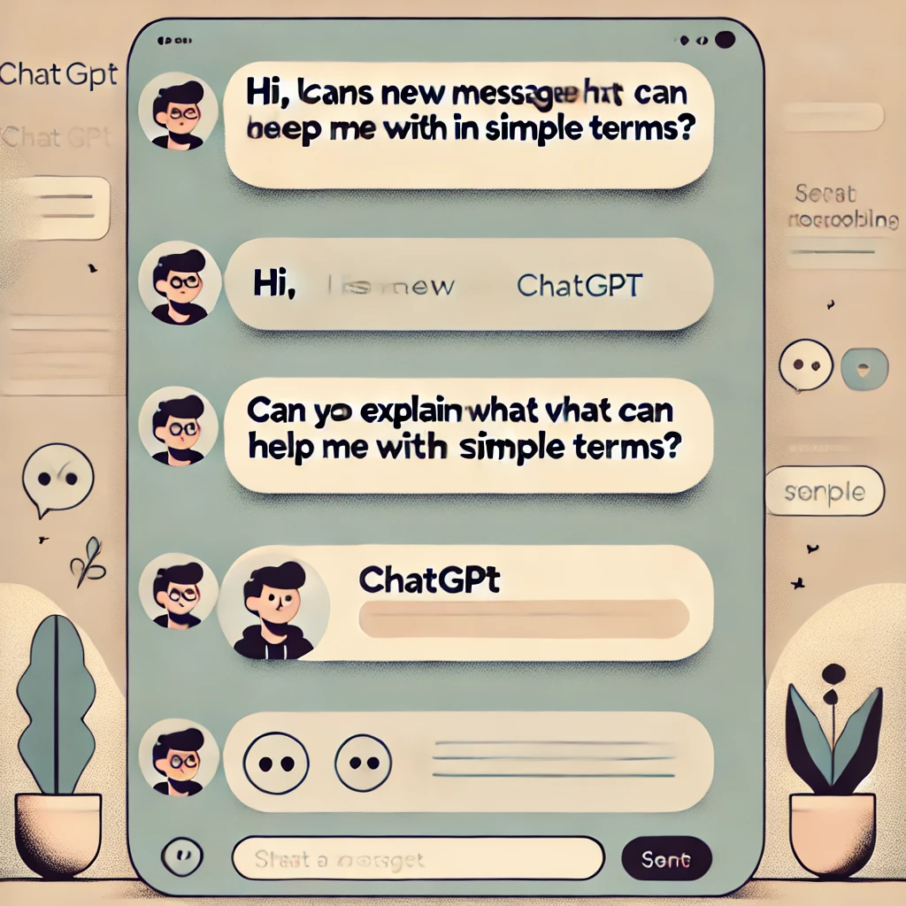
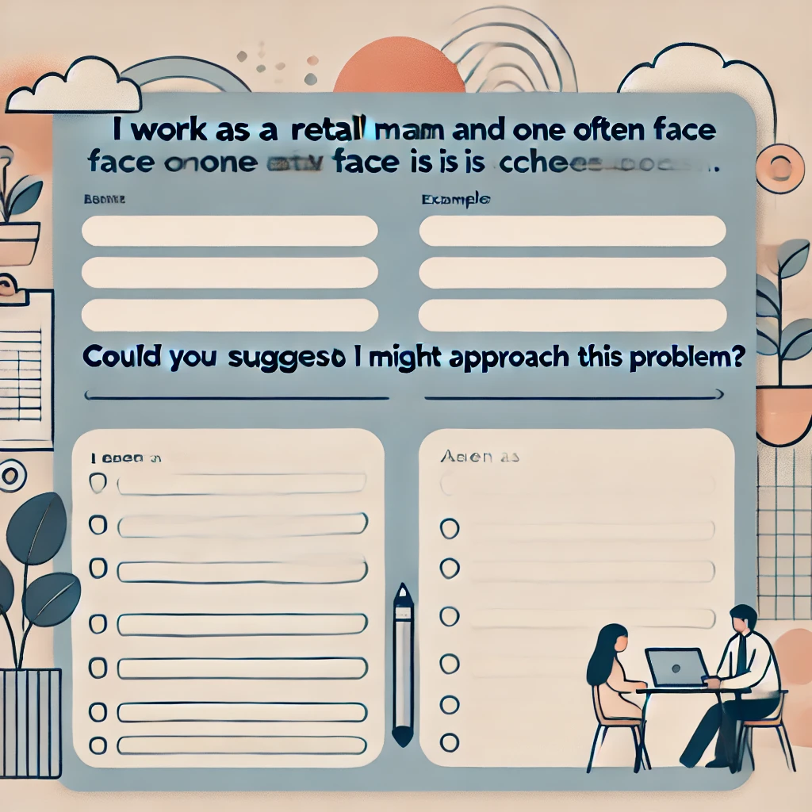
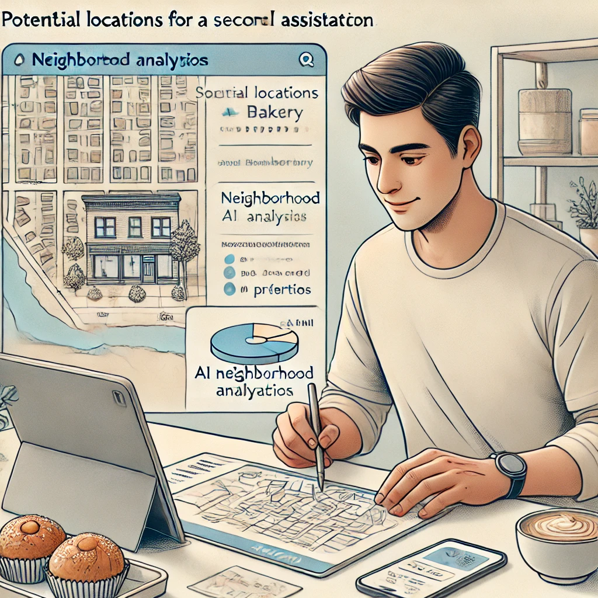
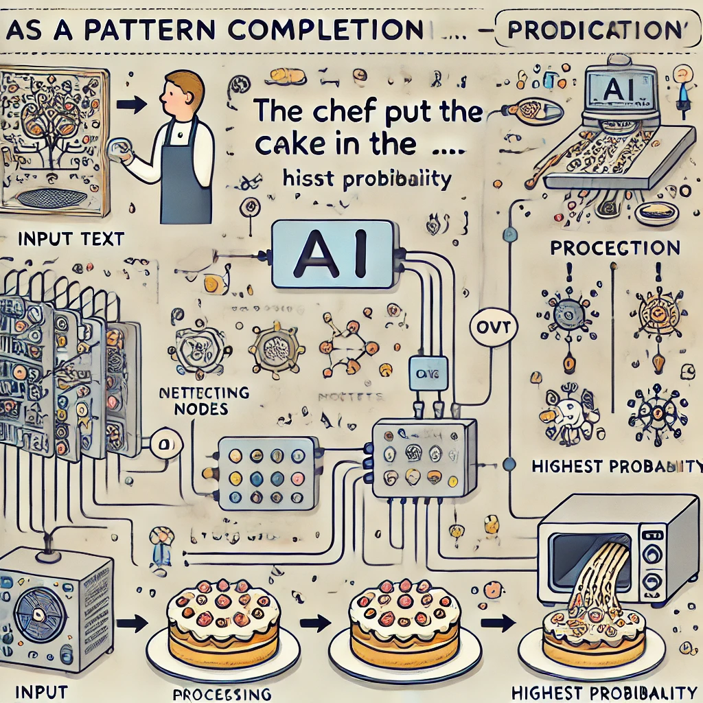
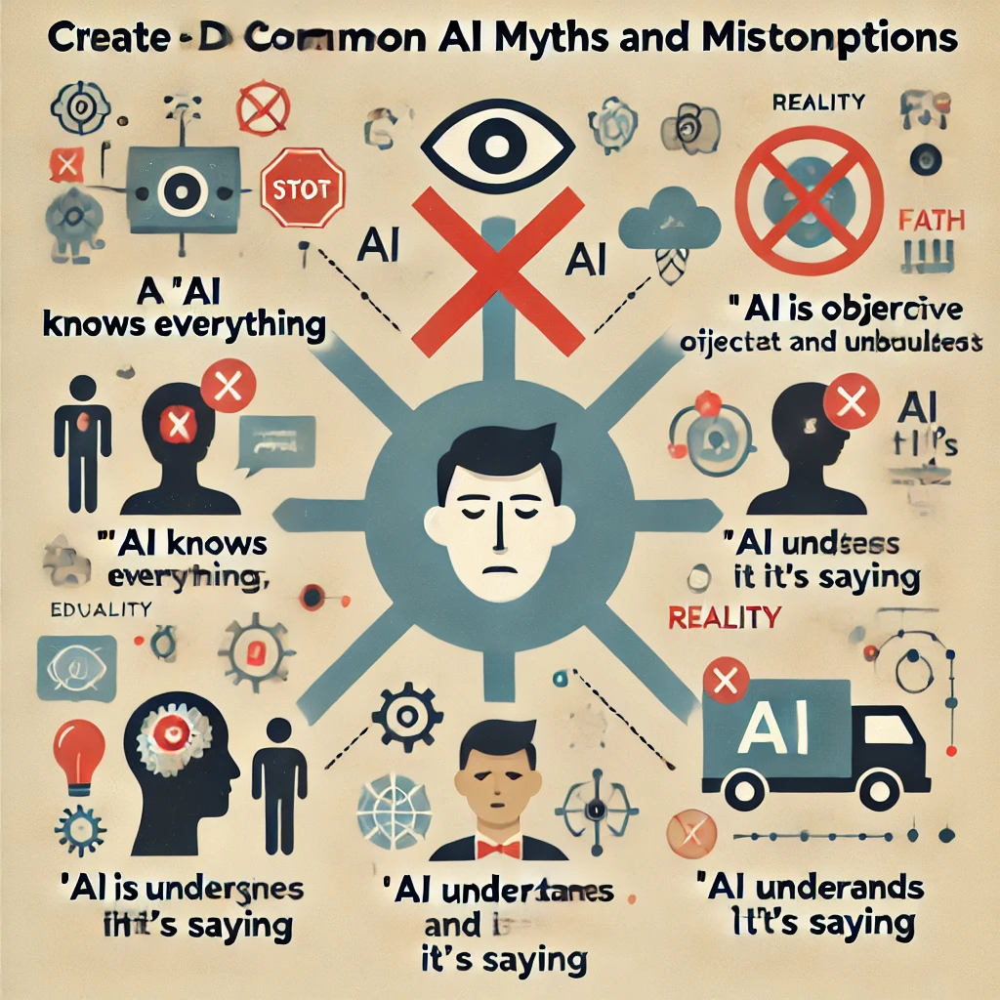
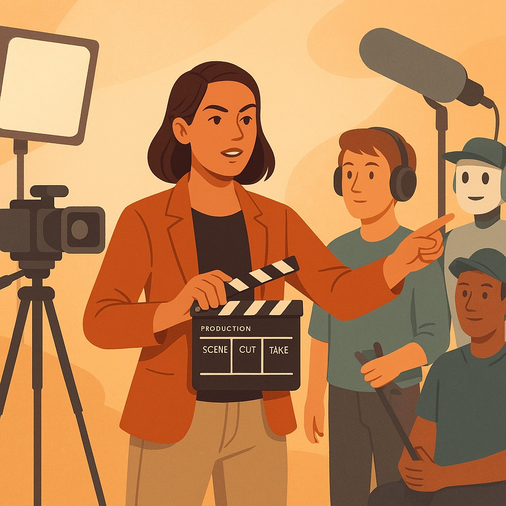

# Chapter 1: Actual Intelligence
*...The Human Side of AI*

Have you ever watched someone use a new technology and make it look effortless, only to feel lost when you try it yourself? Or perhaps you've heard about **ChatGPT** and other AI tools in the news but haven't tried them yet, unsure if they're too complicated or technical for you?


You're not alone. Many people find these technologies intimidating or aren't sure where to start. The good news is that you don't need to be a tech expert to use these tools effectively. In fact, the most important skills you'll need are ones you already have—curiosity, judgment, and your own unique perspective on what matters.

That's what this book is all about: showing you how to pair your human wisdom with AI tools to accomplish things that matter to you. We call this partnership **Actual Intelligence**—a framework that centers you, not the technology, in the process.

## Quick Self-Reflection

Before we dive in, take a moment to jot down your answers to these questions:

- What's one task in your daily life or work that feels repetitive or time-consuming?
- What's one topic you've been curious about but haven't had time to explore deeply?
- What's one creative project you've wanted to try but haven't gotten around to?


Keep these answers handy—they'll help us personalize your first AI experiences as we move through this chapter.

In the pages ahead, we'll establish a simple framework for thinking about AI tools, demonstrate how easily you can start using them (no technical knowledge required!), and show you why your direction and judgment are the critical ingredients for getting valuable results.

Let's begin our journey toward becoming confident, effective directors of these powerful tools—starting from the very first interaction.

---


<!-- Start of section: 01-what-is-actual-intelligence.md -->

# What is **Actual Intelligence**?
*...The Human-AI Partnership*

## Your First AI Conversation: A Guided Tour

Let's start with something simple. No technical skills required—just the ability to type a sentence.

1. Open ChatGPT *(we'll show you exactly how in the next chapter)*
2. Type exactly this: `Hi, I'm new to ChatGPT. Can you explain what you can help me with in simple terms?`
3. Press Enter and read the response

That's it! You've just had your first AI conversation. 



Notice how the AI introduces itself and explains its capabilities. This isn't a pre-recorded message—the AI is generating this response specifically for you. In the coming chapters, you'll learn how to make these conversations increasingly useful for your specific needs.

Maria, a small business owner with no technical background, described her first experience: 

*"I was honestly expecting it to be complicated—like I'd need to learn special commands or something. But it was just like texting. I asked how to write a better email newsletter, and within seconds I had ideas I could actually use. No technical jargon, no complicated setup."*

## Understanding the Human-AI Partnership

Think of AI tools like kitchen appliances. A stand mixer can do the hard work of mixing dough, but it doesn't decide what recipe to make or know when the consistency is just right—that's your job. The mixer is very good at its specific task, but you're the one with the taste buds, the creativity to modify recipes, and the knowledge of whether you're baking for someone with dietary restrictions.


**Actual Intelligence** is this partnership between your human judgment and AI's capabilities. It's what happens when your wisdom, creativity, and purpose combine with AI's ability to process information and generate content.

Think about the last time you used a powerful tool to solve a problem. Maybe it was a food processor that cut your prep time in half, or mapping software that helped you navigate an unfamiliar city. The tool was invaluable, but you were the one who decided what to cook or where to go. That's exactly your relationship with AI — you're not just pushing buttons, you're the creative director calling the shots.


### The Partnership Model

Rather than thinking of AI as some magical entity with a mind of its own, consider this simple relationship:

- **You** provide the goals, values, creativity, and judgment
- **AI** provides computational power, information access, and task assistance

Why does this relationship matter so much? Because understanding it transforms how you'll use these tools every single day.

When you recognize that you're the director and AI is your assistant, you naturally take charge of the process instead of passively accepting whatever the AI produces. You develop clearer expectations about what these tools can (and can't) do for you. You focus on strengthening the uniquely human skills that AI can't replicate. And perhaps most importantly, you maintain ownership of your work and ideas.

Isn't that a more empowering way to approach these tools?

### The Human Element in Action

Let's see this partnership in action through a real example.

Lisa, a middle school science teacher with no previous AI experience, wanted to create a lesson on climate change. She could have simply asked ChatGPT to `create a climate change lesson for 7th graders` and used whatever it generated—but that would have ignored her unique knowledge of her students.


Instead, Lisa applied her human judgment. She knew her specific students—their knowledge levels, interests, and the local environmental issues they see every day. She understood which concepts they'd struggled with in past lessons.

With this context that no AI could possess, Lisa directed ChatGPT with a more specific request: `Help me create an interactive demonstration that shows how greenhouse gases work, suitable for 7th graders who have already learned about the water cycle but struggle with abstract concepts.`

The resulting lesson was far more effective because it combined Lisa's understanding of her students with the AI's ability to generate creative teaching ideas. That's Actual Intelligence at work—you remain central to the process while leveraging AI as a powerful tool.

## Creating Your First Personalized Prompt

Now it's your turn. Let's create a prompt that's specifically relevant to you. Fill in the blanks below:
`I work as a _____________ and one challenge I often face is _____________. Could you suggest three ways I might approach this problem?`



For example:
`I work as a retail manager and one challenge I often face is scheduling staff efficiently. Could you suggest three ways I might approach this problem?`

 or

 `I work as a parent and one challenge I often face is finding educational activities for rainy days. Could you suggest three ways I might approach this problem?`

In the next sections, we'll explore what makes human intelligence unique and how it complements AI capabilities. But remember, you don't need to understand all the technical details to start using these tools effectively today.

---


<!-- Start of section: 02-ai-tools-vs-human-intelligence.md -->

# AI Tools vs. Human Intelligence: Understanding the Relationship


You might be wondering... *"Do I need to learn coding or computer science to use these AI tools effectively?"*

The simple answer is *no*. Using AI tools like ChatGPT requires no more technical skill than using a search engine or sending a text message. If you can type a question, you can use AI.


What matters far more than technical knowledge is your ability to:

- Ask clear questions about topics that matter to you
- Evaluate whether the answers make sense for your situation
- Follow up when you need more details or a different approach

These are human skills you've been developing your entire life—and they're exactly what makes you the **Actual Intelligence** in the partnership.

To use AI tools effectively, it helps to understand what makes human intelligence different from artificial intelligence, and why that difference creates such a powerful partnership.

## What Makes Human Intelligence Unique

Human intelligence has several qualities that current AI systems simply don't possess, despite their impressive capabilities:

### Purpose and Meaning

Humans don't just do things — we do things for reasons. We ask *why* questions, set goals based on our values, and feel satisfaction when we accomplish something meaningful. We care deeply about the purpose behind an activity, not just getting it done.

AI systems, by contrast, have no intrinsic purposes or desires. They don't *want* anything—they simply process inputs and generate outputs. Any sense of purpose must come from the humans using them.


### Real-World Understanding

Think about your rich understanding of the world, built through lived experience. You know how it feels when you're caught in the rain without an umbrella. You understand the emotional weight of receiving unexpected good news. You grasp the subtle social dynamics of a family gathering.

AI systems like ChatGPT have been trained on vast amounts of text that describe the world, but they've never actually lived in it. They've "read" about ice cream but never tasted it. They can describe what it's like to be caught in the rain, but they've never felt that sudden cold splash or made that mad dash for cover. It's like the difference between reading a travel guide and actually visiting a place — no matter how detailed the guide, there's something essential about the experience that just can't be captured in words.

### Creativity and Intuition

Elena, a retired art teacher, was skeptical about using AI for her watercolor hobby. *"I didn't see how a computer program could help with something as personal as art,"* she said. But when she asked ChatGPT for suggestions on painting autumn leaves with more vibrancy, she was pleasantly surprised.


*"The techniques it suggested were solid fundamentals — things I might tell my own students. But I still had to apply my eye for color, my sense of composition, and my own aesthetic preferences. The AI gave me options to consider, but the creative decisions remained mine."*

This illustrates another key difference: human creativity often involves making unexpected connections, being inspired by seemingly unrelated ideas, or having sudden insights that can't be fully explained. Our intuition allows us to make judgment calls based on subtle cues and years of experience.

While AI can recombine existing ideas in impressive ways, it doesn't have the spark of genuine inspiration or the intuitive sense that allows humans to make leaps beyond what's explicitly known.

### What AI Tools Do Well

These differences aren't weaknesses — they're the foundation of a powerful partnership. AI and humans are like teammates with complementary strengths.

Imagine you're researching a health condition that affects someone you love. You could spend weeks reading medical journals, trying to understand complex terminology and conflicting studies. Or you could ask an AI to summarize the current research, explain key terms, and highlight treatment options—all in minutes. This is where AI truly shines: processing vast amounts of information that would overwhelm even the most dedicated human reader.


AI excels at:

**Information Processing**: Quickly synthesizing enormous amounts of information and finding patterns across vast datasets.

**Consistent Output**: Working tirelessly without getting bored, distracted, or emotional.

**Rapid Idea Generation**: Producing multiple options, drafts, or approaches to a problem in seconds.

**Learning from Patterns**: Identifying trends and connections in data that humans might otherwise miss.

## The Director and the Assistant

A helpful way to understand this relationship is to think of yourself as a film director and AI as your assistant.


As the director, you:

- Determine the vision and purpose of the project
- Make creative and ethical decisions
- Evaluate quality based on your taste and judgment
- Take ultimate responsibility for the final product

The AI assistant:

- Helps execute specific tasks
- Offers options based on your direction
- Provides information and suggestions
- Works tirelessly on the details you specify

Without the director, the assistant would have no purpose or direction. Without the assistant, the director would have to handle every small detail alone.

So what does this look like in practice? Let's see how Marcus, a small business owner with no technical background, puts this partnership into action.

Marcus owns a successful bakery and is considering opening a second location. Instead of simply asking AI, *"Where should I open my second bakery location?"* — a question the AI couldn't possibly answer well without knowing his specific business — Marcus directs the AI with more specific prompts:



- `What demographic data should I analyze when selecting a new bakery location?`
- `Help me create a checklist for evaluating potential retail spaces for a bakery.`
- `What are typical challenges bakeries face when opening a second location?`

Notice the pattern here — each question taps into the AI's ability to organize information while keeping Marcus firmly in the decision-making role. The AI provides valuable frameworks and information, but Marcus makes the final decision based on factors only he can fully understand — his appetite for risk, his intuition about different neighborhoods, and his vision for his brand.

In the next section, we'll explore in simple terms how these AI tools actually work, which will help you understand their capabilities and limitations without requiring any technical background.

---


<!-- Start of section: 03-how-modern-ai-tools-work.md -->

# How Modern AI Tools Work (Simplified for Non-Technical Readers)

To effectively direct AI tools, you don't need to understand all the technical details—just as you don't need to know exactly how a car engine functions to drive effectively. However, having a basic conceptual understanding will help you set realistic expectations and use these tools more skillfully.

Let's explore how AI tools like ChatGPT work, using simple analogies that highlight both their capabilities and limitations.

*"When I first heard about AI, I imagined something from science fiction movies—like a computer that thinks and feels,"* says James, a retiree who now uses ChatGPT daily to help with his genealogy hobby. "*But once I started using it, I realized it's more like having a very well-read research assistant who's incredibly fast but needs careful direction."*


## The Pattern Completion Machine

At its core, an AI like ChatGPT is a sophisticated pattern completion machine. Imagine you're playing a game with a friend where you start a sentence and they finish it:

You say: `The chef put the cake in the...`

Your friend almost certainly responds: `oven`

Why? Because based on all the language they've encountered throughout their life, `oven` is the most likely word to come next in this context.

ChatGPT does something similar, but on a much larger scale. It's been trained on enormous amounts of text from books, articles, websites, and other sources. During this training, it learned to recognize patterns in how words and ideas typically follow one another.



Think of it like a musician who has listened to thousands of songs but doesn't actually understand music theory. When you hum a few notes, the musician can continue the melody based on similar patterns they've heard before. They're not composing something truly original—they're drawing on all the music they've absorbed to continue the pattern you started.

## The Echo Chamber of Human Knowledge

Another helpful way to think about these AI tools is as an echo chamber of human knowledge. They can only reflect back information and patterns that already exist in the data they were trained on.


If you ask ChatGPT about the French Revolution, it can provide information because many human writers have written about this topic, and those writings were part of its training data. But if you ask about a completely fictional historical event that no one has written about, it can't provide accurate information because that pattern doesn't exist in its training data.

This means AI tools:

- Can reflect existing human knowledge and writing patterns
- Cannot generate truly novel discoveries or insights that aren't derived from existing knowledge
- May confidently present information that seems plausible but is actually incorrect

## Text Prediction, Not Understanding

Despite its impressive ability to generate human-like text, ChatGPT doesn't actually "understand" the meaning of words the way humans do. It predicts which words are likely to follow each other based on statistical patterns, not based on connecting those words to real-world experiences or deeper concepts.

Think of it like someone who has memorized a cookbook in a foreign language without understanding what the words mean. They might be able to recite recipes perfectly and even make reasonable substitutions based on patterns they've observed, but they've never tasted the food, felt the texture of the ingredients, or understood why certain techniques are used.


This limitation explains why AI often struggles with:

- Common sense reasoning
- Understanding the physical world
- Grasping cause and effect
- Distinguishing between plausible-sounding nonsense and actual truth

## The Probability Generator

When ChatGPT generates text, it's essentially making a series of word choices based on probability, like guessing the next note in a melody. For each position in a sentence, it calculates which word is most likely to come next, given the preceding words and the overall context.

Imagine a game where you start a sentence, and someone has to guess what word comes next:

`The chef put the cake in the...`

Most people would guess `"oven"` because that's the most probable word to follow in this context. AI systems do something similar, but with a much more sophisticated understanding of language patterns and a much larger vocabulary of possible words to choose from.


This probabilistic approach means that:

- ChatGPT doesn't have a fixed set of responses—it generates new text each time
- Responses can vary even to identical prompts
- The AI doesn't "decide" what to say based on reasoning—it selects words based on probability

## What This Means for You

Understanding these basics about how AI works helps explain both its impressive capabilities and its surprising limitations:

1. **It can generate human-like text** because it has learned patterns from vast amounts of human writing

2. **It can provide information on many topics** because it has been trained on diverse texts

3. **It struggles with factual accuracy** because it's predicting plausible text, not verifying truth

4. **It can't truly reason or understand** because it's matching patterns, not comprehending meaning

5. **It doesn't have experiences or goals** because it's a text prediction system, not a conscious entity

These characteristics make AI tools incredibly useful for certain tasks but also highlight why human direction and judgment—your Actual Intelligence—remains essential.

## The Assistant, Not the Expert

Given these limitations, it's helpful to think of AI tools as assistants rather than experts or authorities. They can help you brainstorm, draft content, summarize information, and explore ideas, but you should always apply your own judgment to their output.


Remember Jake, who's planning a family vacation to Japan. If he simply asks ChatGPT `"Plan my perfect Japan trip"` and follows whatever itinerary it generates, he might end up with a generic tourist experience that doesn't match his family's interests or visit attractions that are closed for renovation.

Instead, Jake uses his understanding of AI limitations to direct the tool more effectively. He knows that:

- The AI's information might be outdated
- It doesn't know his family's specific preferences
- It can't verify if suggested accommodations are actually available

So he uses AI as an assistant for specific tasks where pattern matching is helpful—generating ideas for kid-friendly activities in Tokyo, suggesting phrasing for basic Japanese phrases, or creating a packing checklist—while handling the critical judgment calls himself and verifying key information through other sources.

In the next section, we'll explore how to take control of this human-AI partnership to get the most value from these powerful but limited tools.

---

<!-- Start of section: 04-directing-ai-and-setting-expectations.md -->

# Directing AI and Setting Realistic Expectations

Now that we understand the relationship between human intelligence and AI capabilities, let's focus on two critical elements that will make your AI experiences successful: how to effectively direct these tools and what you should realistically expect from them.

## The Director's Mindset

Remember our film director metaphor? Let's expand on what it means to be an effective director of AI tools.


Just as a film director doesn't simply tell actors "make a good scene" and hope for the best, you shouldn't approach AI with vague requests and passive acceptance of whatever it produces. The director's mindset involves several key practices:

### 1. Clarity of Purpose

*"I used to start by asking ChatGPT vague questions and get frustrated with the generic answers,"* explains David, a small business consultant. *"Now I always take a moment to get clear on exactly what I need before I even open the app."*

Before engaging with AI, ask yourself:

- What specific problem am I trying to solve?
- What would a successful outcome look like?
- What constraints or requirements should I keep in mind?

This clarity helps you give more effective directions and evaluate the AI's responses more critically.

--

### 2. Specificity in Direction

Vague prompts lead to generic responses. The more specific your direction, the more useful the AI's assistance will be. Compare these approaches:

**Vague direction:** "Give me some marketing ideas."

**Specific direction:** "I run a local organic farm stand targeting health-conscious families. Suggest five low-budget marketing approaches that would help us emphasize our sustainable farming practices and community roots."


The specific direction provides context and constraints that help the AI generate relevant responses tailored to your needs.

--

### 3. Iterative Refinement

Working with AI is rarely a one-and-done process. Think of it as a conversation rather than a single question and answer.

*"At first I'd just accept whatever the AI gave me,"* says Priya, a freelance writer. *"Now I know that the magic happens in the back-and-forth. I'll say 'that's too formal' or 'can you add more examples about X' and the results get dramatically better."*

Don't settle for the first response if it doesn't quite meet your needs. Instead, provide feedback and additional direction to guide the AI toward more useful outputs:

- `That's helpful, but could you make it simpler?`
- `I like the third idea best. Can you expand on that approach specifically?`
- `These examples are too technical. Can you rewrite them for someone with no background in this field?`

--

### 4. Critical Evaluation

Approach AI-generated content with a healthy skepticism. Ask yourself:

- Does this information seem accurate and reliable?
- Is this the right approach for my specific situation?
- Does this align with my values and objectives?


Remember that you are the ultimate judge of quality and appropriateness. The AI is there to assist you, not make final decisions.

## The Amplification Effect

When you combine human direction with AI capabilities, something remarkable happens: both are amplified beyond what either could achieve alone. This is the essence of Actual Intelligence.

- Your creativity is amplified by the AI's ability to quickly generate variations and alternatives
- Your knowledge is amplified by the AI's ability to provide information and perspectives you might not have considered
- Your productivity is amplified by the AI's ability to handle routine aspects of tasks, freeing you to focus on higher-level thinking

This amplification becomes particularly powerful when applied to real-world challenges. Consider how Sarah, a high school English teacher, experiences this amplification when planning her curriculum:

```markdown
I need to design a unit on 'identity' for my 10th grade English class. Many of my students are first-generation Americans who often discuss the challenges of navigating between cultures. Suggest contemporary short stories from diverse authors that explore identity formation, and for each story, outline potential discussion questions that connect to the immigrant experience.
```


With this direction, ChatGPT can quickly generate suggestions that Sarah then evaluates based on her professional judgment, knowledge of her specific students, and curriculum requirements. She might accept some suggestions, modify others, and reject those that don't fit her vision.

The result is a curriculum that reflects Sarah's expertise and understanding of her students, but was developed more efficiently and with a broader range of perspectives than she might have managed working entirely on her own. That's Actual Intelligence at work.

## Setting Realistic Expectations

One of the biggest challenges in working effectively with AI tools is setting realistic expectations. Media hype often presents AI as either magical thinking machines or imminent threats to humanity—neither of which accurately reflects the reality of current tools like ChatGPT.

*"I was honestly intimidated by all the news about AI,"* admits Raj, a retired accountant. *"I expected it to either be impossibly complex to use or creepily human-like. The reality was much more down-to-earth—helpful in some ways, limited in others."*

Let's establish a balanced understanding of what these tools can and cannot do to help you use them more effectively.

### What AI Tools Can Do Well

#### Generate Human-Like Text

AI excels at producing various types of written content—from creative writing to technical explanations, from casual conversation to formal documents. It can adapt its tone, style, and complexity level based on your direction.


#### Process and Summarize Information

AI can take large amounts of information and distill it into summaries, key points, or structured formats that are easier to understand and use.

#### Brainstorm Ideas and Alternatives

AI can quickly generate multiple options, perspectives, or approaches to a problem, helping you explore possibilities you might not have considered on your own.

#### Draft and Edit Content

AI can create initial drafts of many types of content and help improve existing text by suggesting edits, reorganization, or alternative phrasing.

#### Explain Concepts at Various Levels

AI can explain complex topics in simpler terms or provide more detailed explanations of basic concepts, adapting to different knowledge levels and learning needs.

#### Simulate Conversations and Perspectives

AI can role-play different viewpoints or expertise areas, allowing you to explore how different people might approach a situation.

### What AI Tools Cannot Do Well

#### Verify Factual Accuracy

AI language models don't have the ability to independently verify facts. They can confidently present incorrect information (sometimes called "hallucinations") that sounds plausible but is actually wrong.


#### Provide Up-to-Date Information

AI training data has a cutoff date, after which the model has no knowledge of world events, new products, or recent developments unless specifically updated.

#### Access Your Personal Information

AI doesn't know who you are, your personal history, or your specific circumstances unless you explicitly share this information in your conversation.

#### Perform Actions in the Real World

AI language models can't directly access the internet, run programs, or interact with other systems unless specifically integrated with those capabilities.

#### Exercise True Judgment or Wisdom

AI can simulate advice or opinions, but lacks the lived experience, moral grounding, and contextual understanding needed for true wisdom or judgment.

#### Create Truly Original Ideas

While AI can recombine existing concepts in new ways, it doesn't generate truly novel ideas disconnected from its training data.

## Common Misconceptions

Let's address some frequent misconceptions about AI tools that can lead to unrealistic expectations:

### Misconception: "AI knows everything"

**Reality:** AI only knows what was in its training data, and that knowledge is neither comprehensive nor always accurate. It can present incorrect information with high confidence.

### Misconception: "AI is objective and unbiased"

**Reality:** AI reflects the biases present in its training data and those introduced by its creators. It does not have a neutral or objective viewpoint.

### Misconception: "AI understands what it's saying"

**Reality:** AI generates text without genuine comprehension. It doesn't understand concepts the way humans do—it predicts patterns in language without connecting them to real-world meaning.

### Misconception: "AI has opinions or beliefs"

**Reality:** AI simulates opinions based on patterns in its training data but doesn't actually hold beliefs or convictions.



### Misconception: "AI is always improving itself"

**Reality:** Most AI tools don't learn from your interactions unless specifically designed to do so. Your conversations typically don't make the AI smarter or more personalized to you over time.

## The Verification Principle

A helpful guideline when using AI tools is what we might call the "verification principle": the importance of an AI-generated response should be proportional to your verification efforts.

In other words:

- For low-stakes brainstorming or first drafts, you might accept AI output with minimal verification
- For moderate-stakes content, you should review AI suggestions carefully and make your own judgments
- For high-stakes decisions or factual claims, you should independently verify information through reliable sources


Michael, a hobby photographer researching camera equipment, applies this principle: *"I use ChatGPT to get quick explanations of technical concepts and generate questions I should ask. But before spending $2,000 on a new camera, I always verify the specific model details on the manufacturer's website and read reviews from trusted photography sites."*

This principle helps you use AI efficiently while managing the risks associated with its limitations.

## Taking Control of the Process

To fully embrace your role as the director of AI tools, consider this general approach:

1. **Define your objective** clearly before engaging with the AI

2. **Provide context and constraints** that help the AI understand your specific situation

3. **Start with specific questions or requests** rather than open-ended prompts

4. **Evaluate responses critically**, looking for both useful elements and potential issues

5. **Provide feedback and refinement** to guide the AI toward more helpful responses

6. **Integrate multiple sources**, not relying solely on AI-generated content

7. **Make the final decisions** based on your judgment, values, and knowledge


This approach puts you firmly in control of the process while still leveraging the AI's capabilities to enhance your thinking and productivity.

In the next section, we'll put these ideas into practice with hands-on activities designed to help you develop your skills as an AI director.

---


<!-- Start of section: 05-00-activities-intro.md -->

# Activities: Your First Hands-On AI Experiences

Let's put everything we've learned into practice! These hands-on activities will help you develop your AI direction skills while experiencing firsthand how your input shapes the results you get.

Remember, there's no better way to learn than by doing. Don't worry about making mistakes—they're part of the learning process.


--- 

<!-- Start of section: 05-01-directors-chair.md -->

## Activity 1: The Director's Chair

**Objective:** See how the specificity of your direction affects AI output.


**What You'll Need:**
- Access to ChatGPT (free account)
- 10-15 minutes


*"This activity was eye-opening,"* says Miguel (a high school teacher). *"I couldn't believe how different the responses were just by adding a few details to my question."*

**Instructions:**

1. Open ChatGPT and start a new conversation.

2. First, give a vague prompt and observe the response:
   
   `"Give me some advice."`

3. Now, try a slightly more specific prompt:
   
   `"Give me some advice about learning new skills."`

4. Finally, provide a highly specific prompt with context, constraints, and your goal:
   
   `"I'm a busy parent with two young children trying to learn basic Spanish in preparation for a family trip to Mexico in three months. I can only practice for about 15 minutes each day, usually while commuting on public transportation. Give me a realistic learning plan that fits these constraints and focuses on practical travel phrases."`


5. Compare the three responses. Notice how the quality and usefulness of the AI's output directly corresponds to the specificity of your direction.


**Reflection Questions:**

- Which response was most useful to you, and why?
- What specific elements of your detailed prompt led to improvements in the AI's response?
- How might you apply this principle of specificity to your own goals when using AI?

--- 

<!-- Start of section: 05-02-intelligence-amplifier.md -->

## Activity 2: Intelligence Amplifier

**Objective:** Use AI as a thinking partner to amplify your own intelligence on a personal challenge.


**What You'll Need:**

- Access to ChatGPT
- A real problem or challenge you're currently facing
- 15-20 minutes


**Instructions:**

1. Identify a current challenge in your life that requires some thinking or planning. This could be a decision you need to make, a project you're planning, or a problem you're trying to solve. Choose something real but not extremely personal or sensitive.


2. Before consulting AI, spend 3-5 minutes writing down your own thoughts about the challenge:

   - What makes this challenging?
   - What approaches have you considered?
   - What constraints or considerations are important?

3. Now, craft a prompt that asks the AI to help you think through this challenge. Include:

   - A brief description of the situation
   - Your current thoughts and approaches
   - What specific type of help you want (brainstorming, organizing your thoughts, considering perspectives you might have missed, etc.)

4. Review the AI's response and identify at least one insight or idea you hadn't fully considered.

5. Follow up with at least one clarifying question or request based on the AI's response.

*"I used this approach when planning a career change,"* shares Tanisha, a former retail manager now working in healthcare administration. *"The AI didn't tell me what to do, but it helped me organize my thoughts and consider aspects I hadn't thought about, like what transferable skills I already had."*

**Reflection Questions:**

- How did the AI's response compare to your initial thinking?
- Did the AI help you see the problem from new angles?
- How did your specific knowledge of the situation help you evaluate the AI's suggestions?
- What role did you play versus what role did the AI play in this thinking partnership?

--- 

<!-- Start of section: 05-03-myth-vs-reality.md -->

## Activity 3: Myth vs. Reality

**Objective:** Test the limitations of AI to better understand where human intelligence remains essential.


**What You'll Need:**
- Access to ChatGPT
- Access to reliable information sources (websites, books, experts)
- 20-30 minutes


**Instructions:**

1. Choose a topic you know well—perhaps related to your profession, a hobby, or your local community.


2. Ask ChatGPT a series of increasingly specific questions about this topic, starting with general questions and moving toward highly specific ones that might require very recent or specialized knowledge.

3. Note which questions the AI answers accurately and which ones it struggles with or provides incorrect information for.

4. For at least one question where the AI provided incorrect or incomplete information, verify the correct information through reliable sources.

5. Ask the AI to explain its limitations regarding this topic. A prompt like this works well: 
   
   `"What limitations might you have in providing information about [your topic]? What aspects of this subject would be difficult for you to address accurately?"`

Robert, an amateur astronomer, tried this with his hobby: *"I was impressed with the AI's knowledge of basic astronomy concepts, but when I asked about specific deep-sky objects I've observed or recent discoveries, it either gave outdated information or made up details. It was actually quite honest about its limitations when I asked directly."*

**Reflection Questions:**

- At what point did the AI's knowledge or accuracy begin to break down?
- What types of questions seemed most challenging for the AI?
- How transparent was the AI about its limitations?
- How would you approach using AI for this topic in the future, knowing these limitations?

--- 

<!-- Start of section: 05-04-creative-control.md -->

## Activity 4: Creative Control

**Objective:** Practice maintaining ownership of a creative project while using AI as an assistant.


**What You'll Need:**

- Access to ChatGPT
- 20-30 minutes


**Instructions:**

1. Choose a simple creative project from the options below (or create your own):

   - Write a short story (300-500 words)
   - Plan a themed dinner party
   - Design a flyer for a community event
   - Create a workout routine


2. Begin by defining your vision for the project. Write down:

   - The main goal or purpose
   - Key elements you want to include
   - Your personal style or preferences
   - Any constraints or requirements

3. Create a series of specific requests for ChatGPT that will help you with different aspects of your project. Instead of asking it to complete the entire project, break it down into components where AI assistance would be helpful. For example, if writing a short story:
   - `Suggest three possible opening paragraphs for a story about...`
   - `Help me develop the main character who is...`
   - `Provide some descriptive language for the setting of...`

4. For each AI response, select elements you like, modify others, and discard those that don't fit your vision.

5. Assemble the final project yourself, integrating AI-assisted elements with your own contributions.

*"I used this approach to plan my daughter's birthday party,"* explains Wei, a busy parent. *"I had a dinosaur theme in mind but needed help with game ideas and decorations. Instead of asking for a complete party plan, I asked specific questions about each aspect and pieced together the elements I liked. The party felt like my creation, not something an AI made."*

**Reflection Questions:**

- How did breaking the project into specific requests help you maintain creative control?
- Which parts of the process benefited most from AI assistance?
- Which aspects required your human judgment and creativity?
- How does the final result reflect your vision and style, despite using AI assistance?

--- 

<!-- Start of section: 05-05-setting-ai-compass.md -->

## Activity 5: Setting Your AI Compass

**Objective:** Develop personal guidelines for how you want to use AI in your life.


**What You'll Need:**

- Access to ChatGPT
- Paper and pen, or digital document
- 15-20 minutes

**Instructions:**

1. Reflect on your values, goals, and the areas of your life where you think AI tools might be helpful. Consider:

   - What types of tasks do you find draining or time-consuming?
   - What skills would you like to develop, with AI as a learning aid?
   - What aspects of your thinking or work would you never want to outsource?


2. Ask ChatGPT for assistance in thinking through these questions with a prompt like:
   
   `I'm developing personal guidelines for how I want to use AI tools like you in my life. Can you help me think through some questions to consider about where AI might be most helpful to me and where I might want to be cautious about using it? Consider aspects like learning, creativity, critical thinking, and practical tasks.`

3. Based on the AI's suggestions and your own reflection, draft 3-5 personal guidelines for your AI use. These might include:

   - Types of tasks you'll use AI for
   - Boundaries you'll maintain
   - How you'll verify or evaluate AI-generated content
   - When you'll rely on purely human approaches

4. Share your draft guidelines with ChatGPT and ask for feedback: 
   
   `Here are my draft guidelines for using AI. Can you suggest any considerations I might have overlooked or ways to make these guidelines more practical?`

5. Finalize your guidelines based on this feedback, keeping what resonates and discarding what doesn't fit your values and needs.

*"This exercise helped me set healthy boundaries,"* says Gabriela, a freelance writer. *"I realized I wanted to use AI for research and editing but not for the creative heart of my writing. Having these guidelines helps me use AI as a tool without feeling like I'm compromising my craft."*

**Reflection Questions:**

- What did you learn about your own priorities through this exercise?
- Were there any suggestions from the AI that surprised you or made you reconsider your approach?
- How might these guidelines evolve as you gain more experience with AI tools?
- How do these guidelines reflect your understanding of Actual Intelligence as a human-AI partnership?

--- 

<!-- Start of section: 05-06-conclusion.md -->

## Moving Forward with Confidence

Congratulations on completing these activities! You've taken your first steps toward becoming a skilled AI director. Through these exercises, you've experienced firsthand how your direction shapes AI output, how to maintain control of creative processes, and how to set healthy boundaries for AI use in your life.


Remember that the concept of Actual Intelligence emphasizes that you—the human—are the essential intelligence in this partnership. The AI is a tool that amplifies your thinking, but the direction, purpose, and wisdom come from you.

*"Before trying these activities, I felt like AI was this mysterious thing I couldn't possibly understand,"* shares Jordan, a small business owner. *"Now I see it's just a tool—a powerful one, but still just a tool that I control. That shift in perspective has made all the difference."*

In the chapters ahead, we'll build on these foundations by exploring more specific applications and techniques for using AI tools effectively in various aspects of your life. We'll start by setting up your free ChatGPT account and walking through the basics of the interface, so you can begin applying what you've learned right away.

For now, take a moment to reflect on what you've discovered about the human-AI partnership and how you might start incorporating these tools into your life in ways that align with your goals and values.

--- # Chapter 2: Mastering ChatGPT with Effective Prompts

... The Art of Directing AI

Do you ever find yourself unsure how to ask ChatGPT for what you really want? Or perhaps you've tried using it but thought: *"Is this really all it can do?"*  

You're not alone. Many people's first experiences with AI tools leave them underwhelmed—not because the tools lack power, but because **directing AI effectively requires the same human skills we explored in Chapter 1**.  

Remember Maria, the small business owner from our introduction? At first, she thought AI would be too technical, but once she learned to direct it with clear intentions—like a filmmaker guiding their crew—she transformed ChatGPT into her most valuable assistant.

  
*Just as a film director doesn't need to operate every camera to create magic, you don't need technical expertise to harness AI—only the ability to communicate your vision clearly.*  

In this chapter, we'll build on your **Actual Intelligence** foundation to help you:  

1. **Set up ChatGPT** (free account creation and interface basics)  
2. **Master prompt engineering** - Turn vague requests into focused instructions  
3. **Maintain productive conversations** - Manage context like a skilled collaborator  
4. **Apply these skills** to real tasks that matter in your daily life  

By the end, you'll wield ChatGPT not as a mysterious black box, but as a predictable tool that amplifies *your* goals—just like Sarah (our teacher from Chapter 1) designs better lessons or Jake plans more meaningful family trips.

## Quick Self-Reflection

Think of a recent experience asking a question or giving instructions to another person. What made that interaction successful or frustrating? What details helped them understand exactly what you needed?

Similarly, if you've tried ChatGPT before, what made that experience satisfying or disappointing? We'll revisit these reflections after learning prompt techniques.

## Your Chapter 1 Takeaways

As we move into more practical applications, let's recall the key principles from Chapter 1:

* **The Director's Mindset**: You provide the vision, purpose, and judgment while AI assists with specific tasks
* **The Verification Principle**: The importance of an AI response should match your verification efforts
* **Human-AI Amplification**: The partnership between your human judgment and AI's capabilities creates something more powerful than either alone

Think of prompting like giving instructions to a talented assistant. You don't need to understand all the technical details—you focus on articulating what you want:

**Vague instruction**: *"Help with research"* → Generic, unfocused results  
**Directed guidance**: *"Find 1990s immigration records from Ireland to Boston using these spellings: O'Connor, McCarthy. Prioritize ship manifests over census data."* → Actionable help

In this chapter, you'll learn to give AI the equivalent of that second instruction—the kind that turns a well-meaning assistant into an indispensable partner.

### Actual Intelligence in Action

Maria now uses ChatGPT to handle 30% of her customer emails—not by letting AI write freely, but by directing it like this: 

*"Draft a response to a customer who received damaged goods. Emphasize our apology, replacement policy, and include a 15% discount code. Keep tone empathetic but professional."*

This approach maintains Maria's business values and voice while saving her valuable time. That's the essence of the human-AI partnership we call Actual Intelligence.

<!-- Start of section: 01-getting-started.md -->

## Getting Started with ChatGPT

Let's begin with the basics: setting up your ChatGPT account and becoming familiar with the interface.

### Creating Your Free Account

1. Open your web browser and go to [chat.openai.com](https://chat.openai.com)
2. Click on "Sign up" to create a new account
3. You can sign up using:
   - Google account
   - Microsoft account
   - Apple ID
   - Email address and password
4. If you choose to sign up with email, you'll need to verify your email address
5. Complete any required identity verification steps
6. Agree to the terms of service

Congratulations! You now have access to ChatGPT's free tier.

### Free vs. Paid: Understanding Your Options

ChatGPT offers both free and paid tiers:

**ChatGPT (Free)**
- Access to chat functionality
- Ability to start new conversations and ask questions
- Support for general knowledge up to the model's training cutoff date
- Occasional usage limitations during high-demand periods
- Standard response times

**ChatGPT Plus (Paid Subscription)**
- Priority access even during peak times
- Faster response speeds
- Access to the most advanced AI models
- Early access to new features
- Additional tools like web browsing, data analysis, and image generation

For most beginners, the free tier provides plenty of functionality to get started and learn the basics of working with AI. You can always upgrade later if you find yourself using the tool regularly and would benefit from the additional features.

### Navigating the Interface

When you first log in to ChatGPT, you'll see a clean, straightforward interface:


**Main components:**

1. **Conversation area** - The central space where your conversation with ChatGPT appears
2. **Input field** - At the bottom of the screen, where you type your prompts
3. **New chat button** - In the upper left corner, to start a fresh conversation
4. **Conversation history** - On the left sidebar, showing your previous chats
5. **Settings** - Accessible from the menu in the bottom left corner

**Key features to know:**

- **New chat**: Start a fresh conversation (ChatGPT won't remember details from previous conversations unless you specifically reference them)
- **Conversation naming**: ChatGPT automatically names your conversations based on content, helping you find them later
- **History search**: You can search through your past conversations to find specific information
- **Response generation**: While ChatGPT is generating a response, you'll see a typing indicator
- **Regenerate response**: If you're not satisfied with a response, you can ask ChatGPT to try again

### Your First Interaction

Let's try a simple interaction to get comfortable with the interface:

1. Click on the input field at the bottom of the screen
2. Type: `Hello! Can you explain what types of questions I can ask you?`
3. Press Enter or click the submit button (paper airplane icon)
4. Read ChatGPT's response to get a sense of its capabilities

This simple first interaction helps you understand the conversational nature of the tool and sets the stage for more complex interactions we'll explore throughout this chapter.

### Mobile vs. Desktop Experience

ChatGPT works well on both desktop browsers and mobile devices, with a few differences:

**Mobile:**
- Simplified interface with collapsible menus
- Convenient for on-the-go questions
- May require more scrolling for longer responses
- Voice input option on most devices

**Desktop:**
- More screen space to see both your prompts and responses
- Easier to copy and paste longer text
- Better for complex tasks involving multiple prompts
- Full sidebar visibility for conversation history

Whether you're using a phone, tablet, or computer, the core functionality remains the same. Choose whichever device is most convenient for your needs.

<!-- Start of section: 02-basic-prompting-techniques.md -->

## Basic Prompting Techniques

Now that you're familiar with the ChatGPT interface, let's explore how to craft effective prompts—the instructions you give to AI—to get the most useful responses.

### The Director's Approach to Prompting

Remember our film director metaphor from Chapter 1? Just as a director doesn't simply tell actors "make a good scene" and hope for the best, you shouldn't approach AI with vague requests and passive acceptance of whatever it produces.

Effective prompting involves the same key practices we explored in the Director's Mindset:

**1. Clarity of Purpose**: Know exactly what problem you're trying to solve
**2. Specificity in Direction**: Provide details that guide the AI toward your vision
**3. Iterative Refinement**: Treat prompting as a conversation, not a single question
**4. Critical Evaluation**: Judge the outputs based on how well they serve your needs


*Understanding the anatomy of an effective prompt helps you move from vague requests to clear direction that yields useful results.*

### What Makes a Good Prompt?

A good prompt is like a well-formulated question or clear instruction. It provides enough information for ChatGPT to understand exactly what you're looking for. Let's look at the key elements of effective prompts:

**Clarity**: Be specific about what you want
**Context**: Provide relevant background information
**Constraints**: Set parameters or limitations
**Format**: Specify how you want the response structured

Lisa, our middle school science teacher from Chapter 1, applies these elements when using ChatGPT for her lesson planning:

**Weak prompt:**
`Give me a lesson on climate change.`

**Strong prompt:**
`Help me create an interactive demonstration that shows how greenhouse gases work, suitable for 7th graders who have already learned about the water cycle but struggle with abstract concepts. Include a simple hands-on experiment using household materials that visually demonstrates the greenhouse effect in under 15 minutes.`

Notice how Lisa's stronger prompt provides clarity (interactive demonstration about greenhouse gases), context (7th graders with specific background knowledge), constraints (household materials, under 15 minutes), and format guidance (hands-on experiment that visually demonstrates the concept).

### The Anatomy of Effective Prompts

Let's break down the structure of an effective prompt using the principles from Chapter 1:

1. **Task specification**: Clearly state what you want ChatGPT to do
   - "Write," "Analyze," "Explain," "Summarize," etc.

2. **Relevant context**: Provide background information
   - Your experience level with the topic
   - Intended audience
   - Previous actions you've taken

3. **Parameters**: Set boundaries and requirements
   - Length (brief, detailed, 500 words, etc.)
   - Complexity level (beginner, expert, etc.)
   - Tone (formal, casual, enthusiastic, etc.)

4. **Output format**: Specify how you want the information presented
   - Bullet points
   - Step-by-step instructions
   - Comparison table
   - Pros and cons list

This approach embodies the Director's Mindset we explored in Chapter 1. You're not just asking a question; you're providing a vision and guidance.

Jake, who was planning a family trip to Japan in our previous chapter, could use this structure to get more helpful information:

**Task**: "Create an itinerary"
**Context**: "for a 10-day family trip to Japan with two children ages 8 and 12 who enjoy outdoor activities and are interested in samurai history"
**Parameters**: "Focus on family-friendly locations, avoiding excessively crowded tourist spots. We prefer a moderate pace with no more than two major activities per day."
**Format**: "Organize by day with morning and afternoon activities, suggested transportation between sites, and estimated times."

Combined prompt: 
`Create an itinerary for a 10-day family trip to Japan with two children ages 8 and 12 who enjoy outdoor activities and are interested in samurai history. Focus on family-friendly locations, avoiding excessively crowded tourist spots. We prefer a moderate pace with no more than two major activities per day. Organize by day with morning and afternoon activities, suggested transportation between sites, and estimated times.`

### The Amplification Effect in Action

When you apply these prompting techniques, you're experiencing the Amplification Effect described in Chapter 1—your knowledge and creativity combine with AI capabilities to produce better results than either could achieve alone.

Marcus, the bakery owner we met earlier, demonstrates this when researching locations for his second shop:

**Vague prompt:**
`Where should I open my second bakery?`

**Amplified prompt:**
`I own a successful artisanal bakery specializing in sourdough bread and French pastries in a college town. I'm considering opening a second location and have narrowed my options to either: (1) a business district with high weekday foot traffic but quiet weekends, or (2) a residential neighborhood with steady traffic and several complementary businesses (coffee shop, bookstore). Help me create a pros and cons analysis for each location, considering factors like customer demographics, competition, rent considerations, staffing requirements, and potential for cross-promotion with nearby businesses.`

Notice how Marcus infuses the prompt with his specific business knowledge and decision-making context. The AI can't know which location is best for his unique situation, but it can help him organize relevant considerations for his final decision.

### Before and After: Transforming Weak Prompts

Let's practice identifying weak prompts and strengthening them using the Director's Mindset:

**Weak**: 
`Tell me about climate change.`

**Why it's weak**: Too broad, no specified format or depth, unclear what aspects are most relevant to the user.

**Improved**: 
`Explain the three most significant ways climate change is affecting agriculture globally. Include recent scientific findings and potential adaptation strategies farmers are using. Keep the explanation accessible to someone with basic science knowledge.`

---

**Weak**: 
`How do I learn a language?`

**Why it's weak**: Vague, doesn't specify which language, the user's experience level, or learning goals.

**Improved**: 
`I want to learn conversational Spanish for an upcoming trip to Mexico in 3 months. I'm a complete beginner with about 30 minutes daily to practice. Please suggest a structured learning plan with specific resources and activities that prioritize practical travel vocabulary and basic conversation skills.`

---

**Weak**: 
`Write an email.`

**Why it's weak**: No information about purpose, recipient, tone, or content.

**Improved**: 
`Help me draft a polite email to my landlord requesting repairs for a leaking faucet that I first reported two weeks ago. The tone should be firm but respectful, and I want to emphasize that the leak is worsening and causing water damage to the cabinet below.`

### The Verification Principle Applied

Remember the Verification Principle from Chapter 1? The importance of an AI-generated response should be proportional to your verification efforts.

This principle is essential when crafting prompts. For low-stakes creative brainstorming, you might accept AI suggestions with minimal verification. But for important decisions or factual claims, you should independently verify information.

This is why specific prompts are so valuable—they make it easier for you to evaluate the quality and relevance of the response to your needs.

For example, Elena (our watercolor enthusiast from Chapter 1) might use this approach:

**Brainstorming prompt (low verification needed):**
`Suggest 10 unusual subjects for watercolor painting practice that would help me explore color mixing and translucency effects.`

**Technical information prompt (medium verification needed):**
`Explain how watercolor paints are traditionally manufactured, focusing on pigment selection and binding agents. Compare traditional and modern production methods.`

**Purchase decision prompt (high verification needed):**
`Compare Winsor & Newton and Daniel Smith professional watercolor brands in terms of lightfastness, pigment concentration, and price value. Include the specific pigments used in their Ultramarine Blue offerings.`

For the third prompt, Elena would verify information against manufacturer websites and professional reviews before making a significant purchase decision.

### Understanding AI Limitations in Prompting

Even with well-crafted prompts, it's important to understand ChatGPT's limitations:

- **Knowledge cutoff**: ChatGPT doesn't know about events after its training cutoff date
- **Factual accuracy**: It may sometimes present incorrect information confidently
- **Personal information**: It doesn't have access to your personal files, accounts, or browsing history unless you explicitly share them
- **Specialized expertise**: While knowledgeable in many areas, it isn't a replacement for professional advice in fields like medicine, law, or finance
- **Context window**: It can only recall information from the current conversation

Knowing these limitations helps set realistic expectations and develop strategies to work around them when needed—another example of how your human judgment remains essential in the partnership.

As we move forward, remember that prompting is a partnership between your human direction and AI capabilities—the essence of Actual Intelligence.

<!-- Start of section: 03-intermediate-prompting-strategies.md -->

## Intermediate Prompt Engineering Strategies

As you become more comfortable with basic prompting, you can incorporate more advanced techniques to get even better results. These intermediate strategies allow for greater precision and help overcome some of ChatGPT's limitations.


### Role Assignment: Giving ChatGPT a Persona

One powerful technique is to assign ChatGPT a specific role or persona. This helps frame its responses from a particular perspective or expertise area.

**Format**: "I want you to act as [role/persona]. [Additional context about the role]. [Your request]."

**Examples**:

`I want you to act as a travel guide who specializes in budget-friendly European destinations. Recommend a 7-day itinerary for Barcelona that includes free or low-cost attractions, affordable dining options, and transportation tips.`

`I want you to act as a fitness coach for beginners. Create a simple 20-minute home workout routine that requires no equipment and is gentle on the knees. Include warm-up and cool-down exercises.`

`I want you to act as a children's book editor. Review the following story opening and suggest ways to make it more engaging for 8-10 year olds while keeping the language at an appropriate reading level.`

By assigning a specific role, you help ChatGPT understand not just what information you're looking for, but also what perspective, tone, and type of expertise should be emphasized in the response.

### Format Specification: Controlling Output Structure

Another useful technique is explicitly stating how you want information to be structured. This helps organize complex information in a way that's most useful to you.

**Common format specifications include**:

- Tables: Great for comparisons and data presentation
- Bullet points: Ideal for lists and key takeaways
- Numbered steps: Perfect for procedures and instructions
- Q&A format: Useful for anticipating questions about a topic
- Pros and cons lists: Helpful for decision-making

**Example**:

`Compare electric cars and gasoline cars in terms of initial cost, maintenance expenses, environmental impact, and convenience. Present this information in a table with two columns, and after the table, provide a brief paragraph summarizing which type might be better for different types of users.`

Specifying formats not only makes information easier to consume but also ensures you get exactly the type of output you need for your specific purpose.

### Temperature Control: Adjusting Creativity vs. Precision

While you can't directly change ChatGPT's "temperature" setting in the standard interface (this is a technical parameter that controls randomness), you can effectively request more creative or more precise responses through your prompting language.

**For more precise, factual responses**:
- "Provide a concise, fact-based explanation of..."
- "Give me the most accurate and straightforward answer about..."
- "Focusing solely on well-established information, explain..."

**For more creative, varied responses**:
- "Think creatively about different possibilities for..."
- "Generate diverse and innovative ideas for..."
- "Explore unusual or unconventional approaches to..."

**Example**:

*Precise request*: 
`Provide a concise, fact-based explanation of how vaccines work in the human body, focusing on the role of antibodies and immune response.`

*Creative request*: 
`Think creatively about different ways to explain how vaccines work to a curious 8-year-old. Use imaginative analogies and engaging scenarios that would capture a child's attention.`

### Chain of Thought: Breaking Down Complex Problems

For complex problems, you can guide ChatGPT to break down its thinking process step by step, which often leads to more accurate results.

**Format**: "Think through [problem] step by step. First analyze [aspect 1], then consider [aspect 2], and finally determine [conclusion type]."

**Example**:

`Think through this math word problem step by step. First identify the key variables and what we're solving for, then set up the appropriate equation, solve it mathematically showing each step, and finally interpret what the result means in context of the original problem:

```
A café sells coffee for $4.50 per cup and tea for $3.75 per cup. On Tuesday, they sold 56 more coffees than teas, with total sales of $526.50. How many cups of each drink did they sell?
```

This technique is particularly useful for math problems, logical reasoning, troubleshooting, and complex decision-making processes.

### System Message Emulation: Setting the Stage

While you don't have direct access to system messages (instructions that set parameters for AI behavior) in the standard ChatGPT interface, you can emulate their effect with your prompts.

**Format**: Start your conversation with clear guidelines about how you want ChatGPT to behave throughout the interaction.

**Example**:

```
For our conversation, I'd like you to act as a writing coach helping me improve a short story. Please provide constructive criticism focused on character development, plot coherence, and dialogue authenticity. When giving feedback, first mention one positive aspect before suggesting improvements. Keep your responses concise, around 3-4 paragraphs. If something in my story is unclear, ask clarifying questions instead of making assumptions.
```

This approach is especially useful for longer conversations where you'll be sharing multiple excerpts or ideas and want consistent feedback in a particular style.

### Using Examples: Learning by Demonstration

Sometimes the easiest way to get exactly what you want is to show ChatGPT an example of your desired output.

**Format**: "I'd like you to [task], following this format and style: [example]"

**Example**:

```
I'd like you to create social media post ideas for a small bakery, following this format and style:

#MondayMuffins: 'Start your week on a sweet note with our blueberry streusel muffins! Baked fresh this morning with locally sourced berries. Perfect with your morning coffee or as an afternoon pick-me-up! 💙🧁'

Please create 5 more post ideas for different products using this same approachable tone, emoji style, and format with a hashtag followed by the post text.`

This technique, sometimes called "few-shot learning," dramatically improves the likelihood of getting results that match your expectations exactly.
```

### Multi-turn Refinement: Iterative Improvement

Complex tasks often benefit from breaking the work into multiple turns of conversation, with each building on the previous.

**Approach**:
1. Start with a basic request
2. Review the response
3. Ask for specific refinements
4. Repeat until satisfied

**Example sequence**:

1. `Draft a simple introduction for a presentation about sustainable urban transportation options.`
2. *[ChatGPT provides draft]*
3. `That's a good start. Could you revise it to include a brief statistic about carbon emissions from traditional vehicles?`
4. *[ChatGPT provides revised draft]*
5. `Now make the tone more engaging and conversational, as if speaking to young professionals rather than academics.`

This iterative approach allows you to guide the development of content or ideas in stages, rather than trying to get a perfect result with a single, complex prompt.

### Combining Multiple Techniques

The most effective prompting often combines several of these techniques. Here's an example that integrates role assignment, format specification, and examples:

```
I want you to act as an experienced science teacher for middle school students. Create a lesson plan about photosynthesis that will engage 7th graders with different learning styles. The lesson plan should include:

1. Learning objectives (in bullet points)
2. A 5-minute attention-grabbing introduction activity
3. Main content presentation (15 minutes)
4. A hands-on activity (20 minutes)
5. Assessment strategy

For the hands-on activity, something similar to this would work well: 'Students create a comic strip showing the journey of a carbon dioxide molecule through the photosynthesis process.'

Keep the language accessible to 12-13 year olds while being scientifically accurate.
```

This comprehensive prompt combines role (science teacher), format (structured lesson plan with timing), an example (for the activity section), and parameters (middle school language level, scientific accuracy).

### When to Use These Techniques

Not every interaction requires advanced prompting. Use these techniques when:

- Basic prompts aren't yielding the results you want
- You need very specific formats or styles
- You're working on complex or nuanced topics
- You're trying to solve challenging problems
- You need creative content that follows particular parameters

With practice, you'll develop an intuition for which techniques work best for different types of requests.

<!-- Start of section: 04-context-and-conversation.md -->

## Understanding Context and Conversation Flow

One of ChatGPT's most powerful features is its ability to maintain context throughout a conversation. Unlike traditional search engines that treat each query independently, ChatGPT can remember what you've discussed earlier in the same conversation and build upon that context. Mastering this aspect of the tool can significantly enhance your experience.


### How Context Works in ChatGPT

When you chat with ChatGPT, it maintains what's called a "context window" — essentially the recent history of your conversation. This allows for natural, flowing exchanges where you can:

- Ask follow-up questions without restating the topic
- Refine responses based on previous answers
- Build on ideas progressively
- Reference earlier points in the conversation

However, the context window has limits. ChatGPT can't remember infinite conversation history, and it doesn't store information between separate chat sessions unless you specifically reintroduce that information.

### Techniques for Managing Context Effectively

#### 1. Thread-Based Conversations

Keep related questions within the same conversation thread to maintain context. For example, if you're planning a trip to Japan, keep all travel-related questions in one conversation rather than starting new chats for each aspect of your trip.

**Example sequence:**

1. `What are the must-visit locations in Tokyo for a first-time visitor?`
2. `Which of those would be good for someone interested in traditional culture?`
3. `What are the transportation options between these sites?`
4. `Are there any special seasonal considerations for visiting in October?`

ChatGPT will understand that each question builds upon previous ones, providing more coherent and relevant information than if these were separate conversations.

#### 2. Context Refreshing

If a conversation becomes lengthy or you want to ensure ChatGPT remembers specific details, occasionally summarize important points or explicitly reference earlier information.

**Example:**

`Earlier we discussed starting a container garden on a balcony with 4 hours of morning sunlight. Based on that lighting situation, which of the herb varieties you just mentioned would be most suitable?`

This refreshes critical context (lighting conditions) while moving the conversation forward (selecting suitable herbs).

#### 3. Starting Fresh When Needed

Sometimes, accumulated context can actually get in the way, especially when:
- The conversation has drifted far from the original topic
- Previous misunderstandings are influencing current responses
- You want to approach a topic from a completely different angle

In these cases, starting a new chat creates a clean slate. You can also explicitly state when you want to shift gears:

`Let's set aside our previous discussion about fiction writing. I'd now like to focus on non-fiction research methods.`

### Multi-Turn Conversations: The Power of Follow-Up

One of the most effective ways to get value from ChatGPT is through multi-turn exchanges where each prompt builds on previous responses. This allows for:

- Gradual refinement of ideas
- Deeper exploration of complex topics
- Clarification of misunderstandings
- Progressive problem-solving

**Example of a productive multi-turn exchange:**

**User:** `I need to explain the water cycle to a 6-year-old. Can you help me with a simple explanation?`

**ChatGPT:** *[Provides a basic explanation of the water cycle appropriate for a young child]*

**User:** `That's a good start. Could you include a simple activity or demonstration I could do with household items to illustrate this?`

**ChatGPT:** *[Suggests an age-appropriate demonstration using common items]*

**User:** `Perfect. Now can you suggest some simple questions I could ask to check their understanding after the explanation and activity?`

This step-by-step approach often leads to more thorough and useful outcomes than trying to get everything in a single prompt.

### Common Context Challenges and Solutions

#### Challenge: Context Overload

**Problem:** After a long conversation, ChatGPT seems to get confused by too much context.

**Solution:** Periodically summarize the key points you want to maintain and explicitly discard irrelevant parts of the conversation.

**Example:** `To recap our key points: we're designing a vegetable garden for Zone 7b with clay soil and part shade. Let's focus on these conditions and set aside our earlier discussion about flower gardening.`

#### Challenge: Lost Context Between Sessions

**Problem:** You want to continue a conversation from a previous day or session.

**Solution:** Start the new session with a brief summary of the previous conversation and any important conclusions reached.

**Example:** `Yesterday we discussed marketing strategies for my small bakery business. We concluded that focusing on local social media and community events would be most effective given my limited budget. Today I'd like to develop a specific 3-month content plan based on those approaches.`

#### Challenge: Redirecting a Conversation That's Off Track

**Problem:** The conversation has drifted away from your original goal.

**Solution:** Politely but firmly redirect with a clear statement of what you want to focus on.

**Example:** `I notice we've drifted into discussing bread recipes, but I'd like to return to my original question about pricing strategies for specialty baked goods in a small-town market.`

### Preparing for Longer Conversations

If you anticipate a complex, multi-turn conversation, consider preparing by:

1. **Outlining key points** you want to cover beforehand
2. **Breaking complex topics** into logical segments
3. **Planning a progression** from general to specific
4. **Anticipating follow-up areas** where you might want to dig deeper

This preparation helps you guide the conversation efficiently and ensures you don't miss important aspects of your topic.

### Privacy Considerations in Context Management

Remember that anything you share with ChatGPT becomes part of the conversation context. Consider these best practices:

- Avoid sharing sensitive personal information like full names, addresses, phone numbers, or financial details
- When discussing sensitive topics, provide only the level of detail necessary
- Remember that starting a new chat creates a fresh context

By thoughtfully managing context, you can have rich, productive conversations that build meaningfully over multiple exchanges while maintaining appropriate privacy boundaries.

<!-- Start of section: 05-personal-use-cases.md -->

## Common Personal Use Cases

Now that we've covered the fundamental techniques for effective prompting, let's explore how to apply these skills to everyday scenarios. This section highlights common use cases where ChatGPT can be particularly helpful in your personal life.

### Writing Assistance

Writing is one of the most popular applications for ChatGPT, whether you're drafting professional communications or working on creative projects.

#### Email Composition

**Effective prompt examples:**

`Help me draft a polite email to decline a wedding invitation due to a prior commitment. I want to express genuine regret and maintain the friendship.`

`I need to write a professional email requesting a deadline extension for a project. The original deadline was March 15, but I need until March 22 due to unexpected supplier delays. My manager is generally understanding but values timeliness.`

**Pro tips:**
- Specify the tone you want (formal, casual, warm, straightforward)
- Include key points that must be addressed
- Mention relationship context for more appropriate language

#### Creative Writing

**Effective prompt examples:**

`I'm writing a short story set in 1920s Chicago. Can you help me brainstorm 5 possible plot complications involving a speakeasy owner and a police detective?`

`Help me develop a character profile for a fantasy novel. She's a middle-aged herbalist with a mysterious past who lives at the edge of a small village. Include personality traits, potential secrets, and how villagers perceive her.`

**Pro tips:**
- Use ChatGPT to overcome writer's block with targeted brainstorming
- Request specific elements rather than entire stories
- Use iterative prompting to develop ideas progressively

#### Editing and Improvement

**Effective prompt examples:**

`Review this paragraph for clarity and conciseness, while maintaining the key points: [your text here]`

`Suggest 3 different ways to rephrase this sentence to sound more professional: [sentence]`

**Pro tips:**
- Provide specific criteria for the type of improvement you want
- Ask for multiple alternatives to choose from
- For longer texts, break them into manageable chunks

### Learning and Education

ChatGPT can serve as a patient, adaptable learning companion for various subjects and skills.

#### Explaining Complex Concepts

**Effective prompt examples:**

`Explain how blockchain technology works to someone with no technical background. Use everyday analogies and avoid jargon.`

`I'm struggling to understand the concept of opportunity cost in economics. Could you explain it using multiple examples, starting with very simple ones and progressing to more complex scenarios?`

**Pro tips:**
- Specify your current knowledge level
- Ask for examples that relate to your interests or experiences
- Request explanations from different angles if the first approach doesn't click

#### Study Assistance

**Effective prompt examples:**

`Create 10 practice questions on photosynthesis suitable for a high school biology exam. Include a mix of multiple choice and short answer questions, then provide the answers with explanations.`

`I'm studying Spanish verb conjugations in the present tense. Can you create a practice exercise with 8 sentences that require me to fill in the correct verb form? Include verbs that follow regular patterns and some irregular verbs like 'tener' and 'ir'.`

**Pro tips:**
- Specify the difficulty level appropriate for your current knowledge
- Ask for explanations along with answers to deepen understanding
- Use ChatGPT to create customized practice materials for topics you're struggling with

#### Learning New Skills

**Effective prompt examples:**

`I want to learn basic photography. Create a 30-day learning plan for a complete beginner who has a smartphone and a basic DSLR camera. Each day should have a specific focus, brief explanation, and simple practice activity.`

`I'd like to start meditation but don't know where to begin. Can you provide a beginner's guide with 5-minute daily practices for the first week? Include guidance on posture, breathing, and managing distractions.`

**Pro tips:**
- Break complex skills into smaller, manageable components
- Request specific guidance appropriate for your experience level
- Ask for troubleshooting advice for common challenges beginners face

### Planning and Organization

ChatGPT can help structure your thinking and create frameworks for various planning needs.

#### Trip Planning

**Effective prompt examples:**

`I'm planning a 5-day trip to Barcelona with my family (two adults, children ages 8 and 12). We enjoy cultural experiences, outdoor activities, and local food, but need to avoid excessive walking due to a mild mobility issue. Our budget is moderate. Could you suggest a daily itinerary with activities, estimated costs, and transportation options?`

`Help me create a packing list for a two-week business trip to Tokyo in November. I'll need professional attire for meetings, casual clothes for evenings, and appropriate items for the seasonal weather. I prefer to pack light and do laundry if necessary.`

**Pro tips:**
- Include specific constraints (budget, mobility, preferences, time)
- Ask for alternatives in case of weather or other disruptions
- Break complex trips into manageable segments

#### Event Organization

**Effective prompt examples:**

`I'm hosting a dinner party for 8 people, including two vegetarians and one person with a gluten allergy. Can you suggest a three-course menu that will accommodate these dietary needs without making separate dishes for everyone? Include a shopping list and a preparation timeline.`

`I need to plan a virtual team-building activity for 12 colleagues across different time zones (US, Europe, and Asia). The activity should last about 60 minutes, promote collaboration, and be engaging even through video conferencing. What are some options?`

**Pro tips:**
- Specify all important constraints and considerations
- Ask for contingency options
- Request timeline and logistical guidance

### Creative Projects

ChatGPT can spark ideas and provide frameworks for various creative endeavors.

#### Home Improvement and Decoration

**Effective prompt examples:**

`I want to redesign my small living room (12ft x 14ft) on a budget of $500. The current style is traditional, but I'd like to incorporate more modern elements while keeping some existing furniture. Can you suggest a transformation plan with specific focus areas and budget allocation?`

`Suggest creative storage solutions for a child's bedroom that's only 10ft x 10ft and needs to accommodate toys, books, clothes, and a study area. The child is 9 years old and loves space and dinosaurs.`

**Pro tips:**
- Include specific measurements and constraints
- Provide information about existing elements that need to be incorporated
- Ask for solutions at different price points if budget is flexible

#### Cooking and Recipe Development

**Effective prompt examples:**

`I have chicken breasts, bell peppers, onions, and rice in my pantry. Can you suggest three different easy dinner recipes using these ingredients and basic spices? I prefer recipes that take less than 30 minutes of active cooking time.`

`Help me create a weekly meal plan focused on Mediterranean diet principles. I need breakfast, lunch, and dinner options that are practical for a busy professional. Include a shopping list organized by grocery store department.`

**Pro tips:**
- Specify cooking skill level and time constraints
- Mention dietary preferences or restrictions
- Ask for substitution options for ingredients you might not have

### Problem Solving and Decision Making

ChatGPT can help analyze situations and provide frameworks for making decisions.

#### Personal Dilemmas

**Effective prompt examples:**

`I'm trying to decide whether to accept a job offer in a new city. The position offers better pay and career advancement, but means moving away from family and friends. Can you help me create a comprehensive pros and cons analysis with categories like career impact, financial considerations, lifestyle changes, and social factors?`

`I need to choose between renovating my current home or moving to a new one. Can you suggest a systematic approach to making this decision, including key factors to consider and questions I should answer before deciding?`

**Pro tips:**
- Present as much relevant context as possible
- Ask for multiple perspectives or frameworks
- Remember that ChatGPT can help structure your thinking but can't know your personal values

#### Troubleshooting

**Effective prompt examples:**

`My houseplant's leaves are turning yellow and dropping off. It's a potted fiddle leaf fig in an east-facing window that I water once a week. Can you help diagnose possible problems and suggest solutions?`

`My laptop is running extremely slowly. It's a 3-year-old Windows machine with 8GB of RAM. I've already tried restarting it and closing unnecessary applications. What are some potential causes and step-by-step troubleshooting approaches I can try before seeking professional help?`

**Pro tips:**
- Provide detailed information about the problem and context
- Mention what solutions you've already tried
- Ask for solutions organized from simplest to most complex

### Self-Improvement

ChatGPT can serve as a supportive resource for various personal development goals.

#### Habit Formation

**Effective prompt examples:**

`I want to establish a regular exercise routine as a complete beginner. Can you create a 4-week plan that starts very gently and gradually increases in intensity? Include strategies for staying motivated and tracking progress.`

`Help me design a morning routine that takes 30 minutes and incorporates mindfulness, brief exercise, and planning for the day. I'm not naturally a morning person, so I need something realistic that I can stick with.`

**Pro tips:**
- Be realistic about your starting point and time constraints
- Ask for strategies to overcome common obstacles
- Request small, incremental steps rather than dramatic changes

#### Productivity Enhancement

**Effective prompt examples:**

`I struggle with procrastination when working on long-term projects. Can you suggest specific techniques to break tasks down effectively and maintain momentum? Include advice for different types of procrastination triggers.`

`I need a system to better manage my email inbox, which currently has over 1,000 unread messages. Suggest a step-by-step approach to regain control and maintain organization going forward, keeping in mind I spend about 2 hours daily on email.`

**Pro tips:**
- Describe your specific challenges rather than general goals
- Ask for techniques that align with your personal work style
- Request concrete, actionable steps rather than general advice

### Comparison with Real-World Examples

To illustrate the impact of effective prompting, let's look at some real-world examples showing how the same basic request can yield dramatically different results depending on how it's formulated:

#### Example 1: Recipe Planning

**Basic prompt:** 
`Give me some dinner recipes.`

**Result:** Generic list of common recipes without consideration for ingredients, dietary needs, or skill level.

**Improved prompt:** 
`I need quick dinner recipes for a family of four, including two children who are picky eaters. We prefer dishes that take less than 30 minutes of prep time, use common pantry ingredients, and are reasonably healthy. One child dislikes most vegetables except corn and carrots, and I'd like options that don't require turning on the oven since it's summer.`

**Result:** Tailored, practical recipes that address specific family needs, with suggestions for ingredient substitutions and tips for appealing to picky eaters.

#### Example 2: Exercise Guidance

**Basic prompt:** 
`Give me a workout plan.`

**Result:** Generic fitness routine that may not match your fitness level, goals, or constraints.

**Improved prompt:** 
`I'm a 45-year-old beginner looking to build core strength and improve posture after recovering from minor back issues. I can commit to 20-30 minutes, 3 times per week, and only have access to basic equipment at home (resistance bands and light dumbbells). Please create a progressive 4-week plan that starts gently and includes proper warm-up techniques.`

**Result:** Safe, appropriate workout plan that considers physical limitations, gradually increases in intensity, and works with available equipment and time constraints.

These examples demonstrate how taking the time to craft detailed prompts with relevant context leads to significantly more useful responses that address your specific situation.

<!-- Start of section: 06-00-activities-intro.md -->

## Activities: Crafting Effective Prompts for Different Scenarios

Now it's time to put your new knowledge into practice! The following activities will help you develop your prompt engineering skills through hands-on exercises. Each activity focuses on a different aspect of effective prompting and provides a structured way to experiment with the techniques we've discussed.

--- 

<!-- Start of section: 06-01-prompt-makeover.md -->

### Activity 1: Prompt Makeover

**Objective:** Transform vague prompts into effective, detailed instructions.

**What You'll Need:**

- Access to ChatGPT
- 15-20 minutes

**Instructions:**

1. Look at each of the following basic prompts:

   - `Help me write a resume.`
   - `Tell me about healthy eating.`
   - `How do I fix my garden?`
   - `Give me ideas for my presentation.`
   - `Help with my homework.`

2. For each basic prompt, develop an improved version by adding:

   - Specific context about your situation
   - Clear parameters or constraints
   - Format specifications where appropriate
   - Any relevant background information

3. Try both the basic and improved versions with ChatGPT and compare the results.

4. Reflect on the differences in the responses. Which elements of your improved prompts had the biggest impact on the quality and relevance of the results?

**Example Makeover:**

**Original:** `Help me write a resume.`

**Improved:** `I need help creating a resume for entry-level marketing positions. I recently graduated with a degree in communications and have two summers of internship experience in social media management. Could you create a one-page resume template that highlights transferable skills from my academic projects and internships, uses a clean professional format, and includes sections for education, experience, skills, and a brief professional summary?`

--- 

<!-- Start of section: 06-02-role-play-workshop.md -->

### Activity 2: Role Play Workshop

**Objective:** Experiment with assigning different roles to ChatGPT for specific tasks.

**What You'll Need:**

- Access to ChatGPT
- Paper and pen for notes
- 20-25 minutes

**Instructions:**

1. Choose a topic you'd like advice or information about (e.g., starting a vegetable garden, improving public speaking skills, understanding basic economics).

2. Create prompts that assign ChatGPT each of these roles to address your topic:

   - A patient teacher explaining to a beginner
   - An experienced professional giving practical advice
   - A creative thinker generating unusual approaches
   - A methodical researcher providing evidence-based information
   - A mentor providing encouragement and motivation

3. Use each prompt with ChatGPT and take notes on how the responses differ.

4. Reflect on which role produced the most helpful response for your specific needs and why.

**Example Role Assignment:**

Topic: Learning to cook basic meals

**Teacher role:** `I want you to act as a cooking teacher for a complete beginner. Explain how to prepare a simple pasta dish with sauce, focusing on fundamental techniques and common mistakes to avoid. Use straightforward language and explain cooking terminology as you go.`

**Professional role:** `I want you to act as an experienced chef who specializes in efficient home cooking. Provide practical advice for preparing quick weeknight pasta dishes, including time-saving techniques, ingredient substitutions, and how to elevate basic recipes. Focus on methods used in professional kitchens that can be adapted for home use.`

--- 

<!-- Start of section: 06-03-format-factory.md -->

### Activity 3: Format Factory

**Objective:** Practice specifying different output formats for the same information.

**What You'll Need:**

- Access to ChatGPT
- 15-20 minutes

**Instructions:**

1. Choose an informational topic you're interested in (e.g., the benefits of exercise, basic investing concepts, or tips for sustainable living).

2. Create prompts requesting the same core information in each of these formats:

   - A bulleted list of key points
   - A step-by-step guide
   - A table comparing different aspects
   - A FAQ (frequently asked questions) format
   - A narrative explanation with examples

3. Use each prompt with ChatGPT and observe how the same information is transformed by different format specifications.

4. Reflect on which format made the information most useful or accessible for your needs.

**Example Format Specification:**

Topic: Benefits of different types of exercise

**Bulleted list format:** `Provide the main benefits of different exercise types (cardio, strength training, flexibility, and balance) in a comprehensive bulleted list format. Organize by exercise category and keep each point concise and clear.`

**Comparison table format:** `Create a comparison table showing the benefits of different exercise types (cardio, strength training, flexibility, and balance). Include columns for physical benefits, mental/emotional benefits, recommended frequency, and beginner-friendly examples of each type.`

--- 

<!-- Start of section: 06-04-context-control.md -->

### Activity 4: Context Control

**Objective:** Practice managing and directing multi-turn conversations.

**What You'll Need:**

- Access to ChatGPT
- 20-30 minutes

**Instructions:**

1. Choose a project or scenario that would benefit from a multi-step conversation (e.g., planning a special meal, organizing a small event, or developing a personal learning plan).

2. Start a conversation with a clear initial prompt about your project.

3. Through at least 5 follow-up exchanges, practice these context management techniques:

   - Ask for more detail on a specific aspect of the response
   - Redirect the conversation when it goes off-track
   - Reference information from earlier in the conversation
   - Request a modification to previous suggestions
   - Summarize progress and set direction for the next step

4. Reflect on how the conversation evolved and which techniques were most effective at maintaining productive context.

**Example Sequence:**

Project: Planning a weekend hiking trip

**Initial prompt:** `I'm planning a day hike this weekend with 2 friends. We're intermediate hikers looking for a trail within 2 hours of Portland, Oregon. We'd like something with good views that's between 5-8 miles round trip. Can you suggest some options?`

**Follow-up 1 (asking for detail):** `The Columbia River Gorge trails sound perfect. Can you provide more specific information about the Eagle Creek Trail? What's the elevation gain and are there any specific landmarks or viewpoints?`

**Follow-up 2 (referencing earlier information):** `Based on the elevation gain you mentioned, I think Eagle Creek might be too challenging for one member of our group. Of the other options you suggested earlier, which would have more moderate elevation changes?`

--- 

<!-- Start of section: 06-05-creative-companion.md -->

### Activity 5: Creative Companion

**Objective:** Use ChatGPT for brainstorming and developing creative projects.

**What You'll Need:**

- Access to ChatGPT
- A creative project you're interested in working on
- 20-30 minutes

**Instructions:**

1. Choose a creative project you're interested in (e.g., writing a short story, planning a garden, designing a room, creating a presentation, or developing a photography series).

2. Create prompts that use ChatGPT to:

   - Generate initial ideas or concepts (at least 5-7 possibilities)
   - Explore one of those ideas in greater depth
   - Identify potential challenges or considerations
   - Suggest resources or techniques to enhance your project
   - Provide a structure or outline for implementation

3. Throughout the conversation, refine the ideas based on your preferences and add your own creative input.

4. Reflect on how the collaboration with ChatGPT enhanced your creative process and which prompting approaches were most valuable.

**Example Creative Prompt Sequence:**

Project: Creating a children's story

**Idea generation:** `I'd like to write a bedtime story for a 6-year-old who loves animals and the ocean. Could you help me brainstorm 7 different story concepts that involve marine animals and contain subtle lessons about friendship or courage? For each concept, provide a brief premise and main characters.`

**Deepening chosen idea:** `I like the concept about the shy octopus who learns to use his unique talents to help other sea creatures. Could you help me develop this further by suggesting: 1) Names for the octopus and 3 other main characters, 2) Three challenges the octopus might face, 3) A surprising twist in the middle of the story, and 4) A satisfying resolution that emphasizes the friendship theme?`

--- 

<!-- Start of section: 06-06-email-assistant.md -->

### Activity 6: Email Assistant

**Objective:** Practice using ChatGPT to draft different types of professional and personal emails.

**What You'll Need:**

- Access to ChatGPT
- Scenarios for different types of emails
- 20-25 minutes

**Instructions:**

1. For each of the following email scenarios, craft a detailed prompt that specifies:

   - The purpose of the email
   - The relationship with the recipient
   - Key points that must be included
   - Desired tone and level of formality
   - Any constraints (length, style, etc.)

2. Email scenarios to address:

   - A request for information from a business or organization
   - A professional networking message to someone you briefly met
   - A complaint about a product or service that seeks resolution
   - A message declining an invitation or opportunity
   - A thank-you note for significant help or a gift

3. For at least one email, practice the refinement process by requesting specific changes to the initial draft.

4. Reflect on which elements of your prompts were most important for getting appropriate, ready-to-use email drafts.

**Example Email Prompt:**

**Scenario:** Requesting a letter of recommendation

**Prompt:** `Help me draft an email to my former professor, Dr. Martinez, requesting a letter of recommendation for a graduate school application. We had a positive relationship - I took two of her courses in environmental science and earned A's in both. She also supervised my senior research project last year. The application is due in 3 weeks, and I need the letter submitted online by then. I want the tone to be respectful and professional but not overly formal since we worked closely together. The email should be concise (no more than 3 paragraphs), mention specific accomplishments she observed that would strengthen my application, and offer to provide any additional information she might need.`

--- 

<!-- Start of section: 06-07-conclusion.md -->

### Moving Forward With Your New Skills

As you complete these activities, you'll likely notice your prompting skills improving and your interactions with ChatGPT becoming more productive. Remember that effective prompting is both an art and a science—while the techniques we've covered provide a solid foundation, your own experimentation and practice will help you develop an intuitive sense for what works best in different situations.

Keep a record of particularly effective prompts you develop through these exercises. They can serve as templates that you customize for future needs, creating your own personal library of proven prompting strategies.

In the next chapter, we'll build on these fundamentals to explore more advanced applications of ChatGPT, including how to integrate it into your workflow for specific professional and educational contexts.

--- 

<!-- Start of section: 07-conclusion.md -->

## Moving Forward with Confidence

Congratulations! You've taken significant steps toward becoming an effective AI director. You now understand how to set up ChatGPT, craft prompts that get results, maintain productive conversations, and apply these skills to real-world tasks.

Remember Raj, the retired accountant who was initially intimidated by AI? After learning these techniques, he shared: "I went from being overwhelmed by the technology to realizing it's just a tool—a powerful one, but still just a tool that I control. That shift in perspective has made all the difference."

### What You've Learned

In this chapter, you've developed several key skills:

1. **Effective prompting techniques**: You can now transform vague questions into specific, actionable instructions
2. **Context management**: You understand how to maintain a productive conversation thread
3. **Format specification**: You can request information in the most useful structure for your needs
4. **Critical evaluation**: You know when to trust AI outputs and when verification is necessary

These skills build directly on the foundation from Chapter 1. You're putting the Director's Mindset into action, applying the Verification Principle, and experiencing the Amplification Effect firsthand.

### The Partnership in Practice

David, a small business consultant we met earlier, put it perfectly: "AI tools aren't replacing my expertise—they're extending it. I still provide the strategic thinking and client-specific knowledge, but ChatGPT helps me produce deliverables much faster."

This captures the essence of Actual Intelligence. The partnership between your human judgment and AI capabilities creates something more powerful than either alone.

### Try This Now: Setting Your AI Compass

Before we move on, take a moment to reflect on your AI journey so far:

1. Look back at your Quick Self-Reflection from the beginning of this chapter
2. Consider how the prompting techniques you've learned might address some of the challenges you identified
3. Write down 2-3 specific ways you plan to use ChatGPT in the coming week
4. Create a template prompt for one of those uses, applying the techniques from this chapter

This simple exercise helps solidify your learning and gives you a practical next step.

### What's Next?

These prompting skills form your director's toolkit. In Chapter 3, we'll explore more advanced techniques—like assigning specific roles to ChatGPT and creating multi-step work processes—that will help you tackle even more complex tasks.

You'll learn how Jake combines these skills to plan family adventures, how Marcus uses them to grow his bakery business, and how Lisa creates more engaging science lessons for her students.

As we continue our journey, remember that the most powerful aspect of AI tools isn't the technology itself—it's your ability to direct it toward goals that matter to you. That's the true meaning of Actual Intelligence.