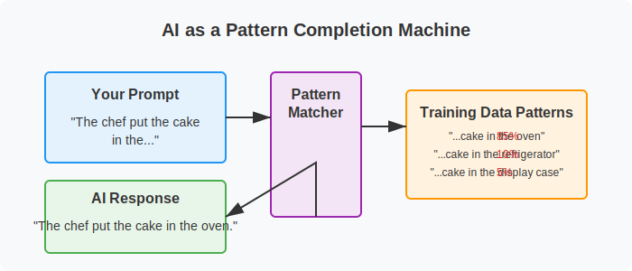

# Chapter 1: Actual Intelligence - The Human Side of AI

Welcome to the first chapter of "Actual Intelligence," where we'll establish the fundamental principle that will guide our entire journey: AI is merely a tool, and the real intelligence—the "Actual Intelligence"—comes from you, the human using it.

In a world increasingly filled with headlines about artificial intelligence, it's easy to feel intimidated or even threatened by these seemingly magical technologies. But the truth is both simpler and more empowering: these tools are powerful extensions of human capabilities, not replacements for human intelligence.

In this chapter, we'll explore the relationship between human intelligence and AI tools like ChatGPT, helping you understand both in non-technical terms. We'll clarify what these tools can and cannot do, dispel common misconceptions, and establish a framework for thinking about the human-AI partnership that puts you firmly in control.

Most importantly, we'll introduce practical activities that help you take the driver's seat in your AI interactions from day one. These hands-on exercises will demonstrate how your direction, judgment, and creativity remain essential when working with AI tools.

By the end of this chapter, you'll have a clear understanding of what we mean by "Actual Intelligence" and why your role as the human director of AI tools is so crucial to getting valuable results. You'll also have experienced firsthand how the quality of your direction directly impacts the usefulness of AI outputs.

Let's begin our journey toward becoming confident, effective directors of these powerful tools, rather than passive consumers of whatever they produce.

---

# What is "Actual Intelligence"? (The Human-AI Partnership)

In a world increasingly dominated by artificial intelligence, we often find ourselves wondering about our place alongside these powerful tools. The term "Actual Intelligence" might seem like yet another AI buzzword, but it represents something far more important: the unique and irreplaceable human intelligence that gives AI its purpose and direction.

**Actual Intelligence** is what happens when human wisdom, creativity, and judgment combine with AI capabilities to solve real problems. It's not about the tool—it's about how you use it.

Imagine a master carpenter with a collection of sophisticated power tools. The tools themselves, regardless of how advanced they are, cannot decide what to build or why it matters. They cannot determine if a table should be round or rectangular based on a family's specific needs. They cannot feel satisfaction when the finished piece brings joy to its new owners. This decision-making, purpose-finding, and meaning-creating ability is the domain of human intelligence—the actual intelligence that drives the entire process.

In the same way, AI tools like ChatGPT are incredibly sophisticated instruments that can process language, generate content, and help with various tasks—but they fundamentally lack the human spark that gives those tasks meaning and direction.

## The Partnership Model

Rather than thinking of AI as a replacement for human thinking, we invite you to consider a different model: the human-AI partnership. In this relationship:

- **You** provide the goals, values, creativity, and judgment
- **AI** provides computational power, information access, and task assistance

This partnership model places you—the human—firmly in the driver's seat. You are not just a passive user of AI but its director and purpose-giver. You are the intelligence that matters most.

Throughout this book, we'll refer to this partnership as "Actual Intelligence"—the powerful combination of human wisdom and AI capabilities working together to achieve goals that matter to you.

## Why This Distinction Matters

Understanding this relationship is not just a philosophical exercise—it has practical implications for how effectively you'll use AI tools:

1. It empowers you to take an active role rather than a passive one
2. It helps you set realistic expectations about what AI can and cannot do
3. It encourages you to develop the skills that remain uniquely human
4. It helps you maintain ownership of your work and ideas

As AI tools become increasingly embedded in our daily lives, those who understand how to direct them effectively—those who exercise their Actual Intelligence—will have an undeniable advantage.

## The Human Element

Consider Lisa, a middle school science teacher preparing lessons on climate change. She could simply ask ChatGPT to "create a climate change lesson for 7th graders" and use whatever it generates. That would be using AI as a replacement for her own thinking.

Instead, Lisa applies her Actual Intelligence. She knows her specific students—their knowledge levels, interests, and the local environmental issues they see every day. She understands which concepts they've struggled with in past lessons. She has educational goals beyond just conveying information—she wants to inspire curiosity and environmental stewardship.

With this human context that no AI could fully grasp, Lisa directs ChatGPT to create specific components that fit her vision: "Help me create an interactive demonstration that shows how greenhouse gases work, suitable for 7th graders who have already learned about the water cycle but struggle with abstract concepts."

The resulting lesson is far more effective because it combines Lisa's deep understanding of her students with the AI's ability to generate creative teaching ideas. That's Actual Intelligence at work—the human remains central to the process while leveraging AI as a powerful tool.

In the chapters ahead, we'll show you how to develop this partnership approach with AI tools, starting with the fundamentals and building to more advanced applications. But first, let's further explore the relationship between AI tools and human intelligence to set a solid foundation for our journey.

---

# AI Tools vs. Human Intelligence: Understanding the Relationship

To use AI tools effectively, it's helpful to understand both their remarkable capabilities and their fundamental limitations. Let's explore what makes human intelligence different from artificial intelligence and why that difference creates such a powerful partnership when the two work together.

## What Makes Human Intelligence Unique

Human intelligence has several qualities that current AI systems simply don't possess, despite their impressive capabilities:

### Purpose and Meaning

Humans naturally seek and create meaning. We ask "why" questions, set goals based on our values, and derive satisfaction from achieving things that matter to us. We care about the purpose behind an activity, not just its execution.

AI systems, by contrast, have no intrinsic purposes or desires. They don't "want" anything—they simply process inputs and generate outputs according to their programming. Any sense of purpose must come from the humans using them.

### Contextual Understanding

Humans possess a rich understanding of the world built through lived experience. We understand the physical reality of objects, the emotional reality of relationships, and the practical reality of how things work in daily life—not just as abstract concepts but as deeply felt, personal knowledge.

AI systems like ChatGPT have been trained on vast amounts of text that describe the world, but they haven't experienced it directly. They can simulate understanding but lack the grounding that comes from living in the physical world and navigating human society.

### Creativity and Intuition

Human creativity often involves making unexpected connections, being inspired by seemingly unrelated ideas, or having sudden insights that can't be fully explained. Our intuition allows us to make judgment calls based on subtle cues and years of experience.

While AI can recombine existing ideas in impressive ways, it doesn't have the spark of genuine inspiration or the intuitive sense that allows humans to make leaps beyond what's explicitly known.

### Ethical Judgment

Humans can make complex ethical judgments, weighing values that sometimes conflict, considering the welfare of others, and making decisions in ambiguous situations. We can assess not just what is possible but what is right or appropriate.

AI systems can be programmed with rules and guidelines, but they don't truly understand ethics or possess values of their own. They can simulate ethical reasoning based on patterns in their training data, but the ultimate ethical judgment must come from humans.

## What AI Tools Do Well

While AI lacks these uniquely human capacities, it excels in other areas that complement human intelligence beautifully:

### Information Processing

AI can process and synthesize enormous amounts of information far beyond what a human could handle. It can quickly generate summaries, find patterns, and make connections across vast datasets.

### Consistent Output

AI doesn't get tired, distracted, or emotional. It can produce consistent results without the natural fluctuations in performance that humans experience.

### Rapid Idea Generation

AI can quickly produce multiple options, drafts, or approaches to a problem, providing humans with a broader range of possibilities to consider than they might generate alone.

### Learning from Patterns

AI systems excel at identifying patterns in data and can help humans recognize trends or connections they might otherwise miss.

## The Complementary Relationship

These differences between human and artificial intelligence aren't a weakness—they're the foundation of a powerful partnership. Think of AI as extending specific aspects of your cognitive abilities, similar to how:

- A telescope extends your vision to see distant stars
- A calculator extends your ability to perform mathematical operations
- A book extends your memory by storing information

Each of these tools enhances specific human capabilities without replacing the human. The telescope doesn't decide where to look—you do. The calculator doesn't determine which problem needs solving—you do. The book doesn't interpret the meaning of its information—you do.

In the same way, AI extends certain cognitive capabilities without replacing the uniquely human elements of intelligence.

## The Director and the Assistant

A helpful metaphor for understanding this relationship is to think of yourself as a film director and AI as your assistant.

As the director, you:
- Determine the vision and purpose of the project
- Make creative and ethical decisions
- Evaluate quality based on your taste and judgment
- Take ultimate responsibility for the final product

The AI assistant:
- Helps execute specific tasks
- Offers options based on your direction
- Provides information and suggestions
- Works tirelessly on the details you specify

Without the director, the assistant would have no purpose or direction. Without the assistant, the director would have to handle every small detail alone.

Together, they can create something better than either could produce independently. This is the essence of Actual Intelligence—the powerful combination of human direction and AI assistance.

## Bringing It Together

Consider Marcus, a small business owner planning to open a second location for his bakery. He could simply ask AI, "Where should I open my second bakery location?" But the AI has no knowledge of his specific business, customer base, financial situation, or personal goals.

Instead, Marcus applies his Actual Intelligence. He knows his business intimately—what makes his current location successful, what his customers value most, and his long-term vision. He also understands his financial constraints and how much risk he's willing to take.

Marcus directs the AI with specific questions that leverage its strengths while applying his unique knowledge:

- "What demographic data should I analyze when selecting a new bakery location?"
- "Help me create a checklist for evaluating potential retail spaces for a bakery."
- "What are typical challenges bakeries face when opening a second location?"

The AI provides valuable information and frameworks, but Marcus makes the final decision based on factors only he can fully understand—his appetite for risk, his intuition about different neighborhoods, and his vision for his brand.

In the coming chapters, we'll show you how to develop this director-assistant relationship with AI, starting with understanding how these tools actually work (in non-technical terms) and then building practical skills for directing them effectively.

---

# How Modern AI Tools Work (Simplified for Non-Technical Readers)

To effectively direct AI tools, you don't need to understand all the technical details of how they work—just as you don't need to know exactly how a car engine functions to drive effectively. However, having a basic conceptual understanding will help you develop realistic expectations and use these tools more skillfully.

Let's explore how modern AI tools like ChatGPT work, using simple analogies that highlight both their capabilities and limitations.

## The Pattern Completion Machine

At its core, an AI like ChatGPT is a sophisticated pattern completion machine. It has been trained on enormous amounts of text from books, articles, websites, and other sources. During this training, it learned to recognize patterns in how words and ideas typically follow one another.

When you give it a prompt, it looks for patterns similar to ones it has seen before and generates a response that continues those patterns in a way that seems sensible.

Imagine ChatGPT as a musician who has listened to thousands of songs but doesn't actually understand music theory. When you hum a few notes, the musician can continue the melody based on similar patterns they've heard before. They're not composing something truly original—they're drawing on all the music they've absorbed to continue the pattern you started.

## The Echo Chamber of Human Knowledge

Another helpful way to think about these AI tools is as an echo chamber of human knowledge. They can only reflect back information and patterns that already exist in the data they were trained on.

If you ask ChatGPT about the French Revolution, it can provide information because many human writers have written about this topic, and those writings were part of its training data. But if you ask about a completely fictional historical event that no one has written about, it can't provide accurate information because that pattern doesn't exist in its training data.

This means AI tools:
- Can reflect existing human knowledge and writing patterns
- Cannot generate truly novel discoveries or insights that aren't derived from existing knowledge
- May confidently present information that seems plausible but is actually incorrect

## Text Prediction, Not Understanding

Despite its impressive ability to generate human-like text, ChatGPT doesn't actually "understand" the meaning of words the way humans do. It predicts which words are likely to follow each other based on statistical patterns, not based on connecting those words to real-world experiences or deeper concepts.

Think of it like someone who has memorized a cookbook in a foreign language without understanding what the words mean. They might be able to recite recipes perfectly and even make reasonable substitutions based on patterns they've observed, but they've never tasted the food, felt the texture of the ingredients, or understood why certain techniques are used.

This limitation explains why AI often struggles with:
- Common sense reasoning
- Understanding the physical world
- Grasping cause and effect
- Distinguishing between plausible-sounding nonsense and actual truth

## The Probability Generator

When ChatGPT generates text, it's essentially making a series of word choices based on probability. For each position in a sentence, it calculates which word is most likely to come next, given the preceding words and the overall context.

Imagine a game where you start a sentence, and someone has to guess what word comes next:

"The chef put the cake in the..."

Most people would guess "oven" because that's the most probable word to follow in this context. AI systems do something similar, but with a much more sophisticated understanding of language patterns and a much larger vocabulary of possible words to choose from.

This probabilistic approach means that:
- ChatGPT doesn't have a fixed set of responses—it generates new text each time
- Responses can vary even to identical prompts
- The AI doesn't "decide" what to say based on reasoning—it selects words based on probability

## Limitations by Design

Modern AI tools also have intentional limitations built into them by their creators. Companies like OpenAI have implemented safety measures that prevent their AI from generating certain types of harmful content, even if the patterns for that content exist in the training data.

These guardrails are an important part of responsible AI development, but they also mean that the AI is not simply a neutral pattern-matcher—it has been designed to avoid certain topics and favor others.

## What This Means for You

Understanding these basics about how AI works helps explain both its impressive capabilities and its surprising limitations:

1. **It can generate human-like text** because it has learned patterns from vast amounts of human writing

2. **It can provide information on many topics** because it has been trained on diverse texts

3. **It struggles with factual accuracy** because it's predicting plausible text, not verifying truth

4. **It can't truly reason or understand** because it's matching patterns, not comprehending meaning

5. **It doesn't have experiences or goals** because it's a text prediction system, not a conscious entity

These characteristics make AI tools incredibly useful for certain tasks but also highlight why human direction and judgment—your Actual Intelligence—remains essential.

## The Assistant, Not the Expert

Given these limitations, it's helpful to think of AI tools as assistants rather than experts or authorities. They can help you brainstorm, draft content, summarize information, and explore ideas, but you should always apply your own judgment to their output.

Remember Jake, who's planning a family vacation to Japan. If he simply asks ChatGPT "Plan my perfect Japan trip" and follows whatever itinerary it generates, he might end up with a generic tourist experience that doesn't match his family's interests or visit attractions that are closed for renovation.

Instead, Jake uses his understanding of AI limitations to direct the tool more effectively. He knows that:
- The AI's information might be outdated
- It doesn't know his family's specific preferences
- It can't verify if suggested accommodations are actually available

So he uses AI as an assistant for specific tasks where pattern matching is helpful—generating ideas for kid-friendly activities in Tokyo, suggesting phrasing for basic Japanese phrases, or creating a packing checklist—while handling the critical judgment calls himself and verifying key information through other sources.

In the next section, we'll explore how to take control of this human-AI partnership to get the most value from these powerful but limited tools.

---

# The Power of Human Direction: You Are the Intelligence

Now that we understand the relationship between AI tools and human intelligence, let's focus on the most critical element of this partnership: your role as the director. The true power of AI tools emerges only when guided by human intelligence, purpose, and judgment—and developing these direction skills is what this book is all about.

## The Director's Mindset

When working with AI tools like ChatGPT, adopting a "director's mindset" can transform your results. This means approaching the interaction with clear intention, maintaining control of the process, and taking responsibility for the outcome.

Just as a film director doesn't simply tell actors "make a good scene" and hope for the best, you shouldn't approach AI with vague requests and passive acceptance of whatever it produces. The director's mindset involves:

### 1. Clarity of Purpose

Before engaging with AI, get clear on what you're trying to accomplish. Ask yourself:
- What specific problem am I trying to solve?
- What would a successful outcome look like?
- What constraints or requirements should I keep in mind?

This clarity helps you give more effective directions and evaluate the AI's responses more critically.

### 2. Specificity in Direction

Vague prompts lead to generic responses. The more specific your direction, the more useful the AI's assistance will be. Compare these approaches:

**Vague direction:** "Give me some marketing ideas."

**Specific direction:** "I run a local organic farm stand targeting health-conscious families. Suggest five low-budget marketing approaches that would help us emphasize our sustainable farming practices and community roots."

The specific direction is much more likely to yield useful results because it provides context and constraints that help the AI generate relevant responses.

### 3. Iterative Refinement

Working with AI is rarely a one-and-done process. The best results often come through multiple rounds of direction, feedback, and refinement—just as a director might work with actors through multiple takes of a scene.

Don't settle for the first response if it doesn't quite meet your needs. Instead, provide feedback and additional direction to guide the AI toward more useful outputs.

### 4. Critical Evaluation

Approach AI-generated content with a healthy skepticism. Ask yourself:
- Does this information seem accurate and reliable?
- Is this the right approach for my specific situation?
- Does this align with my values and objectives?

Remember that you are the ultimate judge of quality and appropriateness. The AI is there to assist you, not make final decisions.

## Your Unique Contributions

As the human director of AI tools, you bring several irreplaceable elements to the partnership:

### Personal Knowledge and Context

You have specific knowledge about your situation that no AI could possibly know—your personal history, the nuances of your relationships, the specific culture of your workplace, your private goals and constraints. This contextual knowledge is essential for adapting generic AI suggestions to your unique circumstances.

### Values and Priorities

You know what matters to you, which trade-offs you're willing to make, and where your boundaries lie. These values and priorities should guide how you evaluate and use AI-generated content.

### Creative Vision

You have the ability to envision possibilities beyond what currently exists—to imagine a better future and work toward it. This creative vision gives purpose and direction to your use of AI tools.

### Real-World Validation

You can test ideas in the real world, gather feedback, and observe results. This ability to validate and refine based on real outcomes is something AI cannot do on its own.

## The Amplification Effect

When you combine human direction with AI capabilities, something remarkable happens: both are amplified beyond what either could achieve alone. This is the essence of Actual Intelligence.

- Your creativity is amplified by the AI's ability to quickly generate variations and alternatives
- Your knowledge is amplified by the AI's ability to provide information and perspectives you might not have considered
- Your productivity is amplified by the AI's ability to handle routine aspects of tasks, freeing you to focus on higher-level thinking

Sarah, a high school English teacher, experiences this amplification when planning her curriculum. She could spend hours searching for relevant reading materials, drafting discussion questions, and creating assignments. Instead, she directs ChatGPT with her specific educational goals and knowledge of her students:

"I need to design a unit on 'identity' for my 10th grade English class. Many of my students are first-generation Americans who often discuss the challenges of navigating between cultures. Suggest contemporary short stories from diverse authors that explore identity formation, and for each story, outline potential discussion questions that connect to the immigrant experience."

With this direction, ChatGPT can quickly generate suggestions that Sarah then evaluates based on her professional judgment, knowledge of her specific students, and curriculum requirements. She might accept some suggestions, modify others, and reject those that don't fit her vision.

The result is a curriculum that reflects Sarah's expertise and understanding of her students, but was developed more efficiently and with a broader range of perspectives than she might have managed working entirely on her own. That's Actual Intelligence at work.

## Taking Control of the Process

To fully embrace your role as the director of AI tools, consider this general approach:

1. **Define your objective** clearly before engaging with the AI

2. **Provide context and constraints** that help the AI understand your specific situation

3. **Start with specific questions or requests** rather than open-ended prompts

4. **Evaluate responses critically**, looking for both useful elements and potential issues

5. **Provide feedback and refinement** to guide the AI toward more helpful responses

6. **Integrate multiple sources**, not relying solely on AI-generated content

7. **Make the final decisions** based on your judgment, values, and knowledge

This approach puts you firmly in control of the process while still leveraging the AI's capabilities to enhance your thinking and productivity.

In the coming chapters, we'll develop these direction skills further, providing specific techniques and examples for various contexts. But first, let's address an important question: what exactly can you expect from these AI tools, and what limitations should you keep in mind?

---

# Setting Realistic Expectations: What AI Can and Cannot Do

One of the biggest challenges in working effectively with AI tools is setting realistic expectations. Media hype often presents AI as either magical thinking machines or imminent threats to humanity—neither of which accurately reflects the reality of current tools like ChatGPT.

Let's establish a balanced understanding of what these tools can and cannot do to help you use them more effectively.

## What AI Tools Can Do Well

### Generate Human-Like Text

AI excels at producing various types of written content—from creative writing to technical explanations, from casual conversation to formal documents. It can adapt its tone, style, and complexity level based on your direction.

### Process and Summarize Information

AI can take large amounts of information and distill it into summaries, key points, or structured formats that are easier to understand and use.

### Brainstorm Ideas and Alternatives

AI can quickly generate multiple options, perspectives, or approaches to a problem, helping you explore possibilities you might not have considered on your own.

### Draft and Edit Content

AI can create initial drafts of many types of content and help improve existing text by suggesting edits, reorganization, or alternative phrasing.

### Explain Concepts at Various Levels

AI can explain complex topics in simpler terms or provide more detailed explanations of basic concepts, adapting to different knowledge levels and learning needs.

### Simulate Conversations and Perspectives

AI can role-play different viewpoints or expertise areas, allowing you to explore how different people might approach a situation.

## What AI Tools Cannot Do Well

### Verify Factual Accuracy

AI language models don't have the ability to independently verify facts. They can confidently present incorrect information (sometimes called "hallucinations") that sounds plausible but is actually wrong.

### Provide Up-to-Date Information

AI training data has a cutoff date, after which the model has no knowledge of world events, new products, or recent developments unless specifically updated.

### Access Your Personal Information

AI doesn't know who you are, your personal history, or your specific circumstances unless you explicitly share this information in your conversation.

### Perform Actions in the Real World

AI language models can't directly access the internet, run programs, or interact with other systems unless specifically integrated with those capabilities.

### Exercise True Judgment or Wisdom

AI can simulate advice or opinions, but lacks the lived experience, moral grounding, and contextual understanding needed for true wisdom or judgment.

### Create Truly Original Ideas

While AI can recombine existing concepts in new ways, it doesn't generate truly novel ideas disconnected from its training data.

## Common Misconceptions

Let's address some frequent misconceptions about AI tools that can lead to unrealistic expectations:

### Misconception: "AI knows everything"

**Reality:** AI only knows what was in its training data, and that knowledge is neither comprehensive nor always accurate. It can present incorrect information with high confidence.

### Misconception: "AI is objective and unbiased"

**Reality:** AI reflects the biases present in its training data and those introduced by its creators. It does not have a neutral or objective viewpoint.

### Misconception: "AI understands what it's saying"

**Reality:** AI generates text without genuine comprehension. It doesn't understand concepts the way humans do—it predicts patterns in language without connecting them to real-world meaning.

### Misconception: "AI has opinions or beliefs"

**Reality:** AI simulates opinions based on patterns in its training data but doesn't actually hold beliefs or convictions.

### Misconception: "AI is always improving itself"

**Reality:** Most AI tools don't learn from your interactions unless specifically designed to do so. Your conversations typically don't make the AI smarter or more personalized to you over time.

## Finding the Sweet Spot

Understanding these capabilities and limitations helps you find the "sweet spot" for using AI tools effectively—the zone where you leverage their strengths while compensating for their weaknesses with your human judgment.

Consider Maria, who's starting a new fitness routine. She might use ChatGPT to:

- Generate workout options suitable for beginners (leveraging AI's ability to create structured content)
- Explain unfamiliar exercise terminology (using AI's explanatory capabilities)
- Brainstorm strategies for staying motivated (tapping into AI's idea generation)

But she would not:
- Rely on AI for personalized medical advice (recognizing AI's lack of medical expertise and knowledge of her specific health conditions)
- Assume exercise information is up-to-date with the latest research (knowing AI has a knowledge cutoff date)
- Take AI's suggestions as the final word on what's right for her body (applying her own judgment and listening to her physical responses)

This balanced approach allows Maria to benefit from AI assistance while maintaining appropriate caution about its limitations.

## The Verification Principle

A helpful guideline when using AI tools is what we might call the "verification principle": the importance of an AI-generated response should be proportional to your verification efforts.

In other words:
- For low-stakes brainstorming or first drafts, you might accept AI output with minimal verification
- For moderate-stakes content, you should review AI suggestions carefully and make your own judgments
- For high-stakes decisions or factual claims, you should independently verify information through reliable sources

This principle helps you use AI efficiently while managing the risks associated with its limitations.

## The Complementary Mindset

Perhaps the most productive way to think about AI tools is as complementary to your own abilities—neither magical solutions to all problems nor useless toys, but specific tools with particular strengths and weaknesses.

Just as you wouldn't use a hammer for every household task, you shouldn't expect AI to be the right tool for every situation. The key is understanding when and how to use it effectively, and when to rely on other approaches.

In the next section, we'll put these ideas into practice with activities designed to help you take control of your first AI interactions and develop your skills as an AI director.

---

# Activities: Taking Control of Your First AI Interactions

Now that we've established the foundation of Actual Intelligence—the powerful partnership between your human judgment and AI capabilities—let's put these concepts into practice with hands-on activities. These exercises are designed to help you develop your skills as an AI director while experiencing firsthand the importance of your role in guiding these tools.

---

## Activity 1: The Director's Chair

**Objective:** Experience how the specificity of your direction affects AI output.

**What You'll Need:**
- Access to ChatGPT (free account)
- 10-15 minutes

**Instructions:**

1. Open ChatGPT and start a new conversation.

2. First, give a vague prompt and observe the response:
   
   *"Give me some advice."*

3. Now, try a slightly more specific prompt:
   
   *"Give me some advice about learning new skills."*

4. Finally, provide a highly specific prompt with context, constraints, and your goal:
   
   *"I'm a busy parent with two young children trying to learn basic Spanish in preparation for a family trip to Mexico in three months. I can only practice for about 15 minutes each day, usually while commuting on public transportation. Give me a realistic learning plan that fits these constraints and focuses on practical travel phrases."*

5. Compare the three responses. Notice how the quality and usefulness of the AI's output directly corresponds to the specificity of your direction.

**Reflection Questions:**

- Which response was most useful to you, and why?
- What specific elements of your detailed prompt led to improvements in the AI's response?
- How might you apply this principle of specificity to your own goals when using AI?

---

## Activity 2: Intelligence Amplifier

**Objective:** Use AI as a thinking partner to amplify your own intelligence on a personal challenge.

**What You'll Need:**
- Access to ChatGPT
- A real problem or challenge you're currently facing
- 15-20 minutes

**Instructions:**

1. Identify a current challenge in your life that requires some thinking or planning. This could be a decision you need to make, a project you're planning, or a problem you're trying to solve. Choose something real but not extremely personal or sensitive.

2. Before consulting AI, spend 3-5 minutes writing down your own thoughts about the challenge:
   - What makes this challenging?
   - What approaches have you considered?
   - What constraints or considerations are important?

3. Now, craft a prompt that asks the AI to help you think through this challenge. Include:
   - A brief description of the situation
   - Your current thoughts and approaches
   - What specific type of help you want (brainstorming, organizing your thoughts, considering perspectives you might have missed, etc.)

4. Review the AI's response and identify at least one insight or idea you hadn't fully considered.

5. Follow up with at least one clarifying question or request based on the AI's response.

**Reflection Questions:**

- How did the AI's response compare to your initial thinking?
- Did the AI help you see the problem from new angles?
- How did your specific knowledge of the situation help you evaluate the AI's suggestions?
- What role did you play versus what role did the AI play in this thinking partnership?

---

## Activity 3: Myth vs. Reality

**Objective:** Test the limitations of AI to better understand where human intelligence remains essential.

**What You'll Need:**
- Access to ChatGPT
- Access to reliable information sources (websites, books, experts)
- 20-30 minutes

**Instructions:**

1. Choose a topic you know well—perhaps related to your profession, a hobby, or your local community.

2. Ask ChatGPT a series of increasingly specific questions about this topic, starting with general questions and moving toward highly specific ones that might require very recent or specialized knowledge.

3. Note which questions the AI answers accurately and which ones it struggles with or provides incorrect information for.

4. For at least one question where the AI provided incorrect or incomplete information, verify the correct information through reliable sources.

5. Ask the AI to explain its limitations regarding this topic. A prompt like this works well: 
   
   *"What limitations might you have in providing information about [your topic]? What aspects of this subject would be difficult for you to address accurately?"*

**Reflection Questions:**

- At what point did the AI's knowledge or accuracy begin to break down?
- What types of questions seemed most challenging for the AI?
- How transparent was the AI about its limitations?
- How would you approach using AI for this topic in the future, knowing these limitations?

---

## Activity 4: Creative Control

**Objective:** Practice maintaining ownership of a creative project while using AI as an assistant.

**What You'll Need:**
- Access to ChatGPT
- 20-30 minutes

**Instructions:**

1. Choose a simple creative project from the options below (or create your own):
   - Write a short story (300-500 words)
   - Plan a themed dinner party
   - Design a flyer for a community event
   - Create a workout routine

2. Begin by defining your vision for the project. Write down:
   - The main goal or purpose
   - Key elements you want to include
   - Your personal style or preferences
   - Any constraints or requirements

3. Create a series of specific requests for ChatGPT that will help you with different aspects of your project. Instead of asking it to complete the entire project, break it down into components where AI assistance would be helpful. For example, if writing a short story:
   - "Suggest three possible opening paragraphs for a story about..."
   - "Help me develop the main character who is..."
   - "Provide some descriptive language for the setting of..."

4. For each AI response, select elements you like, modify others, and discard those that don't fit your vision.

5. Assemble the final project yourself, integrating AI-assisted elements with your own contributions.

**Reflection Questions:**

- How did breaking the project into specific requests help you maintain creative control?
- Which parts of the process benefited most from AI assistance?
- Which aspects required your human judgment and creativity?
- How does the final result reflect your vision and style, despite using AI assistance?

---

## Activity 5: Setting Your AI Compass

**Objective:** Develop personal guidelines for how you want to use AI in your life.

**What You'll Need:**
- Access to ChatGPT
- Paper and pen, or digital document
- 15-20 minutes

**Instructions:**

1. Reflect on your values, goals, and the areas of your life where you think AI tools might be helpful. Consider:
   - What types of tasks do you find draining or time-consuming?
   - What skills would you like to develop, with AI as a learning aid?
   - What aspects of your thinking or work would you never want to outsource?

2. Ask ChatGPT for assistance in thinking through these questions with a prompt like:
   
   *"I'm developing personal guidelines for how I want to use AI tools like you in my life. Can you help me think through some questions to consider about where AI might be most helpful to me and where I might want to be cautious about using it? Consider aspects like learning, creativity, critical thinking, and practical tasks."*

3. Based on the AI's suggestions and your own reflection, draft 3-5 personal guidelines for your AI use. These might include:
   - Types of tasks you'll use AI for
   - Boundaries you'll maintain
   - How you'll verify or evaluate AI-generated content
   - When you'll rely on purely human approaches

4. Share your draft guidelines with ChatGPT and ask for feedback: 
   
   *"Here are my draft guidelines for using AI. Can you suggest any considerations I might have overlooked or ways to make these guidelines more practical?"*

5. Finalize your guidelines based on this feedback, keeping what resonates and discarding what doesn't fit your values and needs.

**Reflection Questions:**

- What did you learn about your own priorities through this exercise?
- Were there any suggestions from the AI that surprised you or made you reconsider your approach?
- How might these guidelines evolve as you gain more experience with AI tools?
- How do these guidelines reflect your understanding of Actual Intelligence as a human-AI partnership?

---

## Conclusion

These activities provide a starting point for developing your skills as an AI director—someone who effectively combines human judgment with AI capabilities. As you practice, you'll become more adept at providing clear direction, evaluating AI responses critically, and maintaining ownership of your goals and processes.

Remember that the concept of Actual Intelligence emphasizes that you—the human—are the essential intelligence in this partnership. The AI is a tool that amplifies your thinking, but the direction, purpose, and wisdom come from you.

In the chapters ahead, we'll build on these foundations by exploring more specific applications and advanced techniques for using AI tools effectively in various aspects of your life.

# Chapter 1: Actual Intelligence - The Human Side of AI

## Table of Contents

- [Introduction](00-introduction.md)
- [What is "Actual Intelligence"?](01-what-is-actual-intelligence.md)
- [AI Tools vs. Human Intelligence](02-ai-tools-vs-human-intelligence.md)
- [How Modern AI Tools Work](03-how-modern-ai-tools-work.md)
- [The Power of Human Direction](04-power-of-human-direction.md)
- [Setting Realistic Expectations](05-setting-realistic-expectations.md)
- [Activities: Taking Control of Your First AI Interactions](06-activities.md)

---

