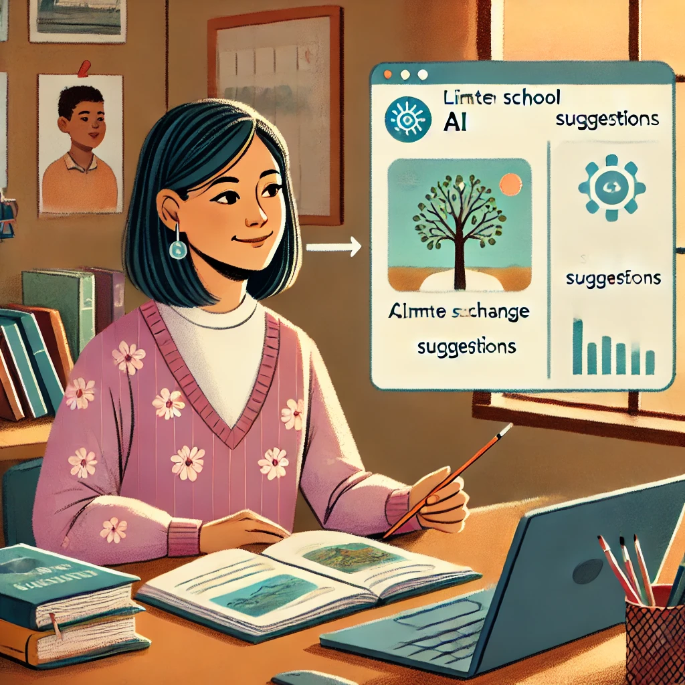
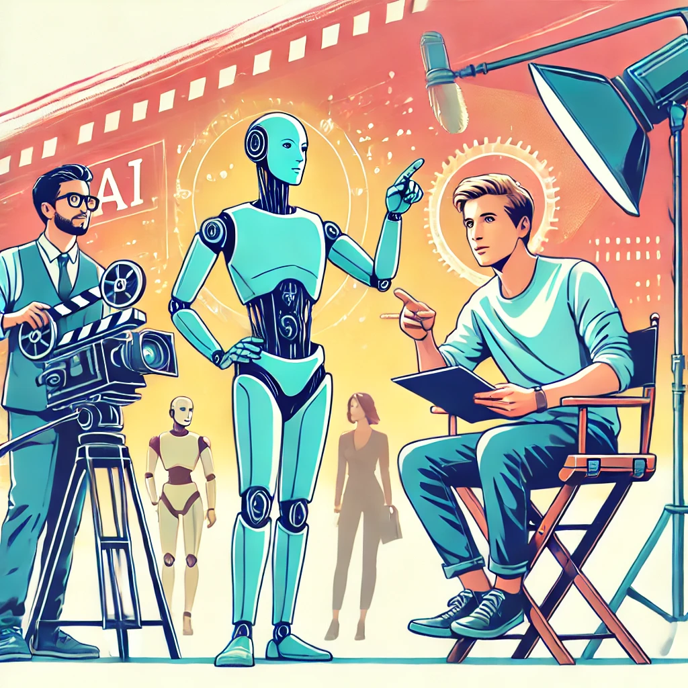

# Chapter 1: Actual Intelligence - The Human Side of AI

Have you ever watched someone use a new technology and make it look effortless, only to feel lost when you try it yourself? Or perhaps you've heard about ChatGPT and other AI tools in the news but haven't tried them yet, unsure if they're too complicated or technical for you?

You're not alone. Many people find these technologies intimidating or aren't sure where to start. The good news is that you don't need to be a tech expert to use these tools effectively. In fact, the most important skills you'll need are ones you already have—curiosity, judgment, and your own unique perspective on what matters.

That's what this book is all about: showing you how to pair your human wisdom with AI tools to accomplish things that matter to you. We call this partnership "Actual Intelligence," and it puts you—not the technology—at the center of the experience.

## Quick Self-Reflection

Before we dive in, take a moment to jot down your answers to these questions:

* What's one task in your daily life or work that feels repetitive or time-consuming?
* What's one topic you've been curious about but haven't had time to explore deeply?
* What's one creative project you've wanted to try but haven't gotten around to?

Keep these answers handy—they'll help us personalize your first AI experiences as we move through this chapter.

In the pages ahead, we'll establish a simple framework for thinking about AI tools, demonstrate how easily you can start using them (no technical knowledge required!), and show you why your direction and judgment are the critical ingredients for getting valuable results.

Let's begin our journey toward becoming confident, effective directors of these powerful tools—starting from the very first interaction.

---

# What is "Actual Intelligence"? (The Human-AI Partnership)

## Your First AI Conversation: A Guided Tour

Let's start with something simple. No technical skills required—just the ability to type a sentence.

1. Open ChatGPT (we'll show you exactly how in the next chapter)
2. Type exactly this: "Hi, I'm new to ChatGPT. Can you explain what you can help me with in simple terms?"
3. Press Enter and read the response

That's it! You've just had your first AI conversation. 

Notice how the AI introduces itself and explains its capabilities. This isn't a pre-recorded message—the AI is generating this response specifically for you. In the coming chapters, you'll learn how to make these conversations increasingly useful for your specific needs.

Maria, a small business owner with no technical background, described her first experience: "I was honestly expecting it to be complicated—like I'd need to learn special commands or something. But it was just like texting. I asked how to write a better email newsletter, and within seconds I had ideas I could actually use. No technical jargon, no complicated setup."

## Understanding the Human-AI Partnership

Think of AI tools like kitchen appliances. A stand mixer can do the hard work of mixing dough, but it doesn't decide what recipe to make or know when the consistency is just right—that's your job. The mixer is very good at its specific task, but you're the one with the taste buds, the creativity to modify recipes, and the knowledge of whether you're baking for someone with dietary restrictions.

**Actual Intelligence** is this partnership between your human judgment and AI's capabilities. It's what happens when your wisdom, creativity, and purpose combine with AI's ability to process information and generate content.

Think about the last time you used a powerful tool to solve a problem. Maybe it was a food processor that cut your prep time in half, or mapping software that helped you navigate an unfamiliar city. The tool was invaluable, but you were the one who decided what to cook or where to go. That's exactly your relationship with AI—you're not just pushing buttons, you're the creative director calling the shots.

### The Partnership Model

Rather than thinking of AI as some magical entity with a mind of its own, consider this simple relationship:

- **You** provide the goals, values, creativity, and judgment
- **AI** provides computational power, information access, and task assistance

Why does this relationship matter so much? Because understanding it transforms how you'll use these tools every single day.

When you recognize that you're the director and AI is your assistant, you naturally take charge of the process instead of passively accepting whatever the AI produces. You develop clearer expectations about what these tools can (and can't) do for you. You focus on strengthening the uniquely human skills that AI can't replicate. And perhaps most importantly, you maintain ownership of your work and ideas.

Isn't that a more empowering way to approach these tools?

### The Human Element in Action

Let's see this partnership in action through a real example.

Lisa, a middle school science teacher with no previous AI experience, wanted to create a lesson on climate change. She could have simply asked ChatGPT to "create a climate change lesson for 7th graders" and used whatever it generated—but that would have ignored her unique knowledge of her students.

Instead, Lisa applied her human judgment. She knew her specific students—their knowledge levels, interests, and the local environmental issues they see every day. She understood which concepts they'd struggled with in past lessons.

With this context that no AI could possess, Lisa directed ChatGPT with a more specific request: "Help me create an interactive demonstration that shows how greenhouse gases work, suitable for 7th graders who have already learned about the water cycle but struggle with abstract concepts."

The resulting lesson was far more effective because it combined Lisa's understanding of her students with the AI's ability to generate creative teaching ideas. That's Actual Intelligence at work—you remain central to the process while leveraging AI as a powerful tool.

## Creating Your First Personalized Prompt

Now it's your turn. Let's create a prompt that's specifically relevant to you. Fill in the blanks below:

"I work as a _____________ and one challenge I often face is _____________. Could you suggest three ways I might approach this problem?"

For example:
* "I work as a retail manager and one challenge I often face is scheduling staff efficiently. Could you suggest three ways I might approach this problem?"
* "I work as a parent and one challenge I often face is finding educational activities for rainy days. Could you suggest three ways I might approach this problem?"

In the next sections, we'll explore what makes human intelligence unique and how it complements AI capabilities. But remember, you don't need to understand all the technical details to start using these tools effectively today.

---

# AI Tools vs. Human Intelligence: Understanding the Relationship

You might be wondering: "Do I need to learn coding or computer science to use these AI tools effectively?"

The simple answer is no. Using AI tools like ChatGPT requires no more technical skill than using a search engine or sending a text message. If you can type a question, you can use AI.

What matters far more than technical knowledge is your ability to:
* Ask clear questions about topics that matter to you
* Evaluate whether the answers make sense for your situation
* Follow up when you need more details or a different approach

These are human skills you've been developing your entire life—and they're exactly what makes you the "Actual Intelligence" in the partnership.

To use AI tools effectively, it helps to understand what makes human intelligence different from artificial intelligence, and why that difference creates such a powerful partnership.

## What Makes Human Intelligence Unique

Human intelligence has several qualities that current AI systems simply don't possess, despite their impressive capabilities:

### Purpose and Meaning

Humans don't just do things—we do things for reasons. We ask "why" questions, set goals based on our values, and feel satisfaction when we accomplish something meaningful. We care deeply about the purpose behind an activity, not just getting it done.

AI systems, by contrast, have no intrinsic purposes or desires. They don't "want" anything—they simply process inputs and generate outputs. Any sense of purpose must come from the humans using them.

### Real-World Understanding

Think about your rich understanding of the world, built through lived experience. You know how it feels when you're caught in the rain without an umbrella. You understand the emotional weight of receiving unexpected good news. You grasp the subtle social dynamics of a family gathering.

AI systems like ChatGPT have been trained on vast amounts of text that describe the world, but they've never actually lived in it. They've "read" about ice cream but never tasted it. They can describe what it's like to be caught in the rain, but they've never felt that sudden cold splash or made that mad dash for cover. It's like the difference between reading a travel guide and actually visiting a place—no matter how detailed the guide, there's something essential about the experience that just can't be captured in words.

### Creativity and Intuition

Elena, a retired art teacher, was skeptical about using AI for her watercolor hobby. "I didn't see how a computer program could help with something as personal as art," she said. But when she asked ChatGPT for suggestions on painting autumn leaves with more vibrancy, she was pleasantly surprised.

"The techniques it suggested were solid fundamentals—things I might tell my own students. But I still had to apply my eye for color, my sense of composition, and my own aesthetic preferences. The AI gave me options to consider, but the creative decisions remained mine."

This illustrates another key difference: human creativity often involves making unexpected connections, being inspired by seemingly unrelated ideas, or having sudden insights that can't be fully explained. Our intuition allows us to make judgment calls based on subtle cues and years of experience.

While AI can recombine existing ideas in impressive ways, it doesn't have the spark of genuine inspiration or the intuitive sense that allows humans to make leaps beyond what's explicitly known.

## What AI Tools Do Well

These differences aren't weaknesses—they're the foundation of a powerful partnership. AI and humans are like teammates with complementary strengths.

Imagine you're researching a health condition that affects someone you love. You could spend weeks reading medical journals, trying to understand complex terminology and conflicting studies. Or you could ask an AI to summarize the current research, explain key terms, and highlight treatment options—all in minutes. This is where AI truly shines: processing vast amounts of information that would overwhelm even the most dedicated human reader.

AI excels at:

* **Information Processing**: Quickly synthesizing enormous amounts of information and finding patterns across vast datasets.

* **Consistent Output**: Working tirelessly without getting bored, distracted, or emotional.

* **Rapid Idea Generation**: Producing multiple options, drafts, or approaches to a problem in seconds.

* **Learning from Patterns**: Identifying trends and connections in data that humans might otherwise miss.

## The Director and the Assistant

A helpful way to understand this relationship is to think of yourself as a film director and AI as your assistant.

As the director, you:
* Determine the vision and purpose of the project
* Make creative and ethical decisions
* Evaluate quality based on your taste and judgment
* Take ultimate responsibility for the final product

The AI assistant:
* Helps execute specific tasks
* Offers options based on your direction
* Provides information and suggestions
* Works tirelessly on the details you specify

Without the director, the assistant would have no purpose or direction. Without the assistant, the director would have to handle every small detail alone.

So what does this look like in practice? Let's see how Marcus, a small business owner with no technical background, puts this partnership into action.

Marcus owns a successful bakery and is considering opening a second location. Instead of simply asking AI, "Where should I open my second bakery location?"—a question the AI couldn't possibly answer well without knowing his specific business—Marcus directs the AI with more specific prompts:

* "What demographic data should I analyze when selecting a new bakery location?"
* "Help me create a checklist for evaluating potential retail spaces for a bakery."
* "What are typical challenges bakeries face when opening a second location?"

Notice the pattern here—each question taps into the AI's ability to organize information while keeping Marcus firmly in the decision-making role. The AI provides valuable frameworks and information, but Marcus makes the final decision based on factors only he can fully understand—his appetite for risk, his intuition about different neighborhoods, and his vision for his brand.

In the next section, we'll explore in simple terms how these AI tools actually work, which will help you understand their capabilities and limitations without requiring any technical background.

---

# How Modern AI Tools Work (Simplified for Non-Technical Readers)

To effectively direct AI tools, you don't need to understand all the technical details—just as you don't need to know exactly how a car engine functions to drive effectively. However, having a basic conceptual understanding will help you set realistic expectations and use these tools more skillfully.

Let's explore how AI tools like ChatGPT work, using simple analogies that highlight both their capabilities and limitations.

"When I first heard about AI, I imagined something from science fiction movies—like a computer that thinks and feels," says James, a retiree who now uses ChatGPT daily to help with his genealogy hobby. "But once I started using it, I realized it's more like having a very well-read research assistant who's incredibly fast but needs careful direction."

## The Pattern Completion Machine

At its core, an AI like ChatGPT is a sophisticated pattern completion machine. Imagine you're playing a game with a friend where you start a sentence and they finish it:

You say: "The chef put the cake in the..."

Your friend almost certainly responds: "oven"

Why? Because based on all the language they've encountered throughout their life, "oven" is the most likely word to come next in this context.

ChatGPT does something similar, but on a much larger scale. It's been trained on enormous amounts of text from books, articles, websites, and other sources. During this training, it learned to recognize patterns in how words and ideas typically follow one another.

Think of it like a musician who has listened to thousands of songs but doesn't actually understand music theory. When you hum a few notes, the musician can continue the melody based on similar patterns they've heard before. They're not composing something truly original—they're drawing on all the music they've absorbed to continue the pattern you started.

## The Echo Chamber of Human Knowledge

Another helpful way to think about these AI tools is as an echo chamber of human knowledge. They can only reflect back information and patterns that already exist in the data they were trained on.

If you ask ChatGPT about the French Revolution, it can provide information because many human writers have written about this topic, and those writings were part of its training data. But if you ask about a completely fictional historical event that no one has written about, it can't provide accurate information because that pattern doesn't exist in its training data.

This means AI tools:
- Can reflect existing human knowledge and writing patterns
- Cannot generate truly novel discoveries or insights that aren't derived from existing knowledge
- May confidently present information that seems plausible but is actually incorrect

## Text Prediction, Not Understanding

Despite its impressive ability to generate human-like text, ChatGPT doesn't actually "understand" the meaning of words the way humans do. It predicts which words are likely to follow each other based on statistical patterns, not based on connecting those words to real-world experiences or deeper concepts.

Think of it like someone who has memorized a cookbook in a foreign language without understanding what the words mean. They might be able to recite recipes perfectly and even make reasonable substitutions based on patterns they've observed, but they've never tasted the food, felt the texture of the ingredients, or understood why certain techniques are used.

This limitation explains why AI often struggles with:
- Common sense reasoning
- Understanding the physical world
- Grasping cause and effect
- Distinguishing between plausible-sounding nonsense and actual truth

## The Probability Generator

When ChatGPT generates text, it's essentially making a series of word choices based on probability. For each position in a sentence, it calculates which word is most likely to come next, given the preceding words and the overall context.

Imagine a game where you start a sentence, and someone has to guess what word comes next:

"The chef put the cake in the..."

Most people would guess "oven" because that's the most probable word to follow in this context. AI systems do something similar, but with a much more sophisticated understanding of language patterns and a much larger vocabulary of possible words to choose from.

This probabilistic approach means that:
- ChatGPT doesn't have a fixed set of responses—it generates new text each time
- Responses can vary even to identical prompts
- The AI doesn't "decide" what to say based on reasoning—it selects words based on probability

## What This Means for You

Understanding these basics about how AI works helps explain both its impressive capabilities and its surprising limitations:

1. **It can generate human-like text** because it has learned patterns from vast amounts of human writing

2. **It can provide information on many topics** because it has been trained on diverse texts

3. **It struggles with factual accuracy** because it's predicting plausible text, not verifying truth

4. **It can't truly reason or understand** because it's matching patterns, not comprehending meaning

5. **It doesn't have experiences or goals** because it's a text prediction system, not a conscious entity

These characteristics make AI tools incredibly useful for certain tasks but also highlight why human direction and judgment—your Actual Intelligence—remains essential.

## The Assistant, Not the Expert

Given these limitations, it's helpful to think of AI tools as assistants rather than experts or authorities. They can help you brainstorm, draft content, summarize information, and explore ideas, but you should always apply your own judgment to their output.

Remember Jake, who's planning a family vacation to Japan. If he simply asks ChatGPT "Plan my perfect Japan trip" and follows whatever itinerary it generates, he might end up with a generic tourist experience that doesn't match his family's interests or visit attractions that are closed for renovation.

Instead, Jake uses his understanding of AI limitations to direct the tool more effectively. He knows that:
- The AI's information might be outdated
- It doesn't know his family's specific preferences
- It can't verify if suggested accommodations are actually available

So he uses AI as an assistant for specific tasks where pattern matching is helpful—generating ideas for kid-friendly activities in Tokyo, suggesting phrasing for basic Japanese phrases, or creating a packing checklist—while handling the critical judgment calls himself and verifying key information through other sources.

In the next section, we'll explore how to take control of this human-AI partnership to get the most value from these powerful but limited tools.

---

# This file has been consolidated into 04-directing-ai-and-setting-expectations.md

Please see the new consolidated file for this content.

# Directing AI and Setting Realistic Expectations

Now that we understand the relationship between human intelligence and AI capabilities, let's focus on two critical elements that will make your AI experiences successful: how to effectively direct these tools and what you should realistically expect from them.

## The Director's Mindset

Remember our film director metaphor? Let's expand on what it means to be an effective director of AI tools.

Just as a film director doesn't simply tell actors "make a good scene" and hope for the best, you shouldn't approach AI with vague requests and passive acceptance of whatever it produces. The director's mindset involves several key practices:

### 1. Clarity of Purpose

"I used to start by asking ChatGPT vague questions and get frustrated with the generic answers," explains David, a small business consultant. "Now I always take a moment to get clear on exactly what I need before I even open the app."

Before engaging with AI, ask yourself:
- What specific problem am I trying to solve?
- What would a successful outcome look like?
- What constraints or requirements should I keep in mind?

This clarity helps you give more effective directions and evaluate the AI's responses more critically.

### 2. Specificity in Direction

Vague prompts lead to generic responses. The more specific your direction, the more useful the AI's assistance will be. Compare these approaches:

**Vague direction:** "Give me some marketing ideas."

**Specific direction:** "I run a local organic farm stand targeting health-conscious families. Suggest five low-budget marketing approaches that would help us emphasize our sustainable farming practices and community roots."

The specific direction provides context and constraints that help the AI generate relevant responses tailored to your needs.

### 3. Iterative Refinement

Working with AI is rarely a one-and-done process. Think of it as a conversation rather than a single question and answer.

"At first I'd just accept whatever the AI gave me," says Priya, a freelance writer. "Now I know that the magic happens in the back-and-forth. I'll say 'that's too formal' or 'can you add more examples about X' and the results get dramatically better."

Don't settle for the first response if it doesn't quite meet your needs. Instead, provide feedback and additional direction to guide the AI toward more useful outputs:

* "That's helpful, but could you make it simpler?"
* "I like the third idea best. Can you expand on that approach specifically?"
* "These examples are too technical. Can you rewrite them for someone with no background in this field?"

### 4. Critical Evaluation

Approach AI-generated content with a healthy skepticism. Ask yourself:
- Does this information seem accurate and reliable?
- Is this the right approach for my specific situation?
- Does this align with my values and objectives?

Remember that you are the ultimate judge of quality and appropriateness. The AI is there to assist you, not make final decisions.

## The Amplification Effect

When you combine human direction with AI capabilities, something remarkable happens: both are amplified beyond what either could achieve alone. This is the essence of Actual Intelligence.

- Your creativity is amplified by the AI's ability to quickly generate variations and alternatives
- Your knowledge is amplified by the AI's ability to provide information and perspectives you might not have considered
- Your productivity is amplified by the AI's ability to handle routine aspects of tasks, freeing you to focus on higher-level thinking

Sarah, a high school English teacher, experiences this amplification when planning her curriculum. She could spend hours searching for relevant reading materials, drafting discussion questions, and creating assignments. Instead, she directs ChatGPT with her specific educational goals and knowledge of her students:

"I need to design a unit on 'identity' for my 10th grade English class. Many of my students are first-generation Americans who often discuss the challenges of navigating between cultures. Suggest contemporary short stories from diverse authors that explore identity formation, and for each story, outline potential discussion questions that connect to the immigrant experience."

With this direction, ChatGPT can quickly generate suggestions that Sarah then evaluates based on her professional judgment, knowledge of her specific students, and curriculum requirements. She might accept some suggestions, modify others, and reject those that don't fit her vision.

The result is a curriculum that reflects Sarah's expertise and understanding of her students, but was developed more efficiently and with a broader range of perspectives than she might have managed working entirely on her own. That's Actual Intelligence at work.

## Setting Realistic Expectations

One of the biggest challenges in working effectively with AI tools is setting realistic expectations. Media hype often presents AI as either magical thinking machines or imminent threats to humanity—neither of which accurately reflects the reality of current tools like ChatGPT.

"I was honestly intimidated by all the news about AI," admits Raj, a retired accountant. "I expected it to either be impossibly complex to use or creepily human-like. The reality was much more down-to-earth—helpful in some ways, limited in others."

Let's establish a balanced understanding of what these tools can and cannot do to help you use them more effectively.

### What AI Tools Can Do Well

#### Generate Human-Like Text

AI excels at producing various types of written content—from creative writing to technical explanations, from casual conversation to formal documents. It can adapt its tone, style, and complexity level based on your direction.

#### Process and Summarize Information

AI can take large amounts of information and distill it into summaries, key points, or structured formats that are easier to understand and use.

#### Brainstorm Ideas and Alternatives

AI can quickly generate multiple options, perspectives, or approaches to a problem, helping you explore possibilities you might not have considered on your own.

#### Draft and Edit Content

AI can create initial drafts of many types of content and help improve existing text by suggesting edits, reorganization, or alternative phrasing.

#### Explain Concepts at Various Levels

AI can explain complex topics in simpler terms or provide more detailed explanations of basic concepts, adapting to different knowledge levels and learning needs.

#### Simulate Conversations and Perspectives

AI can role-play different viewpoints or expertise areas, allowing you to explore how different people might approach a situation.

### What AI Tools Cannot Do Well

#### Verify Factual Accuracy

AI language models don't have the ability to independently verify facts. They can confidently present incorrect information (sometimes called "hallucinations") that sounds plausible but is actually wrong.

#### Provide Up-to-Date Information

AI training data has a cutoff date, after which the model has no knowledge of world events, new products, or recent developments unless specifically updated.

#### Access Your Personal Information

AI doesn't know who you are, your personal history, or your specific circumstances unless you explicitly share this information in your conversation.

#### Perform Actions in the Real World

AI language models can't directly access the internet, run programs, or interact with other systems unless specifically integrated with those capabilities.

#### Exercise True Judgment or Wisdom

AI can simulate advice or opinions, but lacks the lived experience, moral grounding, and contextual understanding needed for true wisdom or judgment.

#### Create Truly Original Ideas

While AI can recombine existing concepts in new ways, it doesn't generate truly novel ideas disconnected from its training data.

## Common Misconceptions

Let's address some frequent misconceptions about AI tools that can lead to unrealistic expectations:

### Misconception: "AI knows everything"

**Reality:** AI only knows what was in its training data, and that knowledge is neither comprehensive nor always accurate. It can present incorrect information with high confidence.

### Misconception: "AI is objective and unbiased"

**Reality:** AI reflects the biases present in its training data and those introduced by its creators. It does not have a neutral or objective viewpoint.

### Misconception: "AI understands what it's saying"

**Reality:** AI generates text without genuine comprehension. It doesn't understand concepts the way humans do—it predicts patterns in language without connecting them to real-world meaning.

### Misconception: "AI has opinions or beliefs"

**Reality:** AI simulates opinions based on patterns in its training data but doesn't actually hold beliefs or convictions.

### Misconception: "AI is always improving itself"

**Reality:** Most AI tools don't learn from your interactions unless specifically designed to do so. Your conversations typically don't make the AI smarter or more personalized to you over time.

## The Verification Principle

A helpful guideline when using AI tools is what we might call the "verification principle": the importance of an AI-generated response should be proportional to your verification efforts.

In other words:
- For low-stakes brainstorming or first drafts, you might accept AI output with minimal verification
- For moderate-stakes content, you should review AI suggestions carefully and make your own judgments
- For high-stakes decisions or factual claims, you should independently verify information through reliable sources

Michael, a hobby photographer researching camera equipment, applies this principle: "I use ChatGPT to get quick explanations of technical concepts and generate questions I should ask. But before spending $2,000 on a new camera, I always verify the specific model details on the manufacturer's website and read reviews from trusted photography sites."

This principle helps you use AI efficiently while managing the risks associated with its limitations.

## Taking Control of the Process

To fully embrace your role as the director of AI tools, consider this general approach:

1. **Define your objective** clearly before engaging with the AI

2. **Provide context and constraints** that help the AI understand your specific situation

3. **Start with specific questions or requests** rather than open-ended prompts

4. **Evaluate responses critically**, looking for both useful elements and potential issues

5. **Provide feedback and refinement** to guide the AI toward more helpful responses

6. **Integrate multiple sources**, not relying solely on AI-generated content

7. **Make the final decisions** based on your judgment, values, and knowledge

This approach puts you firmly in control of the process while still leveraging the AI's capabilities to enhance your thinking and productivity.

In the next section, we'll put these ideas into practice with hands-on activities designed to help you develop your skills as an AI director.

---

# This file has been consolidated into 04-directing-ai-and-setting-expectations.md

Please see the new consolidated file for this content.

# Activities: Your First Hands-On AI Experiences

Let's put everything we've learned into practice! These hands-on activities will help you develop your AI direction skills while experiencing firsthand how your input shapes the results you get.

Remember, there's no better way to learn than by doing. Don't worry about making mistakes—they're part of the learning process.

---

## Activity 1: The Director's Chair

**Objective:** See how the specificity of your direction affects AI output.

**What You'll Need:**
- Access to ChatGPT (free account)
- 10-15 minutes

"This activity was eye-opening," says Miguel, a high school teacher. "I couldn't believe how different the responses were just by adding a few details to my question."

**Instructions:**

1. Open ChatGPT and start a new conversation.

2. First, give a vague prompt and observe the response:
   
   *"Give me some advice."*

3. Now, try a slightly more specific prompt:
   
   *"Give me some advice about learning new skills."*

4. Finally, provide a highly specific prompt with context, constraints, and your goal:
   
   *"I'm a busy parent with two young children trying to learn basic Spanish in preparation for a family trip to Mexico in three months. I can only practice for about 15 minutes each day, usually while commuting on public transportation. Give me a realistic learning plan that fits these constraints and focuses on practical travel phrases."*

5. Compare the three responses. Notice how the quality and usefulness of the AI's output directly corresponds to the specificity of your direction.

**Reflection Questions:**

- Which response was most useful to you, and why?
- What specific elements of your detailed prompt led to improvements in the AI's response?
- How might you apply this principle of specificity to your own goals when using AI?

---

## Activity 2: Intelligence Amplifier

**Objective:** Use AI as a thinking partner to amplify your own intelligence on a personal challenge.

**What You'll Need:**
- Access to ChatGPT
- A real problem or challenge you're currently facing
- 15-20 minutes

**Instructions:**

1. Identify a current challenge in your life that requires some thinking or planning. This could be a decision you need to make, a project you're planning, or a problem you're trying to solve. Choose something real but not extremely personal or sensitive.

2. Before consulting AI, spend 3-5 minutes writing down your own thoughts about the challenge:
   - What makes this challenging?
   - What approaches have you considered?
   - What constraints or considerations are important?

3. Now, craft a prompt that asks the AI to help you think through this challenge. Include:
   - A brief description of the situation
   - Your current thoughts and approaches
   - What specific type of help you want (brainstorming, organizing your thoughts, considering perspectives you might have missed, etc.)

4. Review the AI's response and identify at least one insight or idea you hadn't fully considered.

5. Follow up with at least one clarifying question or request based on the AI's response.

"I used this approach when planning a career change," shares Tanisha, a former retail manager now working in healthcare administration. "The AI didn't tell me what to do, but it helped me organize my thoughts and consider aspects I hadn't thought about, like what transferable skills I already had."

**Reflection Questions:**

- How did the AI's response compare to your initial thinking?
- Did the AI help you see the problem from new angles?
- How did your specific knowledge of the situation help you evaluate the AI's suggestions?
- What role did you play versus what role did the AI play in this thinking partnership?

---

## Activity 3: Myth vs. Reality

**Objective:** Test the limitations of AI to better understand where human intelligence remains essential.

**What You'll Need:**
- Access to ChatGPT
- Access to reliable information sources (websites, books, experts)
- 20-30 minutes

**Instructions:**

1. Choose a topic you know well—perhaps related to your profession, a hobby, or your local community.

2. Ask ChatGPT a series of increasingly specific questions about this topic, starting with general questions and moving toward highly specific ones that might require very recent or specialized knowledge.

3. Note which questions the AI answers accurately and which ones it struggles with or provides incorrect information for.

4. For at least one question where the AI provided incorrect or incomplete information, verify the correct information through reliable sources.

5. Ask the AI to explain its limitations regarding this topic. A prompt like this works well: 
   
   *"What limitations might you have in providing information about [your topic]? What aspects of this subject would be difficult for you to address accurately?"*

Robert, an amateur astronomer, tried this with his hobby: "I was impressed with the AI's knowledge of basic astronomy concepts, but when I asked about specific deep-sky objects I've observed or recent discoveries, it either gave outdated information or made up details. It was actually quite honest about its limitations when I asked directly."

**Reflection Questions:**

- At what point did the AI's knowledge or accuracy begin to break down?
- What types of questions seemed most challenging for the AI?
- How transparent was the AI about its limitations?
- How would you approach using AI for this topic in the future, knowing these limitations?

---

## Activity 4: Creative Control

**Objective:** Practice maintaining ownership of a creative project while using AI as an assistant.

**What You'll Need:**
- Access to ChatGPT
- 20-30 minutes

**Instructions:**

1. Choose a simple creative project from the options below (or create your own):
   - Write a short story (300-500 words)
   - Plan a themed dinner party
   - Design a flyer for a community event
   - Create a workout routine

2. Begin by defining your vision for the project. Write down:
   - The main goal or purpose
   - Key elements you want to include
   - Your personal style or preferences
   - Any constraints or requirements

3. Create a series of specific requests for ChatGPT that will help you with different aspects of your project. Instead of asking it to complete the entire project, break it down into components where AI assistance would be helpful. For example, if writing a short story:
   - "Suggest three possible opening paragraphs for a story about..."
   - "Help me develop the main character who is..."
   - "Provide some descriptive language for the setting of..."

4. For each AI response, select elements you like, modify others, and discard those that don't fit your vision.

5. Assemble the final project yourself, integrating AI-assisted elements with your own contributions.

"I used this approach to plan my daughter's birthday party," explains Wei, a busy parent. "I had a dinosaur theme in mind but needed help with game ideas and decorations. Instead of asking for a complete party plan, I asked specific questions about each aspect and pieced together the elements I liked. The party felt like my creation, not something an AI made."

**Reflection Questions:**

- How did breaking the project into specific requests help you maintain creative control?
- Which parts of the process benefited most from AI assistance?
- Which aspects required your human judgment and creativity?
- How does the final result reflect your vision and style, despite using AI assistance?

---

## Activity 5: Setting Your AI Compass

**Objective:** Develop personal guidelines for how you want to use AI in your life.

**What You'll Need:**
- Access to ChatGPT
- Paper and pen, or digital document
- 15-20 minutes

**Instructions:**

1. Reflect on your values, goals, and the areas of your life where you think AI tools might be helpful. Consider:
   - What types of tasks do you find draining or time-consuming?
   - What skills would you like to develop, with AI as a learning aid?
   - What aspects of your thinking or work would you never want to outsource?

2. Ask ChatGPT for assistance in thinking through these questions with a prompt like:
   
   *"I'm developing personal guidelines for how I want to use AI tools like you in my life. Can you help me think through some questions to consider about where AI might be most helpful to me and where I might want to be cautious about using it? Consider aspects like learning, creativity, critical thinking, and practical tasks."*

3. Based on the AI's suggestions and your own reflection, draft 3-5 personal guidelines for your AI use. These might include:
   - Types of tasks you'll use AI for
   - Boundaries you'll maintain
   - How you'll verify or evaluate AI-generated content
   - When you'll rely on purely human approaches

4. Share your draft guidelines with ChatGPT and ask for feedback: 
   
   *"Here are my draft guidelines for using AI. Can you suggest any considerations I might have overlooked or ways to make these guidelines more practical?"*

5. Finalize your guidelines based on this feedback, keeping what resonates and discarding what doesn't fit your values and needs.

"This exercise helped me set healthy boundaries," says Gabriela, a freelance writer. "I realized I wanted to use AI for research and editing but not for the creative heart of my writing. Having these guidelines helps me use AI as a tool without feeling like I'm compromising my craft."

**Reflection Questions:**

- What did you learn about your own priorities through this exercise?
- Were there any suggestions from the AI that surprised you or made you reconsider your approach?
- How might these guidelines evolve as you gain more experience with AI tools?
- How do these guidelines reflect your understanding of Actual Intelligence as a human-AI partnership?

---

## Moving Forward with Confidence

Congratulations on completing these activities! You've taken your first steps toward becoming a skilled AI director. Through these exercises, you've experienced firsthand how your direction shapes AI output, how to maintain control of creative processes, and how to set healthy boundaries for AI use in your life.

Remember that the concept of Actual Intelligence emphasizes that you—the human—are the essential intelligence in this partnership. The AI is a tool that amplifies your thinking, but the direction, purpose, and wisdom come from you.

"Before trying these activities, I felt like AI was this mysterious thing I couldn't possibly understand," shares Jordan, a small business owner. "Now I see it's just a tool—a powerful one, but still just a tool that I control. That shift in perspective has made all the difference."

In the chapters ahead, we'll build on these foundations by exploring more specific applications and techniques for using AI tools effectively in various aspects of your life. We'll start by setting up your free ChatGPT account and walking through the basics of the interface, so you can begin applying what you've learned right away.

For now, take a moment to reflect on what you've discovered about the human-AI partnership and how you might start incorporating these tools into your life in ways that align with your goals and values.

---

# This file has been moved to 05-activities.md

Please see the new file for this content.

