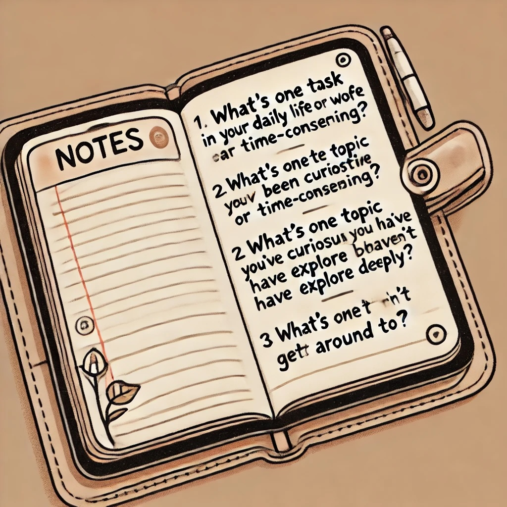

#### Actual Intelligence *...The Human Side of AI*

Have you ever watched someone use a new technology and make it look effortless, only to feel lost when you try it yourself? Or perhaps you've heard about **ChatGPT** and other AI tools in the news but haven't tried them yet, unsure if they're too complicated or technical for you?

You're not alone. Many people find these technologies intimidating or aren't sure where to start. The good news is that you don't need to be a tech expert to use these tools effectively. In fact, the most important skills you'll need are ones you already have—curiosity, judgment, and your own unique perspective on what matters.

That's what this book is all about: showing you how to pair your human wisdom with AI tools to accomplish things that matter to you. We call this partnership **Actual Intelligence**—a framework that centers you, not the technology, in the process.

## Quick Self-Reflection

Before we dive in, take a moment to jot down your answers to these questions:

- What's one task in your daily life or work that feels repetitive or time-consuming?
- What's one topic you've been curious about but haven't had time to explore deeply?
- What's one creative project you've wanted to try but haven't gotten around to?

Keep these answers handy—they'll help us personalize your first AI experiences as we move through this chapter.

In the pages ahead, we'll establish a simple framework for thinking about AI tools, demonstrate how easily you can start using them (no technical knowledge required!), and show you why your direction and judgment are the critical ingredients for getting valuable results.

Let's begin our journey toward becoming confident, effective directors of these powerful tools—starting from the very first interaction.

---