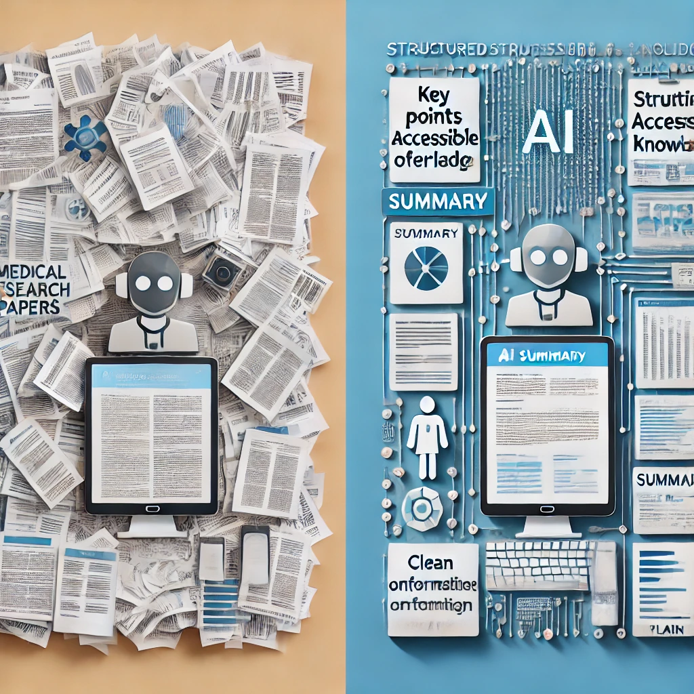

# AI Tools vs. Human Intelligence

## Understanding the Relationship

You might be wondering... *"Do I need to learn coding or computer science to use these AI tools effectively?"*

The simple answer is *no*. Using AI tools like ChatGPT requires no more technical skill than using a search engine or sending a text message. If you can type a question, you can use AI.

What matters far more than technical knowledge is your ability to:

- Ask clear questions about topics that matter to you
- Evaluate whether the answers make sense for your situation
- Follow up when you need more details or a different approach

These are human skills you've been developing your entire life—and they're exactly what makes you the **Actual Intelligence** in the partnership.

To use AI tools effectively, it helps to understand what makes human intelligence different from artificial intelligence, and why that difference creates such a powerful partnership.

## What Makes Human Intelligence Unique

Human intelligence has several qualities that current AI systems simply don't possess, despite their impressive capabilities:

### Purpose and Meaning

Humans don't just do things — we do things for reasons. We ask *why* questions, set goals based on our values, and feel satisfaction when we accomplish something meaningful. We care deeply about the purpose behind an activity, not just getting it done.

AI systems, by contrast, have no intrinsic purposes or desires. They don't *want* anything—they simply process inputs and generate outputs. Any sense of purpose must come from the humans using them.

### Real-World Understanding

Think about your rich understanding of the world, built through lived experience. You know how it feels when you're caught in the rain without an umbrella. You understand the emotional weight of receiving unexpected good news. You grasp the subtle social dynamics of a family gathering.

AI systems like ChatGPT have been trained on vast amounts of text that describe the world, but they've never actually lived in it. They've "read" about ice cream but never tasted it. They can describe what it's like to be caught in the rain, but they've never felt that sudden cold splash or made that mad dash for cover. It's like the difference between reading a travel guide and actually visiting a place — no matter how detailed the guide, there's something essential about the experience that just can't be captured in words.

### Creativity and Intuition

Elena, a retired art teacher, was skeptical about using AI for her watercolor hobby. *"I didn't see how a computer program could help with something as personal as art,"* she said. But when she asked ChatGPT for suggestions on painting autumn leaves with more vibrancy, she was pleasantly surprised.

*"The techniques it suggested were solid fundamentals — things I might tell my own students. But I still had to apply my eye for color, my sense of composition, and my own aesthetic preferences. The AI gave me options to consider, but the creative decisions remained mine."*

This illustrates another key difference: human creativity often involves making unexpected connections, being inspired by seemingly unrelated ideas, or having sudden insights that can't be fully explained. Our intuition allows us to make judgment calls based on subtle cues and years of experience.

While AI can recombine existing ideas in impressive ways, it doesn't have the spark of genuine inspiration or the intuitive sense that allows humans to make leaps beyond what's explicitly known.

### What AI Tools Do Well

These differences aren't weaknesses — they're the foundation of a powerful partnership. AI and humans are like teammates with complementary strengths.

Imagine you're researching a health condition that affects someone you love. You could spend weeks reading medical journals, trying to understand complex terminology and conflicting studies. Or you could ask an AI to summarize the current research, explain key terms, and highlight treatment options—all in minutes. This is where AI truly shines: processing vast amounts of information that would overwhelm even the most dedicated human reader.

AI excels at:

**Information Processing**: Quickly synthesizing enormous amounts of information and finding patterns across vast datasets.

**Consistent Output**: Working tirelessly without getting bored, distracted, or emotional.

**Rapid Idea Generation**: Producing multiple options, drafts, or approaches to a problem in seconds.

**Learning from Patterns**: Identifying trends and connections in data that humans might otherwise miss.

## The Director and the Assistant

A helpful way to understand this relationship is to think of yourself as a film director and AI as your assistant.

As the director, you:

- Determine the vision and purpose of the project
- Make creative and ethical decisions
- Evaluate quality based on your taste and judgment
- Take ultimate responsibility for the final product

The AI assistant:

- Helps execute specific tasks
- Offers options based on your direction
- Provides information and suggestions
- Works tirelessly on the details you specify

Without the director, the assistant would have no purpose or direction. Without the assistant, the director would have to handle every small detail alone.

So what does this look like in practice? Let's see how Marcus, a small business owner with no technical background, puts this partnership into action.

Marcus owns a successful bakery and is considering opening a second location. Instead of simply asking AI, *"Where should I open my second bakery location?"* — a question the AI couldn't possibly answer well without knowing his specific business — Marcus directs the AI with more specific prompts:

- `What demographic data should I analyze when selecting a new bakery location?`
- `Help me create a checklist for evaluating potential retail spaces for a bakery.`
- `What are typical challenges bakeries face when opening a second location?`

Notice the pattern here — each question taps into the AI's ability to organize information while keeping Marcus firmly in the decision-making role. The AI provides valuable frameworks and information, but Marcus makes the final decision based on factors only he can fully understand — his appetite for risk, his intuition about different neighborhoods, and his vision for his brand.

In the next section, we'll explore in simple terms how these AI tools actually work, which will help you understand their capabilities and limitations without requiring any technical background.

---
