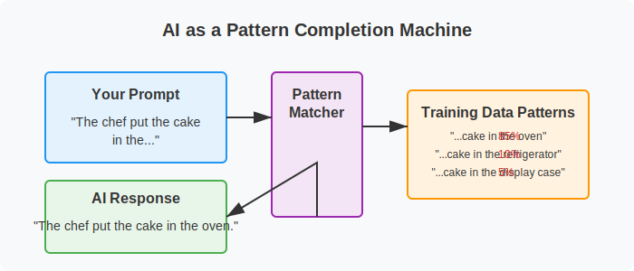

# How Modern AI Tools Work (Simplified for Non-Technical Readers)

To effectively direct AI tools, you don't need to understand all the technical details of how they work—just as you don't need to know exactly how a car engine functions to drive effectively. However, having a basic conceptual understanding will help you develop realistic expectations and use these tools more skillfully.

Let's explore how modern AI tools like ChatGPT work, using simple analogies that highlight both their capabilities and limitations.

## The Pattern Completion Machine

At its core, an AI like ChatGPT is a sophisticated pattern completion machine. It has been trained on enormous amounts of text from books, articles, websites, and other sources. During this training, it learned to recognize patterns in how words and ideas typically follow one another.

When you give it a prompt, it looks for patterns similar to ones it has seen before and generates a response that continues those patterns in a way that seems sensible.

Imagine ChatGPT as a musician who has listened to thousands of songs but doesn't actually understand music theory. When you hum a few notes, the musician can continue the melody based on similar patterns they've heard before. They're not composing something truly original—they're drawing on all the music they've absorbed to continue the pattern you started.

## The Echo Chamber of Human Knowledge

Another helpful way to think about these AI tools is as an echo chamber of human knowledge. They can only reflect back information and patterns that already exist in the data they were trained on.

If you ask ChatGPT about the French Revolution, it can provide information because many human writers have written about this topic, and those writings were part of its training data. But if you ask about a completely fictional historical event that no one has written about, it can't provide accurate information because that pattern doesn't exist in its training data.

This means AI tools:
- Can reflect existing human knowledge and writing patterns
- Cannot generate truly novel discoveries or insights that aren't derived from existing knowledge
- May confidently present information that seems plausible but is actually incorrect

## Text Prediction, Not Understanding

Despite its impressive ability to generate human-like text, ChatGPT doesn't actually "understand" the meaning of words the way humans do. It predicts which words are likely to follow each other based on statistical patterns, not based on connecting those words to real-world experiences or deeper concepts.

Think of it like someone who has memorized a cookbook in a foreign language without understanding what the words mean. They might be able to recite recipes perfectly and even make reasonable substitutions based on patterns they've observed, but they've never tasted the food, felt the texture of the ingredients, or understood why certain techniques are used.

This limitation explains why AI often struggles with:
- Common sense reasoning
- Understanding the physical world
- Grasping cause and effect
- Distinguishing between plausible-sounding nonsense and actual truth

## The Probability Generator

When ChatGPT generates text, it's essentially making a series of word choices based on probability. For each position in a sentence, it calculates which word is most likely to come next, given the preceding words and the overall context.

Imagine a game where you start a sentence, and someone has to guess what word comes next:

"The chef put the cake in the..."

Most people would guess "oven" because that's the most probable word to follow in this context. AI systems do something similar, but with a much more sophisticated understanding of language patterns and a much larger vocabulary of possible words to choose from.

This probabilistic approach means that:
- ChatGPT doesn't have a fixed set of responses—it generates new text each time
- Responses can vary even to identical prompts
- The AI doesn't "decide" what to say based on reasoning—it selects words based on probability

## Limitations by Design

Modern AI tools also have intentional limitations built into them by their creators. Companies like OpenAI have implemented safety measures that prevent their AI from generating certain types of harmful content, even if the patterns for that content exist in the training data.

These guardrails are an important part of responsible AI development, but they also mean that the AI is not simply a neutral pattern-matcher—it has been designed to avoid certain topics and favor others.

## What This Means for You

Understanding these basics about how AI works helps explain both its impressive capabilities and its surprising limitations:

1. **It can generate human-like text** because it has learned patterns from vast amounts of human writing

2. **It can provide information on many topics** because it has been trained on diverse texts

3. **It struggles with factual accuracy** because it's predicting plausible text, not verifying truth

4. **It can't truly reason or understand** because it's matching patterns, not comprehending meaning

5. **It doesn't have experiences or goals** because it's a text prediction system, not a conscious entity

These characteristics make AI tools incredibly useful for certain tasks but also highlight why human direction and judgment—your Actual Intelligence—remains essential.

## The Assistant, Not the Expert

Given these limitations, it's helpful to think of AI tools as assistants rather than experts or authorities. They can help you brainstorm, draft content, summarize information, and explore ideas, but you should always apply your own judgment to their output.

Remember Jake, who's planning a family vacation to Japan. If he simply asks ChatGPT "Plan my perfect Japan trip" and follows whatever itinerary it generates, he might end up with a generic tourist experience that doesn't match his family's interests or visit attractions that are closed for renovation.

Instead, Jake uses his understanding of AI limitations to direct the tool more effectively. He knows that:
- The AI's information might be outdated
- It doesn't know his family's specific preferences
- It can't verify if suggested accommodations are actually available

So he uses AI as an assistant for specific tasks where pattern matching is helpful—generating ideas for kid-friendly activities in Tokyo, suggesting phrasing for basic Japanese phrases, or creating a packing checklist—while handling the critical judgment calls himself and verifying key information through other sources.

In the next section, we'll explore how to take control of this human-AI partnership to get the most value from these powerful but limited tools.

---

