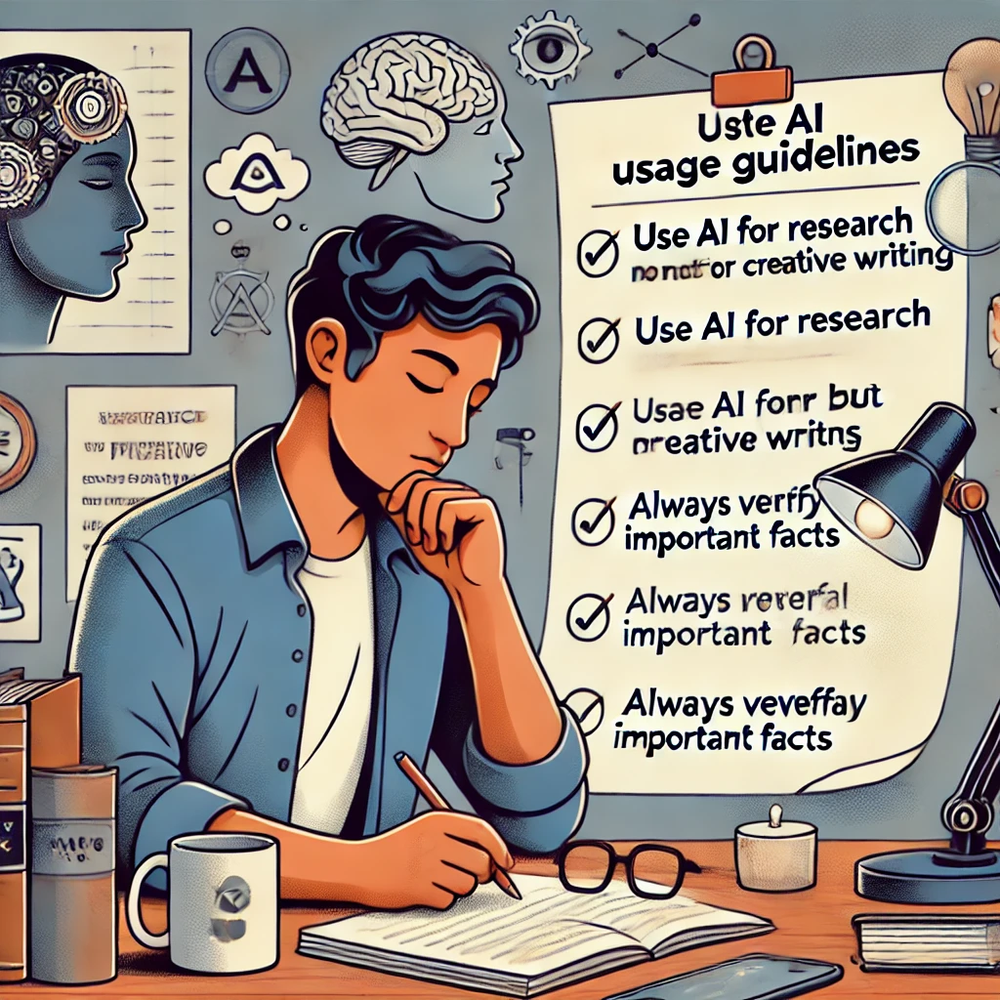

# Activity 5

## Setting Your AI Compass

**Objective:** Develop personal guidelines for how you want to use AI in your life.

**What You'll Need:**

- Access to ChatGPT
- Paper and pen, or digital document
- 15-20 minutes

**Instructions:**

1. Reflect on your values, goals, and the areas of your life where you think AI tools might be helpful. Consider:

   - What types of tasks do you find draining or time-consuming?
   - What skills would you like to develop, with AI as a learning aid?
   - What aspects of your thinking or work would you never want to outsource?

2. Ask ChatGPT for assistance in thinking through these questions with a prompt like:
   
   `I'm developing personal guidelines for how I want to use AI tools like you in my life. Can you help me think through some questions to consider about where AI might be most helpful to me and where I might want to be cautious about using it? Consider aspects like learning, creativity, critical thinking, and practical tasks.`

3. Based on the AI's suggestions and your own reflection, draft 3-5 personal guidelines for your AI use. These might include:

   - Types of tasks you'll use AI for
   - Boundaries you'll maintain
   - How you'll verify or evaluate AI-generated content
   - When you'll rely on purely human approaches

4. Share your draft guidelines with ChatGPT and ask for feedback: 
   
   `Here are my draft guidelines for using AI. Can you suggest any considerations I might have overlooked or ways to make these guidelines more practical?`

5. Finalize your guidelines based on this feedback, keeping what resonates and discarding what doesn't fit your values and needs.

*"This exercise helped me set healthy boundaries,"* says Gabriela, a freelance writer. *"I realized I wanted to use AI for research and editing but not for the creative heart of my writing. Having these guidelines helps me use AI as a tool without feeling like I'm compromising my craft."*

**Reflection Questions:**

- What did you learn about your own priorities through this exercise?
- Were there any suggestions from the AI that surprised you or made you reconsider your approach?
- How might these guidelines evolve as you gain more experience with AI tools?
- How do these guidelines reflect your understanding of Actual Intelligence as a human-AI partnership?

--- 