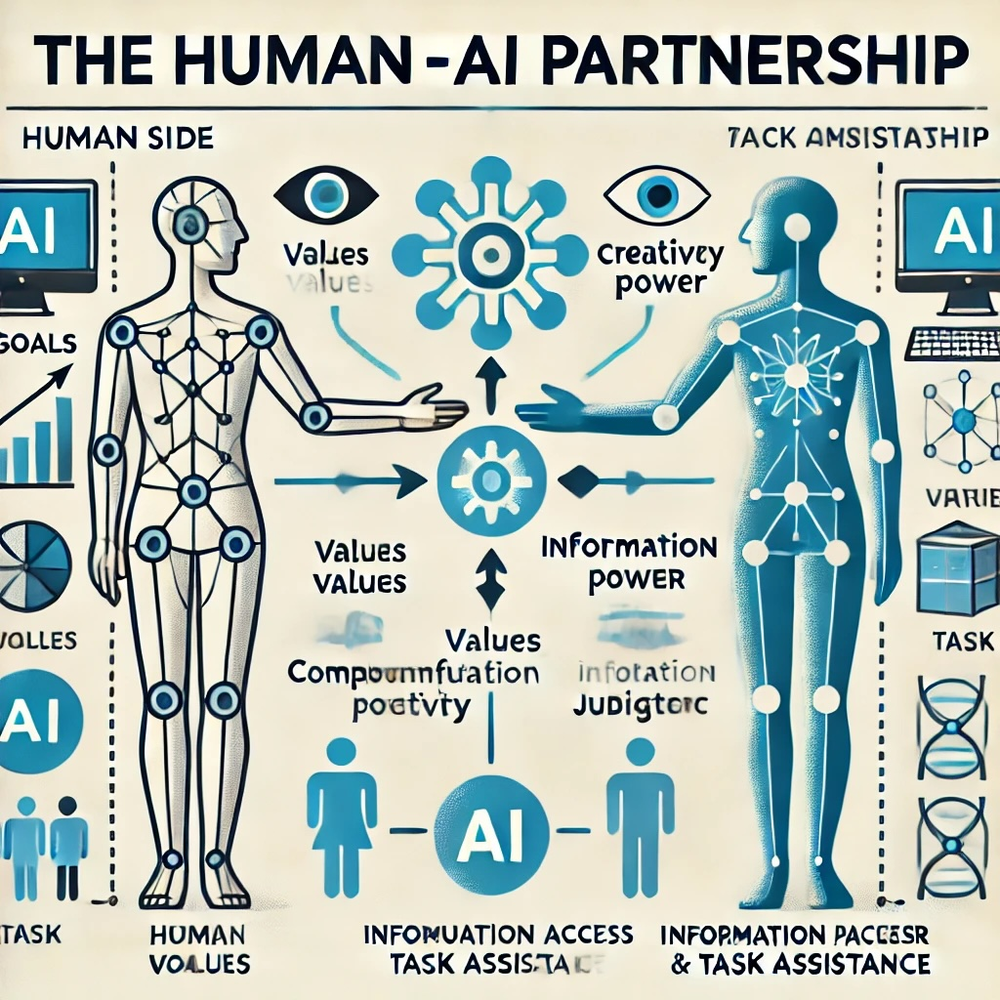
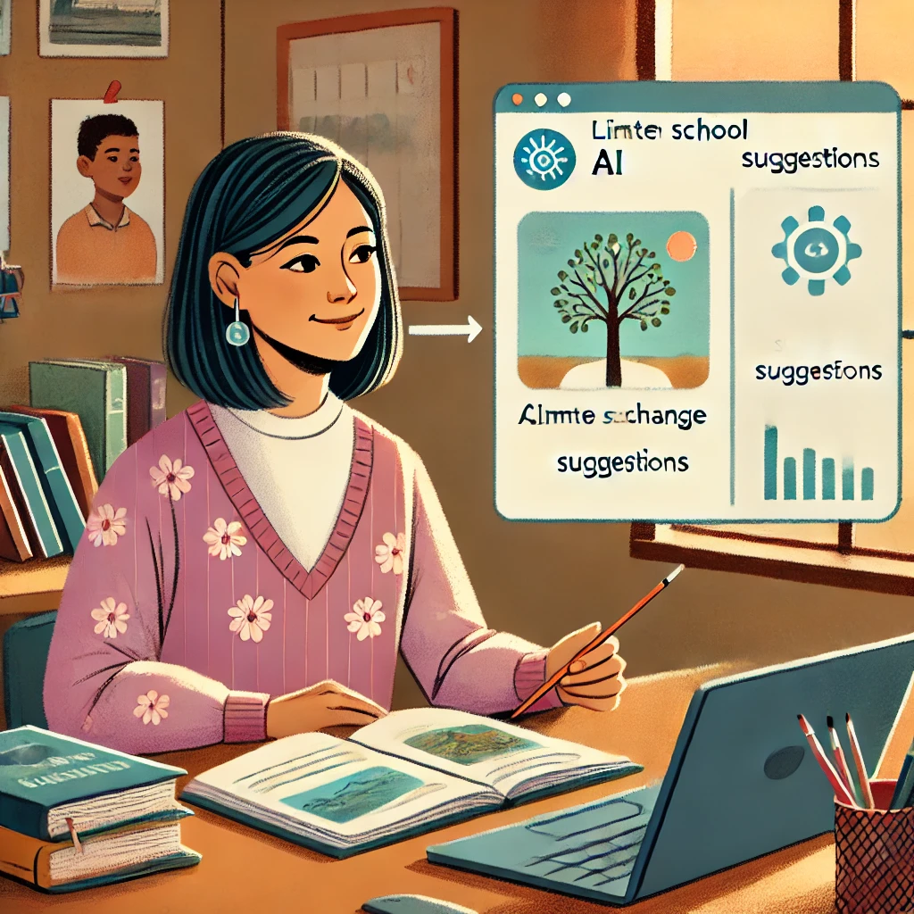

# ¿Qué es la **Inteligencia Real**?
*...La Colaboración Humano-IA*

## Tu Primera Conversación con IA: Un Recorrido Guiado

Comencemos con algo simple. No se requieren habilidades técnicas, solo la capacidad de escribir una frase.

1. Abre ChatGPT *(te mostraremos exactamente cómo en el siguiente capítulo)*
2. Escribe exactamente esto: `Hola, soy nuevo en ChatGPT. ¿Puedes explicarme en términos sencillos en qué me puedes ayudar?`
3. Presiona Enter y lee la respuesta

¡Eso es todo! Acabas de tener tu primera conversación con IA.

Observa cómo la IA se presenta y explica sus capacidades. Este no es un mensaje pregrabado; la IA está generando esta respuesta específicamente para ti. En los próximos capítulos, aprenderás cómo hacer que estas conversaciones sean cada vez más útiles para tus necesidades específicas.

María, una propietaria de un pequeño negocio sin experiencia técnica, describió su primera experiencia: 
*"Honestamente esperaba que fuera complicado, como si necesitara aprender comandos especiales o algo así. Pero fue como enviar mensajes de texto. Pregunté cómo escribir un mejor boletín por correo electrónico, y en segundos tenía ideas que realmente podía usar. Sin jerga técnica, sin configuración complicada."*

## Entendiendo la Colaboración Humano-IA

Piensa en las herramientas de IA como electrodomésticos de cocina. Una batidora de pie puede hacer el trabajo duro de mezclar la masa, pero no decide qué receta hacer o sabe cuándo la consistencia es perfecta; ese es tu trabajo. La batidora es muy buena en su tarea específica, pero tú eres quien tiene las papilas gustativas, la creatividad para modificar recetas y el conocimiento de si estás horneando para alguien con restricciones dietéticas.

**Inteligencia Real** es esta colaboración entre tu juicio humano y las capacidades de la IA. Es lo que sucede cuando tu sabiduría, creatividad y propósito se combinan con la capacidad de la IA para procesar información y generar contenido.

Piensa en la última vez que usaste una herramienta poderosa para resolver un problema. Quizás fue un procesador de alimentos que redujo tu tiempo de preparación a la mitad, o un software de mapas que te ayudó a navegar por una ciudad desconocida. La herramienta fue invaluable, pero tú fuiste quien decidió qué cocinar o a dónde ir. Esa es exactamente tu relación con la IA: no solo estás presionando botones, eres el director creativo que toma las decisiones.

### El Modelo de Colaboración

En lugar de pensar en la IA como una entidad mágica con mente propia, considera esta simple relación:

- **Tú** proporcionas los objetivos, valores, creatividad y criterio
- La **IA** proporciona poder computacional, acceso a información y asistencia en tareas

¿Por qué importa tanto esta relación? Porque entenderla transforma la manera en que usarás estas herramientas todos los días.

Cuando reconoces que eres el director y la IA es tu asistente, naturalmente tomas el control del proceso en lugar de aceptar pasivamente lo que la IA produce. Desarrollas expectativas más claras sobre lo que estas herramientas pueden (y no pueden) hacer por ti. Te enfocas en fortalecer las habilidades exclusivamente humanas que la IA no puede replicar. Y quizás lo más importante, mantienes la propiedad de tu trabajo e ideas.

¿No es esa una forma más empoderadora de abordar estas herramientas?

### El Elemento Humano en Acción

Veamos esta colaboración en acción a través de un ejemplo real.

Luisa, una profesora de ciencias de secundaria sin experiencia previa en IA, quería crear una lección sobre el cambio climático. Podría haber simplemente pedido a ChatGPT que `cree una lección sobre cambio climático para estudiantes de 7º grado` y usar lo que generara, pero eso habría ignorado su conocimiento único de sus estudiantes.

En cambio, Luisa aplicó su criterio humano. Conocía a sus estudiantes específicos: sus niveles de conocimiento, intereses y los problemas ambientales locales que ven todos los días. Entendía con qué conceptos habían luchado en lecciones anteriores.

Con este contexto que ninguna IA podría poseer, Luisa dirigió a ChatGPT con una solicitud más específica: `Ayúdame a crear una demostración interactiva que muestre cómo funcionan los gases de efecto invernadero, adecuada para estudiantes de 7º grado que ya han aprendido sobre el ciclo del agua pero tienen dificultades con conceptos abstractos.`

La lección resultante fue mucho más efectiva porque combinó la comprensión de Luisa sobre sus estudiantes con la capacidad de la IA para generar ideas creativas de enseñanza. Esa es la Inteligencia Real en acción: tú sigues siendo central en el proceso mientras aprovechas la IA como una herramienta poderosa.

## Creando Tu Primera Solicitud Personalizada

Ahora es tu turno. Vamos a crear una solicitud que sea específicamente relevante para ti. Completa los espacios en blanco a continuación:
`Trabajo como _____________ y un desafío que enfrento a menudo es _____________. ¿Podrías sugerirme tres formas en las que podría abordar este problema?`

Por ejemplo:
`Trabajo como gerente de tienda y un desafío que enfrento a menudo es programar al personal de manera eficiente. ¿Podrías sugerirme tres formas en las que podría abordar este problema?`

 o

 `Trabajo como padre/madre y un desafío que enfrento a menudo es encontrar actividades educativas para días lluviosos. ¿Podrías sugerirme tres formas en las que podría abordar este problema?`

En las siguientes secciones, exploraremos qué hace que la inteligencia humana sea única y cómo complementa las capacidades de la IA. Pero recuerda, no necesitas entender todos los detalles técnicos para comenzar a usar estas herramientas de manera efectiva hoy mismo.

---

