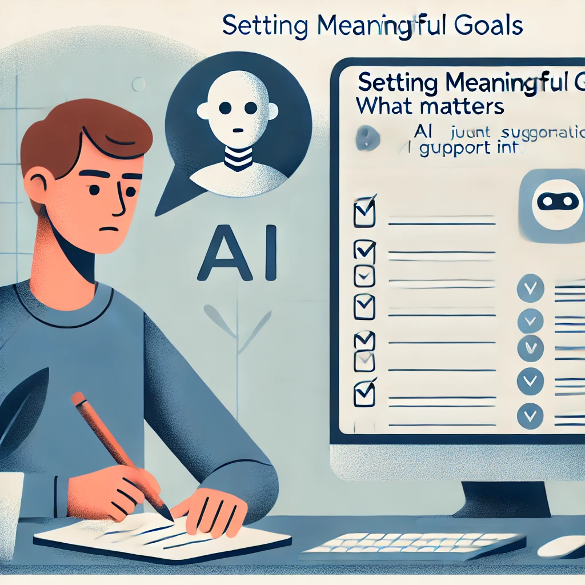
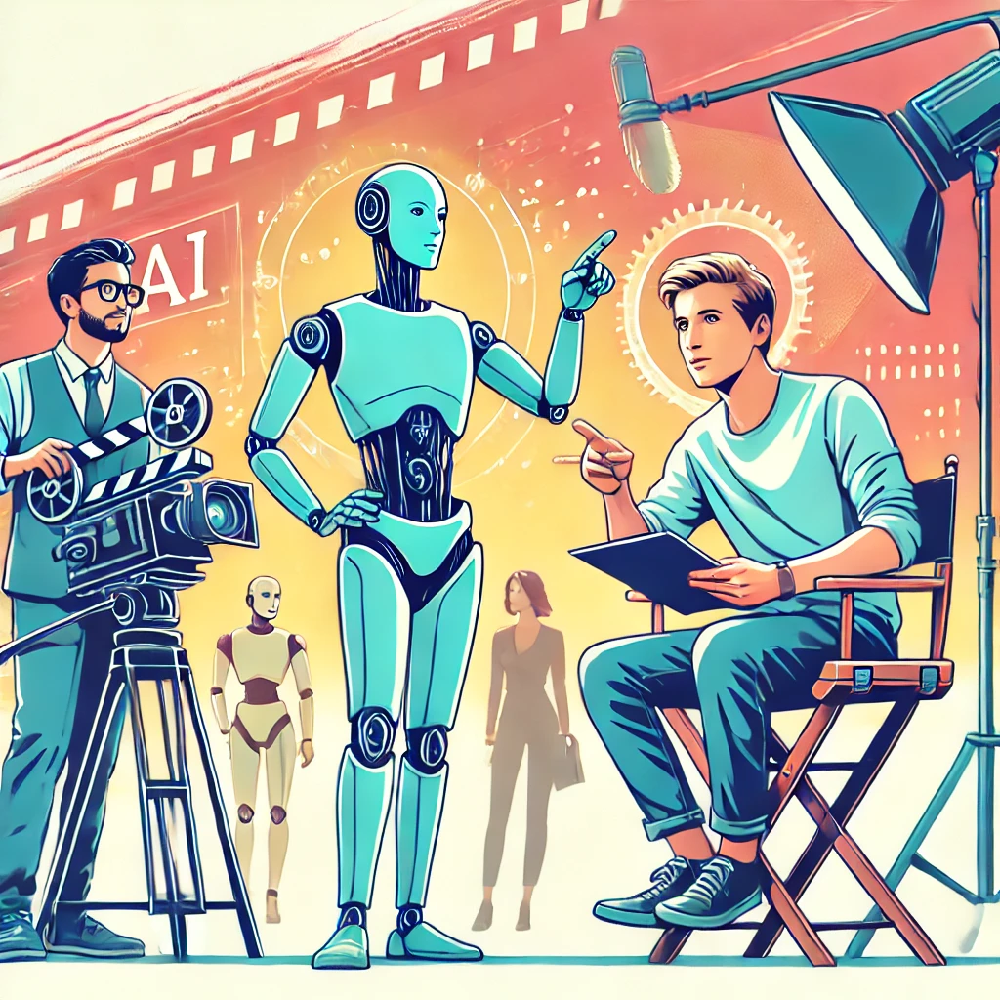

# Herramientas de IA vs. Inteligencia Humana: Entendiendo la Relación

Quizás te estés preguntando... *"¿Necesito aprender programación o ciencias de la computación para usar estas herramientas de IA de manera efectiva?"*

La respuesta simple es *no*. Usar herramientas de IA como ChatGPT no requiere más habilidades técnicas que usar un motor de búsqueda o enviar un mensaje de texto. Si puedes escribir una pregunta, puedes usar IA.

Lo que importa mucho más que el conocimiento técnico es tu capacidad para:

- Hacer preguntas claras sobre temas que te importan
- Evaluar si las respuestas tienen sentido para tu situación
- Hacer seguimiento cuando necesitas más detalles o un enfoque diferente

Estas son habilidades humanas que has estado desarrollando toda tu vida, y son exactamente lo que te convierte en la **Inteligencia Real** en esta colaboración.

Para usar las herramientas de IA de manera efectiva, es útil entender qué hace que la inteligencia humana sea diferente de la inteligencia artificial, y por qué esa diferencia crea una asociación tan poderosa.

## Qué Hace Única a la Inteligencia Humana

La inteligencia humana tiene varias cualidades que los sistemas de IA actuales simplemente no poseen, a pesar de sus impresionantes capacidades:

### Propósito y Significado

Los humanos no solo hacemos cosas, las hacemos por razones. Nos preguntamos *por qué*, establecemos metas basadas en nuestros valores y sentimos satisfacción cuando logramos algo significativo. Nos importa profundamente el propósito detrás de una actividad, no solo completarla.

Los sistemas de IA, en contraste, no tienen propósitos o deseos intrínsecos. No *quieren* nada; simplemente procesan entradas y generan salidas. Cualquier sentido de propósito debe provenir de los humanos que los utilizan.

### Comprensión del Mundo Real

Piensa en tu profunda comprensión del mundo, construida a través de la experiencia vivida. Sabes cómo se siente cuando te sorprende la lluvia sin paraguas. Entiendes el peso emocional de recibir buenas noticias inesperadas. Comprendes la sutil dinámica social de una reunión familiar.

Los sistemas de IA como ChatGPT han sido entrenados con enormes cantidades de texto que describen el mundo, pero nunca han vivido realmente en él. Han "leído" sobre el helado pero nunca lo han probado. Pueden describir cómo es estar bajo la lluvia, pero nunca han sentido esa repentina salpicadura fría o esa carrera loca buscando refugio. Es como la diferencia entre leer una guía de viaje y visitar realmente un lugar; por muy detallada que sea la guía, hay algo esencial sobre la experiencia que simplemente no puede ser capturado en palabras.

### Creatividad e Intuición

Elena, una profesora de arte jubilada, era escéptica sobre el uso de la IA para su afición a la acuarela. *"No veía cómo un programa de computadora podía ayudar con algo tan personal como el arte"*, dijo. Pero cuando le pidió a ChatGPT sugerencias para pintar hojas de otoño con más vivacidad, se sorprendió gratamente.

*"Las técnicas que sugirió eran fundamentos sólidos, cosas que podría decirles a mis propios estudiantes. Pero aún tenía que aplicar mi sentido del color, mi sentido de la composición y mis propias preferencias estéticas. La IA me dio opciones para considerar, pero las decisiones creativas siguieron siendo mías."*

Esto ilustra otra diferencia clave: la creatividad humana a menudo implica hacer conexiones inesperadas, inspirarse en ideas aparentemente no relacionadas o tener repentinas intuiciones que no se pueden explicar completamente. Nuestra intuición nos permite tomar decisiones basadas en señales sutiles y años de experiencia.

Si bien la IA puede recombinar ideas existentes de maneras impresionantes, no tiene la chispa de inspiración genuina o el sentido intuitivo que permite a los humanos dar saltos más allá de lo que se conoce explícitamente.

## En Qué Destacan las Herramientas de IA

Estas diferencias no son debilidades, son la base de una asociación poderosa. La IA y los humanos son como compañeros de equipo con fortalezas complementarias.

Imagina que estás investigando sobre una condición de salud que afecta a alguien que amas. Podrías pasar semanas leyendo revistas médicas, tratando de entender terminología compleja y estudios contradictorios. O podrías pedirle a una IA que resuma la investigación actual, explique términos clave y destaque opciones de tratamiento, todo en minutos. Aquí es donde la IA realmente brilla: procesando vastas cantidades de información que abrumarían incluso al lector humano más dedicado.

La IA sobresale en:

**Procesamiento de Información**: Sintetizar rápidamente enormes cantidades de información y encontrar patrones en vastos conjuntos de datos.

**Producción Consistente**: Trabajar incansablemente sin aburrirse, distraerse o emocionarse.

**Generación Rápida de Ideas**: Producir múltiples opciones, borradores o enfoques para un problema en segundos.

**Aprendizaje de Patrones**: Identificar tendencias y conexiones en datos que los humanos podrían pasar por alto.

## El Director y el Asistente

Una forma útil de entender esta relación es pensar en ti mismo como un director de cine y en la IA como tu asistente.

Como director, tú:

- Determinas la visión y el propósito del proyecto
- Tomas decisiones creativas y éticas
- Evalúas la calidad basada en tu gusto y criterio
- Asumes la responsabilidad final del producto terminado

El asistente de IA:

- Ayuda a ejecutar tareas específicas
- Ofrece opciones basadas en tu dirección
- Proporciona información y sugerencias
- Trabaja incansablemente en los detalles que especificas

Sin el director, el asistente no tendría propósito ni dirección. Sin el asistente, el director tendría que manejar solo cada pequeño detalle.

¿Cómo se ve esto en la práctica? Veamos cómo Marcos, un dueño de un pequeño negocio sin experiencia técnica, pone en acción esta colaboración.

Marcos es propietario de una panadería exitosa y está considerando abrir un segundo local. En lugar de simplemente preguntar a la IA: *"¿Dónde debería abrir mi segunda panadería?"* — una pregunta que la IA no podría responder bien sin conocer su negocio específico — Marcos dirige la IA con indicaciones más específicas:

- `¿Qué datos demográficos debería analizar al seleccionar una nueva ubicación para una panadería?`
- `Ayúdame a crear una lista de verificación para evaluar posibles espacios comerciales para una panadería.`
- `¿Cuáles son los desafíos típicos que enfrentan las panaderías al abrir un segundo local?`

Observa el patrón aquí: cada pregunta aprovecha la capacidad de la IA para organizar información mientras mantiene a Marcos firmemente en el papel de tomador de decisiones. La IA proporciona marcos e información valiosos, pero Marcos toma la decisión final basada en factores que solo él puede entender completamente: su apetito por el riesgo, su intuición sobre diferentes vecindarios y su visión para su marca.

En la siguiente sección, exploraremos en términos simples cómo funcionan realmente estas herramientas de IA, lo que te ayudará a comprender sus capacidades y limitaciones sin requerir ningún conocimiento técnico.

---

