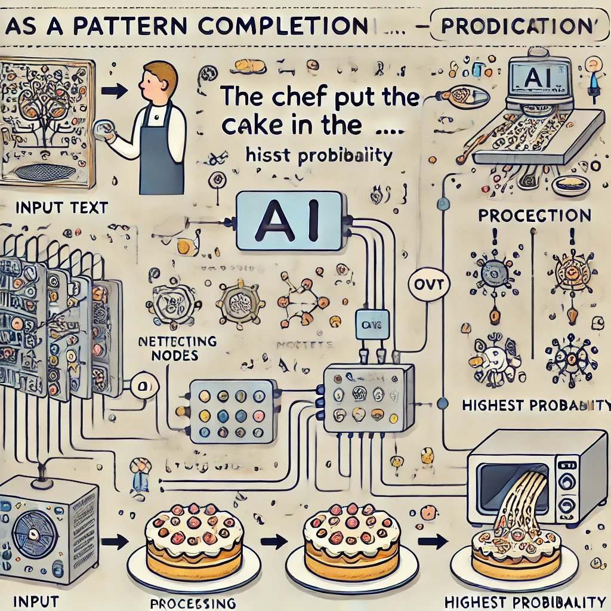

# Cómo Funcionan las Herramientas Modernas de IA (Simplificado para Lectores No Técnicos)

Para dirigir efectivamente las herramientas de IA, no necesitas entender todos los detalles técnicos, al igual que no necesitas saber exactamente cómo funciona el motor de un auto para conducir de manera efectiva. Sin embargo, tener una comprensión conceptual básica te ayudará a establecer expectativas realistas y usar estas herramientas con mayor habilidad.

Exploraremos cómo funcionan herramientas de IA como ChatGPT, usando analogías simples que destacan tanto sus capacidades como sus limitaciones.

*"Cuando escuché por primera vez sobre IA, imaginaba algo de películas de ciencia ficción, como una computadora que piensa y siente"*, dice Jaime, un jubilado que ahora usa ChatGPT diariamente para ayudar con su afición a la genealogía. *"Pero una vez que comencé a usarla, me di cuenta de que es más como tener un asistente de investigación muy culto que es increíblemente rápido pero necesita dirección cuidadosa."*

## La Máquina de Completar Patrones

En su esencia, una IA como ChatGPT es una sofisticada máquina de completar patrones. Imagina que estás jugando con un amigo donde comienzas una frase y ellos la terminan:

Tú dices: `El chef puso el pastel en el...`

Tu amigo casi seguramente responde: `horno`

¿Por qué? Porque basándose en todo el lenguaje que ha encontrado a lo largo de su vida, `horno` es la palabra más probable que sigue en este contexto.

ChatGPT hace algo similar, pero a una escala mucho mayor. Ha sido entrenado con enormes cantidades de texto de libros, artículos, sitios web y otras fuentes. Durante este entrenamiento, aprendió a reconocer patrones en cómo las palabras e ideas normalmente se siguen unas a otras.

Piénsalo como un músico que ha escuchado miles de canciones pero no entiende realmente la teoría musical. Cuando tarareas algunas notas, el músico puede continuar la melodía basándose en patrones similares que ha escuchado antes. No está componiendo algo verdaderamente original, está recurriendo a toda la música que ha absorbido para continuar el patrón que iniciaste.

## La Cámara de Eco del Conocimiento Humano

Otra forma útil de pensar sobre estas herramientas de IA es como una cámara de eco del conocimiento humano. Solo pueden reflejar información y patrones que ya existen en los datos con los que fueron entrenadas.

Si le preguntas a ChatGPT sobre la Revolución Francesa, puede proporcionar información porque muchos escritores humanos han escrito sobre este tema, y esos escritos formaron parte de sus datos de entrenamiento. Pero si preguntas sobre un evento histórico completamente ficticio del que nadie ha escrito, no puede proporcionar información precisa porque ese patrón no existe en sus datos de entrenamiento.

Esto significa que las herramientas de IA:
- Pueden reflejar el conocimiento humano existente y los patrones de escritura
- No pueden generar descubrimientos o ideas verdaderamente novedosos que no se deriven de conocimientos existentes
- Pueden presentar con confianza información que parece plausible pero que es realmente incorrecta

## Predicción de Texto, No Comprensión

A pesar de su impresionante capacidad para generar texto similar al humano, ChatGPT no "entiende" realmente el significado de las palabras como lo hacen los humanos. Predice qué palabras es probable que sigan a otras basándose en patrones estadísticos, no en conectar esas palabras con experiencias del mundo real o conceptos más profundos.

Piénsalo como alguien que ha memorizado un libro de cocina en un idioma extranjero sin entender lo que significan las palabras. Podrían recitar recetas perfectamente e incluso hacer sustituciones razonables basadas en patrones que han observado, pero nunca han probado la comida, sentido la textura de los ingredientes o entendido por qué se utilizan ciertas técnicas.

Esta limitación explica por qué la IA a menudo tiene dificultades con:
- Razonamiento de sentido común
- Comprensión del mundo físico
- Captación de causa y efecto
- Distinción entre tonterías que suenan plausibles y la verdad real

## El Generador de Probabilidades

Cuando ChatGPT genera texto, esencialmente está haciendo una serie de elecciones de palabras basadas en la probabilidad. Para cada posición en una oración, calcula qué palabra es más probable que venga a continuación, dados los términos precedentes y el contexto general.

Imagina un juego donde comienzas una oración, y alguien tiene que adivinar qué palabra viene después:

`El chef puso el pastel en el...`

La mayoría de las personas adivinarían `"horno"` porque esa es la palabra más probable que sigue en este contexto. Los sistemas de IA hacen algo similar, pero con una comprensión mucho más sofisticada de los patrones del lenguaje y un vocabulario mucho más amplio de posibles palabras entre las que elegir.

Este enfoque probabilístico significa que:
- ChatGPT no tiene un conjunto fijo de respuestas—genera nuevo texto cada vez
- Las respuestas pueden variar incluso ante indicaciones idénticas
- La IA no "decide" qué decir basada en el razonamiento—selecciona palabras basadas en la probabilidad

## Qué Significa Esto Para Ti

Entender estos conceptos básicos sobre cómo funciona la IA ayuda a explicar tanto sus impresionantes capacidades como sus sorprendentes limitaciones:

1. **Puede generar texto similar al humano** porque ha aprendido patrones de una vasta cantidad de escritura humana

2. **Puede proporcionar información sobre muchos temas** porque ha sido entrenada con textos diversos

3. **Tiene dificultades con la precisión factual** porque está prediciendo texto plausible, no verificando la verdad

4. **No puede razonar o entender realmente** porque está coincidiendo con patrones, no comprendiendo el significado

5. **No tiene experiencias ni objetivos** porque es un sistema de predicción de texto, no una entidad consciente

Estas características hacen que las herramientas de IA sean increíblemente útiles para ciertas tareas, pero también destacan por qué la dirección y el juicio humanos—tu Inteligencia Real—siguen siendo esenciales.

## El Asistente, No el Experto

Dadas estas limitaciones, es útil pensar en las herramientas de IA como asistentes en lugar de expertos o autoridades. Pueden ayudarte a hacer lluvia de ideas, redactar contenido, resumir información y explorar ideas, pero siempre debes aplicar tu propio juicio a su producción.

Recuerda a Javier, que está planeando unas vacaciones familiares a Japón. Si simplemente le pide a ChatGPT `"Planifica mi viaje perfecto a Japón"` y sigue cualquier itinerario que genere, podría terminar con una experiencia turística genérica que no coincide con los intereses de su familia o visitar atracciones que están cerradas por renovación.

En cambio, Javier utiliza su comprensión de las limitaciones de la IA para dirigir la herramienta de manera más efectiva. Sabe que:
- La información de la IA podría estar desactualizada
- No conoce las preferencias específicas de su familia
- No puede verificar si los alojamientos sugeridos están realmente disponibles

Así que utiliza la IA como un asistente para tareas específicas donde la coincidencia de patrones es útil—generar ideas para actividades aptas para niños en Tokio, sugerir redacción para frases básicas en japonés o crear una lista de comprobación para el equipaje—mientras maneja por sí mismo las decisiones críticas y verifica información clave a través de otras fuentes.

En la siguiente sección, exploraremos cómo tomar el control de esta asociación humano-IA para obtener el mayor valor de estas herramientas poderosas pero limitadas.

---

