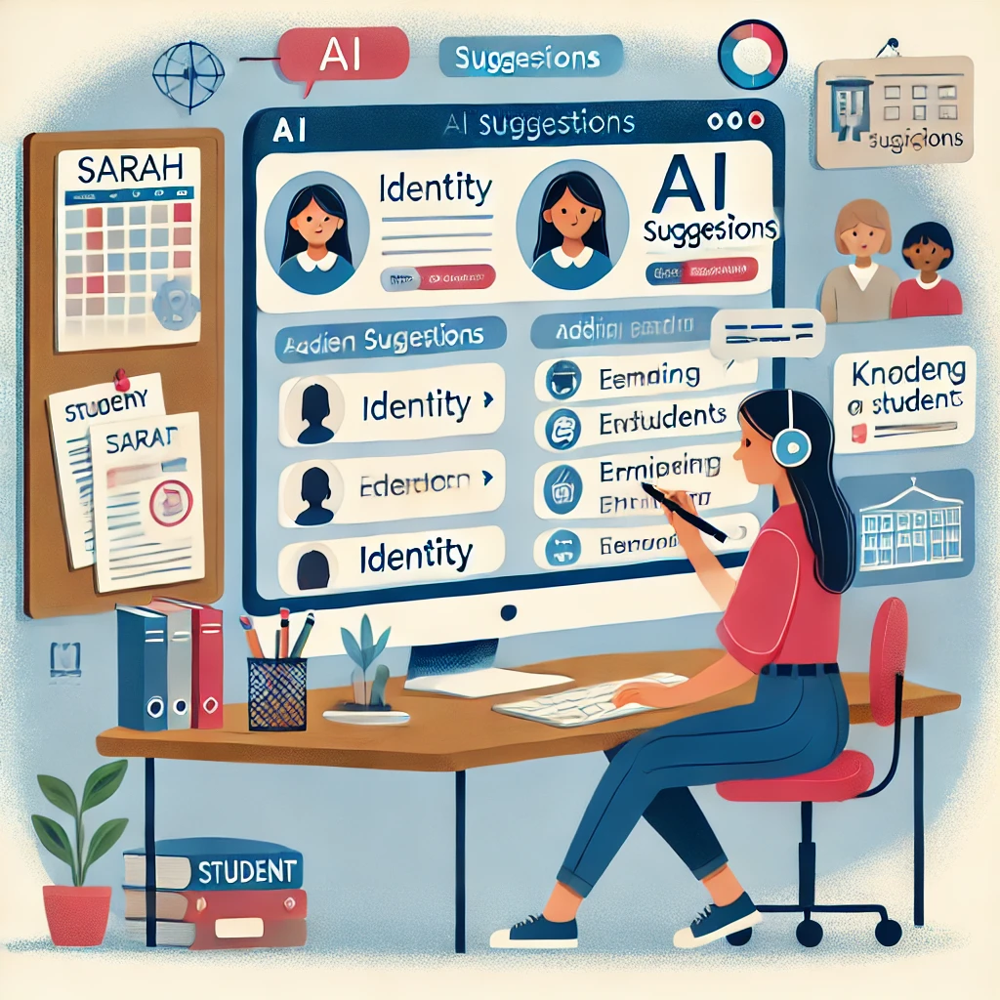
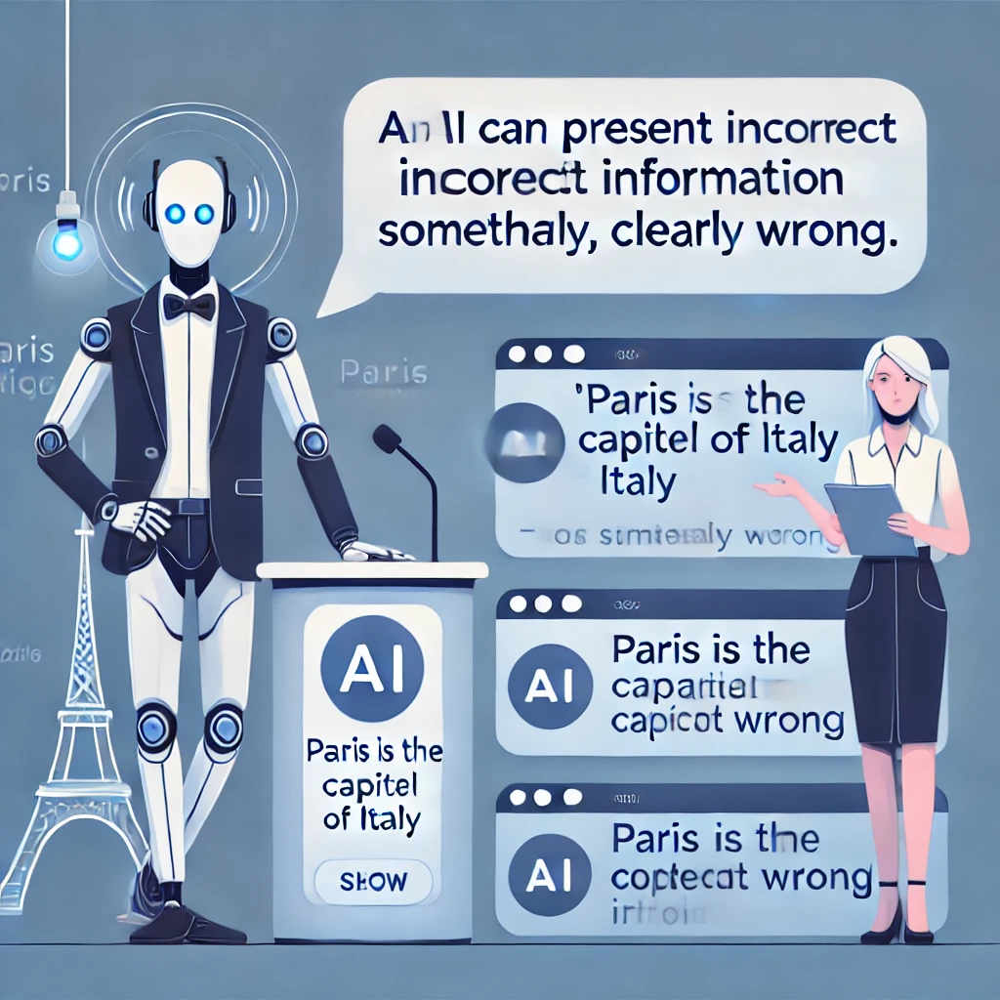

# Dirigiendo la IA y Estableciendo Expectativas Realistas

Ahora que entendemos la relación entre la inteligencia humana y las capacidades de la IA, enfoquémonos en dos elementos críticos que harán que tus experiencias con IA sean exitosas: cómo dirigir efectivamente estas herramientas y qué deberías esperar realistamente de ellas.

## La Mentalidad del Director

¿Recuerdas nuestra metáfora del director de cine? Ampliemos lo que significa ser un director efectivo de herramientas de IA.

Así como un director de cine no simplemente dice a los actores "hagan una buena escena" y espera lo mejor, tú no deberías acercarte a la IA con peticiones vagas y una aceptación pasiva de lo que sea que produzca. La mentalidad del director involucra varias prácticas clave:

### 1. Claridad de Propósito

*"Solía comenzar haciéndole a ChatGPT preguntas vagas y me frustraba con las respuestas genéricas"*, explica David, un consultor de pequeñas empresas. *"Ahora siempre me tomo un momento para aclarar exactamente lo que necesito antes incluso de abrir la aplicación."*

Antes de interactuar con la IA, pregúntate:

- ¿Qué problema específico estoy tratando de resolver?
- ¿Cómo sería un resultado exitoso?
- ¿Qué limitaciones o requisitos debería tener en cuenta?

Esta claridad te ayuda a dar indicaciones más efectivas y evaluar las respuestas de la IA de manera más crítica.

### 2. Especificidad en la Dirección

Las indicaciones vagas conducen a respuestas genéricas. Cuanto más específica sea tu dirección, más útil será la asistencia de la IA. Compara estos enfoques:

**Dirección vaga:** "Dame algunas ideas de marketing."

**Dirección específica:** "Dirijo un puesto de venta de productos de granja orgánica local dirigido a familias conscientes de la salud. Sugiéreme cinco enfoques de marketing de bajo presupuesto que nos ayuden a enfatizar nuestras prácticas agrícolas sostenibles y nuestras raíces comunitarias."

La dirección específica proporciona contexto y limitaciones que ayudan a la IA a generar respuestas relevantes adaptadas a tus necesidades.

### 3. Refinamiento Iterativo

Trabajar con IA raramente es un proceso de una sola vez. Piénsalo como una conversación en lugar de una sola pregunta y respuesta.

*"Al principio simplemente aceptaba lo que la IA me daba"*, dice Pilar, una escritora freelance. *"Ahora sé que la magia ocurre en el ida y vuelta. Diré 'eso es demasiado formal' o 'puedes añadir más ejemplos sobre X' y los resultados mejoran dramáticamente."*

No te conformes con la primera respuesta si no satisface completamente tus necesidades. En cambio, proporciona retroalimentación y dirección adicional para guiar a la IA hacia resultados más útiles:

- `Eso es útil, pero ¿podrías hacerlo más simple?`
- `Me gusta más la tercera idea. ¿Puedes ampliar específicamente ese enfoque?`
- `Estos ejemplos son demasiado técnicos. ¿Puedes reescribirlos para alguien sin experiencia en este campo?`

### 4. Evaluación Crítica

Aproxímate al contenido generado por IA con un escepticismo saludable. Pregúntate:

- ¿Esta información parece precisa y confiable?
- ¿Es este el enfoque correcto para mi situación específica?
- ¿Esto se alinea con mis valores y objetivos?

Recuerda que tú eres el juez final de la calidad y la idoneidad. La IA está ahí para ayudarte, no para tomar decisiones finales.

## El Efecto de Amplificación

Cuando combinas la dirección humana con las capacidades de la IA, sucede algo notable: ambas se amplifican más allá de lo que cualquiera podría lograr por sí sola. Esta es la esencia de la Inteligencia Real.

- Tu creatividad se amplifica por la capacidad de la IA para generar rápidamente variaciones y alternativas
- Tu conocimiento se amplifica por la capacidad de la IA para proporcionar información y perspectivas que quizás no habías considerado
- Tu productividad se amplifica por la capacidad de la IA para manejar aspectos rutinarios de las tareas, liberándote para centrarte en un pensamiento de nivel superior

Sara, una profesora de inglés de secundaria, experimenta esta amplificación cuando planifica su currículum. Podría pasar horas buscando materiales de lectura relevantes, redactando preguntas para discusión y creando tareas. En cambio, dirige a ChatGPT con sus objetivos educativos específicos y conocimiento de sus estudiantes:

*"Necesito diseñar una unidad sobre 'identidad' para mi clase de inglés de 10º grado. Muchos de mis estudiantes son estadounidenses de primera generación que a menudo discuten los desafíos de navegar entre culturas. Sugiere cuentos contemporáneos de autores diversos que exploren la formación de identidad, y para cada historia, esboza posibles preguntas de discusión que conecten con la experiencia inmigrante."*

Con esta dirección, ChatGPT puede generar rápidamente sugerencias que Sara luego evalúa basadas en su juicio profesional, conocimiento de sus estudiantes específicos y requisitos curriculares. Puede aceptar algunas sugerencias, modificar otras y rechazar aquellas que no encajan con su visión.

El resultado es un currículo que refleja la experiencia de Sara y su comprensión de sus estudiantes, pero que se desarrolló de manera más eficiente y con una gama más amplia de perspectivas de lo que podría haber logrado trabajando completamente por su cuenta. Esa es la Inteligencia Real en acción.

## Estableciendo Expectativas Realistas

Uno de los mayores desafíos al trabajar efectivamente con herramientas de IA es establecer expectativas realistas. El bombo mediático a menudo presenta la IA como máquinas pensantes mágicas o amenazas inminentes para la humanidad, ninguna de las cuales refleja con precisión la realidad de las herramientas actuales como ChatGPT.

*"Honestamente estaba intimidado por todas las noticias sobre IA"*, admite Ramón, un contador jubilado. *"Esperaba que fuera imposiblemente compleja de usar o inquietantemente parecida a un humano. La realidad fue mucho más práctica: útil en algunos aspectos, limitada en otros."*

Establezcamos una comprensión equilibrada de lo que estas herramientas pueden y no pueden hacer para ayudarte a usarlas más efectivamente.

### Lo que las Herramientas de IA Pueden Hacer Bien

#### Generar Texto Similar al Humano

La IA sobresale en producir varios tipos de contenido escrito, desde escritura creativa hasta explicaciones técnicas, desde conversaciones casuales hasta documentos formales. Puede adaptar su tono, estilo y nivel de complejidad según tu dirección.

#### Procesar y Resumir Información

La IA puede tomar grandes cantidades de información y destilarla en resúmenes, puntos clave o formatos estructurados que son más fáciles de entender y usar.

#### Hacer Lluvia de Ideas y Alternativas

La IA puede generar rápidamente múltiples opciones, perspectivas o enfoques para un problema, ayudándote a explorar posibilidades que quizás no habías considerado por tu cuenta.

#### Redactar y Editar Contenido

La IA puede crear borradores iniciales de muchos tipos de contenido y ayudar a mejorar el texto existente sugiriendo ediciones, reorganización o frases alternativas.

#### Explicar Conceptos a Varios Niveles

La IA puede explicar temas complejos en términos más simples o proporcionar explicaciones más detalladas de conceptos básicos, adaptándose a diferentes niveles de conocimiento y necesidades de aprendizaje.

#### Simular Conversaciones y Perspectivas

La IA puede representar diferentes puntos de vista o áreas de experiencia, permitiéndote explorar cómo diferentes personas podrían abordar una situación.

### Lo que las Herramientas de IA No Pueden Hacer Bien

#### Verificar la Precisión Factual

Los modelos de lenguaje de IA no tienen la capacidad de verificar hechos de forma independiente. Pueden presentar con confianza información incorrecta (a veces llamada "alucinaciones") que suena plausible pero es realmente errónea.

#### Proporcionar Información Actualizada

Los datos de entrenamiento de IA tienen una fecha límite, después de la cual el modelo no tiene conocimiento de eventos mundiales, nuevos productos o desarrollos recientes a menos que se actualice específicamente.

#### Acceder a Tu Información Personal

La IA no sabe quién eres, tu historia personal o tus circunstancias específicas a menos que compartas explícitamente esta información en tu conversación.

#### Realizar Acciones en el Mundo Real

Los modelos de lenguaje de IA no pueden acceder directamente a internet, ejecutar programas o interactuar con otros sistemas a menos que estén específicamente integrados con esas capacidades.

#### Ejercer Verdadero Juicio o Sabiduría

La IA puede simular consejos u opiniones, pero carece de la experiencia vivida, el fundamento moral y la comprensión contextual necesarios para la verdadera sabiduría o juicio.

#### Crear Ideas Verdaderamente Originales

Aunque la IA puede recombinar conceptos existentes de nuevas maneras, no genera ideas verdaderamente novedosas desconectadas de sus datos de entrenamiento.

## Conceptos Erróneos Comunes

Abordemos algunos conceptos erróneos frecuentes sobre las herramientas de IA que pueden llevar a expectativas poco realistas:

### Concepto erróneo: "La IA lo sabe todo"

**Realidad:** La IA solo conoce lo que estaba en sus datos de entrenamiento, y ese conocimiento no es ni completo ni siempre preciso. Puede presentar información incorrecta con alta confianza.

### Concepto erróneo: "La IA es objetiva e imparcial"

**Realidad:** La IA refleja los sesgos presentes en sus datos de entrenamiento y los introducidos por sus creadores. No tiene un punto de vista neutral u objetivo.

### Concepto erróneo: "La IA entiende lo que está diciendo"

**Realidad:** La IA genera texto sin comprensión genuina. No entiende los conceptos como lo hacen los humanos; predice patrones en el lenguaje sin conectarlos con el significado del mundo real.

### Concepto erróneo: "La IA tiene opiniones o creencias"

**Realidad:** La IA simula opiniones basadas en patrones en sus datos de entrenamiento, pero realmente no tiene creencias o convicciones.

### Concepto erróneo: "La IA siempre se está mejorando a sí misma"

**Realidad:** La mayoría de las herramientas de IA no aprenden de tus interacciones a menos que estén diseñadas específicamente para hacerlo. Tus conversaciones típicamente no hacen que la IA sea más inteligente o más personalizada para ti con el tiempo.

## El Principio de Verificación

Una pauta útil cuando se usan herramientas de IA es lo que podríamos llamar el "principio de verificación": la importancia de una respuesta generada por IA debe ser proporcional a tus esfuerzos de verificación.

En otras palabras:

- Para lluvia de ideas de bajo riesgo o primeros borradores, podrías aceptar la salida de IA con verificación mínima
- Para contenido de riesgo moderado, deberías revisar cuidadosamente las sugerencias de IA y hacer tus propios juicios
- Para decisiones de alto riesgo o afirmaciones factuales, deberías verificar independientemente la información a través de fuentes confiables

Miguel, un fotógrafo aficionado investigando equipos de cámara, aplica este principio: *"Uso ChatGPT para obtener explicaciones rápidas de conceptos técnicos y generar preguntas que debería hacer. Pero antes de gastar 2,000 dólares en una nueva cámara, siempre verifico los detalles específicos del modelo en el sitio web del fabricante y leo reseñas de sitios de fotografía confiables."*

Este principio te ayuda a usar la IA de manera eficiente mientras gestionas los riesgos asociados con sus limitaciones.

## Tomando Control del Proceso

Para abrazar plenamente tu papel como director de herramientas de IA, considera este enfoque general:

1. **Define tu objetivo** claramente antes de interactuar con la IA

2. **Proporciona contexto y limitaciones** que ayuden a la IA a entender tu situación específica

3. **Comienza con preguntas o solicitudes específicas** en lugar de indicaciones abiertas

4. **Evalúa las respuestas críticamente**, buscando tanto elementos útiles como problemas potenciales

5. **Proporciona retroalimentación y refinamiento** para guiar a la IA hacia respuestas más útiles

6. **Integra múltiples fuentes**, sin depender únicamente del contenido generado por IA

7. **Toma las decisiones finales** basadas en tu juicio, valores y conocimiento

Este enfoque te coloca firmemente en control del proceso mientras aprovechas las capacidades de la IA para mejorar tu pensamiento y productividad.

En la siguiente sección, pondremos estas ideas en práctica con actividades prácticas diseñadas para ayudarte a desarrollar tus habilidades como director de IA.

---

