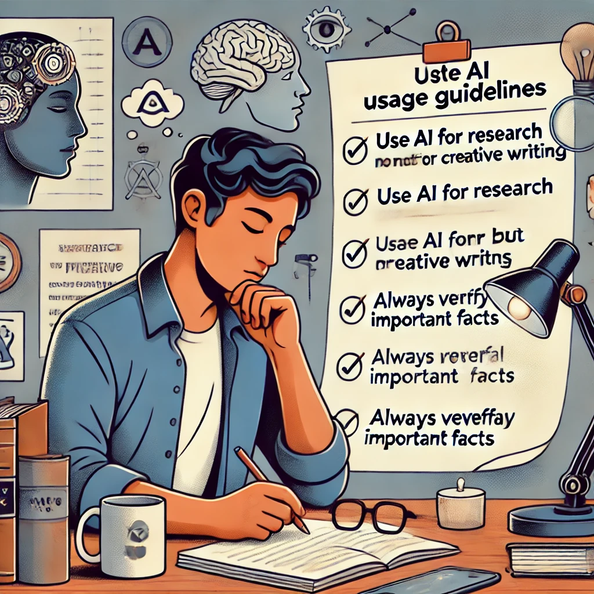

## Actividad 5: Estableciendo Tu Brújula de IA

**Objetivo:** Desarrollar pautas personales sobre cómo quieres usar la IA en tu vida.

**Lo que necesitarás:**
- Acceso a ChatGPT
- Papel y bolígrafo, o documento digital
- 15-20 minutos

**Instrucciones:**

1. Reflexiona sobre tus valores, objetivos y las áreas de tu vida donde crees que las herramientas de IA podrían ser útiles. Considera:
   - ¿Qué tipos de tareas encuentras agotadoras o que consumen mucho tiempo?
   - ¿Qué habilidades te gustaría desarrollar, con la IA como ayuda de aprendizaje?
   - ¿Qué aspectos de tu pensamiento o trabajo nunca querrías externalizar?

2. Pide ayuda a ChatGPT para pensar en estas preguntas con una indicación como:
   
   `Estoy desarrollando pautas personales sobre cómo quiero usar herramientas de IA como tú en mi vida. ¿Puedes ayudarme a pensar en algunas preguntas a considerar sobre dónde la IA podría serme más útil y dónde podría querer ser cauteloso al usarla? Considera aspectos como el aprendizaje, la creatividad, el pensamiento crítico y las tareas prácticas.`

3. Basándote en las sugerencias de la IA y tu propia reflexión, redacta 3-5 pautas personales para tu uso de IA. Estas podrían incluir:
   - Tipos de tareas para las que usarás IA
   - Límites que mantendrás
   - Cómo verificarás o evaluarás el contenido generado por IA
   - Cuándo confiarás en enfoques puramente humanos

4. Comparte tu borrador de pautas con ChatGPT y pide retroalimentación: 
   
   `Aquí están mis pautas preliminares para usar IA. ¿Puedes sugerir alguna consideración que podría haber pasado por alto o formas de hacer estas pautas más prácticas?`

5. Finaliza tus pautas basándote en esta retroalimentación, manteniendo lo que resuena y descartando lo que no se ajusta a tus valores y necesidades.

*"Este ejercicio me ayudó a establecer límites saludables"*, dice Gabriela, una escritora freelance. *"Me di cuenta de que quería usar IA para investigación y edición pero no para el corazón creativo de mi escritura. Tener estas pautas me ayuda a usar la IA como una herramienta sin sentir que estoy comprometiendo mi oficio."*

**Preguntas de reflexión:**

- ¿Qué aprendiste sobre tus propias prioridades a través de este ejercicio?
- ¿Hubo alguna sugerencia de la IA que te sorprendió o te hizo reconsiderar tu enfoque?
- ¿Cómo podrían evolucionar estas pautas a medida que adquieras más experiencia con herramientas de IA?
- ¿Cómo reflejan estas pautas tu comprensión de la Inteligencia Real como una asociación humano-IA?

--- 