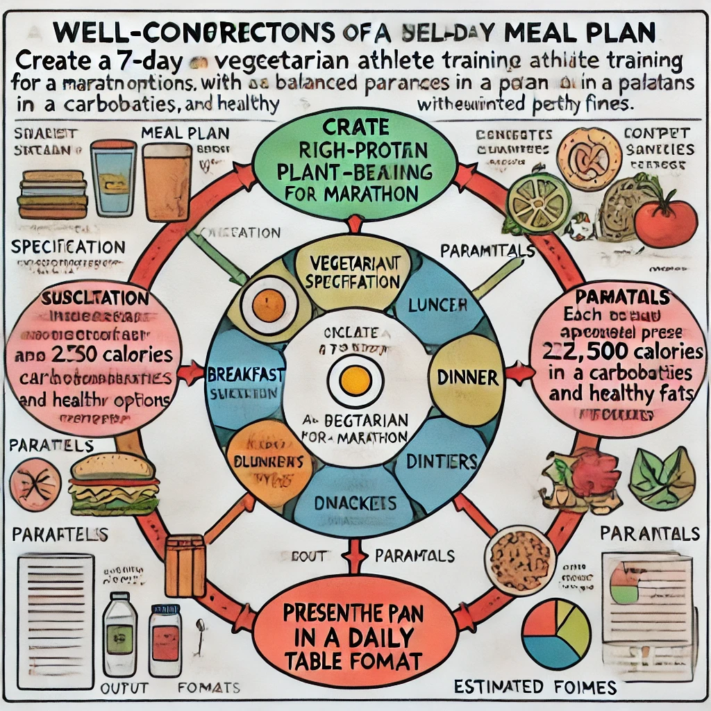

## Estrategias Intermedias de Ingeniería de Indicaciones

A medida que te sientas más cómodo con las indicaciones básicas, puedes incorporar técnicas más avanzadas para obtener mejores resultados. Estas estrategias intermedias permiten una mayor precisión y ayudan a superar algunas de las limitaciones de ChatGPT.



### Asignación de Rol: Dando a ChatGPT una Personalidad

Una técnica poderosa es asignar a ChatGPT un rol o personalidad específica. Esto ayuda a enmarcar sus respuestas desde una perspectiva particular o área de experiencia.

**Formato**: "Quiero que actúes como [rol/personalidad]. [Contexto adicional sobre el rol]. [Tu solicitud]."

**Ejemplos**:

`Quiero que actúes como un guía de viajes especializado en destinos europeos económicos. Recomienda un itinerario de 7 días para Barcelona que incluya atracciones gratuitas o de bajo costo, opciones de comida asequibles y consejos de transporte.`

`Quiero que actúes como un entrenador de fitness para principiantes. Crea una rutina simple de ejercicios en casa de 20 minutos que no requiera equipo y sea suave para las rodillas. Incluye ejercicios de calentamiento y enfriamiento.`

`Quiero que actúes como un editor de libros infantiles. Revisa la siguiente apertura de historia y sugiere formas de hacerla más atractiva para niños de 8-10 años, manteniendo el lenguaje en un nivel de lectura apropiado.`

Al asignar un rol específico, ayudas a ChatGPT a entender no solo qué información estás buscando, sino también qué perspectiva, tono y tipo de experiencia debe enfatizarse en la respuesta.

### Especificación de Formato: Controlando la Estructura de Salida

Otra técnica útil es indicar explícitamente cómo quieres que se estructure la información. Esto ayuda a organizar información compleja de la manera que te resulte más útil.

**Las especificaciones de formato comunes incluyen**:

- Tablas: Excelentes para comparaciones y presentación de datos
- Puntos destacados: Ideales para listas y puntos clave
- Pasos numerados: Perfectos para procedimientos e instrucciones
- Formato de preguntas y respuestas: Útil para anticipar preguntas sobre un tema
- Listas de pros y contras: Útiles para la toma de decisiones

**Ejemplo**:

`Compara coches eléctricos y coches de gasolina en términos de costo inicial, gastos de mantenimiento, impacto ambiental y conveniencia. Presenta esta información en una tabla con dos columnas y, después de la tabla, proporciona un breve párrafo resumiendo qué tipo podría ser mejor para diferentes tipos de usuarios.`

Especificar formatos no solo hace que la información sea más fácil de consumir, sino que también asegura que obtengas exactamente el tipo de salida que necesitas para tu propósito específico.

### Control de Temperatura: Ajustando Creatividad vs. Precisión

Aunque no puedes cambiar directamente la configuración de "temperatura" de ChatGPT en la interfaz estándar (este es un parámetro técnico que controla la aleatoriedad), puedes solicitar efectivamente respuestas más creativas o más precisas a través de tu lenguaje de indicación.

**Para respuestas más precisas y factuales**:
- "Proporciona una explicación concisa basada en hechos de..."
- "Dame la respuesta más precisa y directa sobre..."
- "Enfocándote únicamente en información bien establecida, explica..."

**Para respuestas más creativas y variadas**:
- "Piensa creativamente sobre diferentes posibilidades para..."
- "Genera ideas diversas e innovadoras para..."
- "Explora enfoques inusuales o no convencionales para..."

**Ejemplo**:

*Solicitud precisa*:

`Proporciona una explicación concisa basada en hechos de cómo funcionan las vacunas en el cuerpo humano, enfocándote en el papel de los anticuerpos y la respuesta inmune.`

*Solicitud creativa*:

`Piensa creativamente en diferentes formas de explicar cómo funcionan las vacunas a un niño curioso de 8 años. Utiliza analogías imaginativas y escenarios atractivos que capturen la atención de un niño.`

### Cadena de Pensamiento: Desglosando Problemas Complejos

Para problemas complejos, puedes guiar a ChatGPT para que desglose su proceso de pensamiento paso a paso, lo que a menudo conduce a resultados más precisos.

**Formato**: "Piensa en [problema] paso a paso. Primero analiza [aspecto 1], luego considera [aspecto 2], y finalmente determina [tipo de conclusión]."

**Ejemplo**:

`Piensa en este problema matemático paso a paso. Primero identifica las variables clave y lo que estamos resolviendo, luego establece la ecuación apropiada, resuélvela matemáticamente mostrando cada paso, y finalmente interpreta lo que significa el resultado en el contexto del problema original:

`
Una cafetería vende café a $4.50 por taza y té a $3.75 por taza. El martes, vendieron 56 cafés más que tés, con ventas totales de $526.50. ¿Cuántas tazas de cada bebida vendieron?
`

Esta técnica es particularmente útil para problemas matemáticos, razonamiento lógico, resolución de problemas y procesos complejos de toma de decisiones.

### Emulación de Mensaje del Sistema: Preparando el Escenario

Aunque no tienes acceso directo a mensajes del sistema (instrucciones que establecen parámetros para el comportamiento de la IA) en la interfaz estándar de ChatGPT, puedes emular su efecto con tus indicaciones.

**Formato**: Comienza tu conversación con pautas claras sobre cómo quieres que ChatGPT se comporte durante toda la interacción.

**Ejemplo**:

```
Para nuestra conversación, me gustaría que actuaras como un coach de escritura ayudándome a mejorar un cuento corto. Por favor, proporciona críticas constructivas enfocadas en el desarrollo de personajes, la coherencia de la trama y la autenticidad del diálogo. Al dar retroalimentación, primero menciona un aspecto positivo antes de sugerir mejoras. Mantén tus respuestas concisas, alrededor de 3-4 párrafos.

Si algo en mi historia no está claro, haz preguntas aclaratorias en lugar de hacer suposiciones.
```

Este enfoque es especialmente útil para conversaciones más largas donde compartirás múltiples extractos o ideas y deseas retroalimentación consistente en un estilo particular.

### Usando Ejemplos: Aprendiendo por Demostración

A veces, la forma más fácil de obtener exactamente lo que quieres es mostrar a ChatGPT un ejemplo de tu salida deseada.

**Formato**: "Me gustaría que [tarea], siguiendo este formato y estilo: [ejemplo]"

**Ejemplo**:

```
Me gustaría que crearas ideas de publicaciones para redes sociales para una pequeña panadería, siguiendo este formato y estilo:

#MuffinsDeLunes: '¡Comienza tu semana con una nota dulce con nuestros muffins de arándanos con streusel! Horneados frescos esta mañana con bayas de origen local. ¡Perfectos con tu café de la mañana o como un impulso por la tarde! 💙🧁'

Por favor, crea 5 ideas más de publicaciones para diferentes productos utilizando este mismo tono accesible, estilo de emoji y formato con un hashtag seguido del texto de la publicación.`

Esta técnica, a veces llamada "aprendizaje con pocos ejemplos", mejora dramáticamente la probabilidad de obtener resultados que coincidan exactamente con tus expectativas.
```

### Refinamiento Multi-turno: Mejora Iterativa

Las tareas complejas a menudo se benefician de dividir el trabajo en múltiples turnos de conversación, cada uno basándose en el anterior.

**Enfoque**:

1. Comienza con una solicitud básica
2. Revisa la respuesta
3. Pide refinamientos específicos
4. Repite hasta que estés satisfecho

**Secuencia de ejemplo**:

1. `Redacta una introducción simple para una presentación sobre opciones de transporte urbano sostenible.`
2. *[ChatGPT proporciona borrador]*
3. `Es un buen comienzo. ¿Podrías revisarlo para incluir una breve estadística sobre emisiones de carbono de vehículos tradicionales?`
4. *[ChatGPT proporciona borrador revisado]*
5. `Ahora haz que el tono sea más atractivo y conversacional, como si estuvieras hablando a jóvenes profesionales en lugar de académicos.`

Este enfoque iterativo te permite guiar el desarrollo de contenido o ideas en etapas, en lugar de intentar obtener un resultado perfecto con una sola indicación compleja.

### Combinando Múltiples Técnicas

La indicación más efectiva a menudo combina varias de estas técnicas. Aquí hay un ejemplo que integra asignación de rol, especificación de formato y ejemplos:

```markdown
Quiero que actúes como un experimentado profesor de ciencias para estudiantes de secundaria. Crea un plan de lección sobre la fotosíntesis que involucre a estudiantes de 7º grado con diferentes estilos de aprendizaje. El plan de lección debe incluir:

1. Objetivos de aprendizaje (en puntos destacados)
2. Una actividad de introducción de 5 minutos que capte la atención
3. Presentación del contenido principal (15 minutos)
4. Una actividad práctica (20 minutos)
5. Estrategia de evaluación

Para la actividad práctica, algo similar a esto funcionaría bien: 'Los estudiantes crean una tira cómica que muestra el viaje de una molécula de dióxido de carbono a través del proceso de fotosíntesis.'

Mantén el lenguaje accesible para niños de 12-13 años mientras seas científicamente preciso.
```

Esta indicación integral combina rol (profesor de ciencias), formato (plan de lección estructurado con tiempos), un ejemplo (para la sección de actividad) y parámetros (nivel de lenguaje de secundaria, precisión científica).

### Cuándo Usar Estas Técnicas

No toda interacción requiere indicaciones avanzadas. Usa estas técnicas cuando:

- Las indicaciones básicas no estén dando los resultados que deseas
- Necesites formatos o estilos muy específicos
- Estés trabajando en temas complejos o con matices
- Estés tratando de resolver problemas desafiantes
- Necesites contenido creativo que siga parámetros particulares

Con la práctica, desarrollarás una intuición para qué técnicas funcionan mejor para diferentes tipos de solicitudes. 