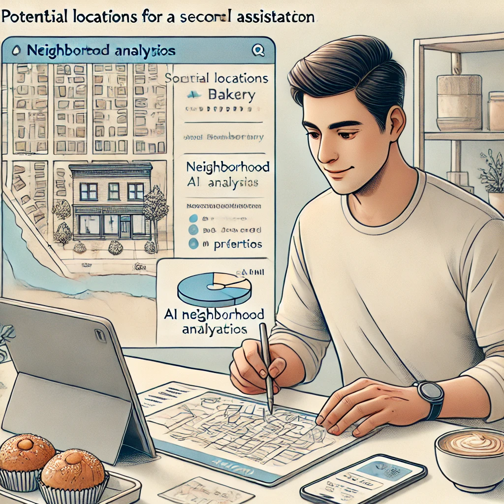

# AIツールと人間の知性

## 関係性を理解する

あなたは疑問に思っているかもしれません...*「これらのAIツールを効果的に使うには、コーディングやコンピューターサイエンスを学ぶ必要があるのでしょうか？」*

簡単な答えは*いいえ*です。ChatGPTのようなAIツールの使用は、検索エンジンの利用やテキストメッセージの送信以上の技術的スキルを必要としません。質問を入力できれば、AIを使用できます。

技術的な知識よりもはるかに重要なのは、あなたの以下の能力です：

- あなたにとって重要なトピックについて明確な質問をする
- 回答があなたの状況に合っているかどうかを評価する
- さらに詳細や別のアプローチが必要な場合にフォローアップする

これらは、あなたが人生を通じて培ってきた人間のスキルであり、パートナーシップにおいてあなたが**実践的知性**である理由でもあります。

AIツールを効果的に使用するには、人間の知性とAIの違いを理解し、その違いがなぜ強力なパートナーシップを生み出すのかを知ることが役立ちます。

## 人間の知性をユニークにしているもの

人間の知性には、現在のAIシステムが印象的な能力にもかかわらず単純に持っていない特質がいくつかあります：

### 目的と意味

人間は単に何かをするのではなく、理由があって行動します。私たちは「なぜ」という質問をし、価値観に基づいて目標を設定し、意味のあることを達成すると満足感を得ます。私たちは活動の裏にある目的を深く気にかけ、単にそれを済ませることだけではありません。

対照的に、AIシステムには本質的な目的や欲求はありません。彼らは何かを「望む」ことはなく、単に入力を処理して出力を生成するだけです。目的意識はそれを使用する人間から来なければなりません。

### 現実世界の理解

生きた経験を通して構築された世界に対するあなたの豊かな理解について考えてみてください。傘なしで雨に降られたときの感覚を知っています。予期せぬ良いニュースを受け取ったときの感情的な重みを理解しています。家族の集まりの微妙な社会的力学を把握しています。

ChatGPTのようなAIシステムは、世界を描写する膨大なテキストでトレーニングされていますが、実際にその中で生きたことはありません。アイスクリームについて「読んだ」ことはあっても、実際に味わったことはありません。雨に降られるとどんな感じかを説明できますが、突然の冷たい水しぶきを感じたり、急いで避難したりした経験はありません。それは旅行ガイドを読むことと実際に場所を訪れることの違いのようなものです—ガイドがどれほど詳細であっても、言葉では捉えられない経験の本質的な何かがあります。

### 創造性と直感

退職した美術教師のエレナは、水彩画の趣味にAIを使うことに懐疑的でした。*「コンピュータープログラムが芸術のような個人的なものにどう役立つのか分かりませんでした」*と彼女は言いました。しかし、彼女がChatGPTに紅葉をより鮮やかに描くためのアドバイスを求めたとき、彼女は心地よい驚きを感じました。

*「提案された技術は基本的な基礎でした—私が自分の生徒に教えるようなことです。しかし、私は依然として色に対する感覚、構図のセンス、そして自分の美的好みを適用する必要がありました。AIは検討すべき選択肢を与えてくれましたが、創造的な決断は私のものでした。」*

これは別の重要な違いを示しています：人間の創造性は、予期せぬつながりを作ること、一見無関係なアイデアからインスピレーションを得ること、あるいは完全に説明できない突然の洞察を持つことを含むことがよくあります。私たちの直感により、微妙な手がかりや長年の経験に基づいて判断を下すことができます。

AIは既存のアイデアを印象的な方法で再結合することはできますが、本物のインスピレーションのきらめきや、明示的に知られていることを超えた飛躍を人間に可能にする直感的なセンスを持っていません。

### AIツールが得意とすること

これらの違いは弱点ではなく、強力なパートナーシップの基盤です。AIと人間は相補的な強みを持つチームメイトのようなものです。

あなたが愛する人に影響を与える健康状態を調査しているとします。医学雑誌を何週間も読み、複雑な専門用語や矛盾する研究を理解しようとすることもできます。または、現在の研究をまとめ、重要な用語を説明し、治療選択肢を強調するようAIに依頼することもできます—すべて数分で。これがAIが真に輝く部分です：最も熱心な人間の読者でも圧倒されるような膨大な量の情報を処理します。

AIが優れている点：

**情報処理**：膨大な量の情報を迅速に統合し、膨大なデータセット全体でパターンを見つけること。

**一貫した出力**：退屈になったり、気が散ったり、感情的になったりすることなく疲れ知らずに働くこと。

**迅速なアイデア生成**：問題に対する複数の選択肢、草案、アプローチを数秒で生成すること。

**パターンからの学習**：人間が見落としがちなデータの傾向と関連性を特定すること。

## ディレクターとアシスタント

この関係を理解するための役立つ方法は、あなた自身を映画監督、AIをあなたのアシスタントと考えることです。

監督として、あなたは：

- プロジェクトのビジョンと目的を決定する
- 創造的および倫理的な決断を下す
- あなたの好みと判断に基づいて品質を評価する
- 最終製品に対する最終的な責任を負う

AIアシスタントは：

- 特定のタスクの実行を支援する
- あなたの方向性に基づいて選択肢を提供する
- 情報と提案を提供する
- あなたが指定した詳細に疲れることなく取り組む

監督がいなければ、アシスタントには目的や方向性がないでしょう。アシスタントがいなければ、監督はすべての小さな詳細を一人で処理しなければなりません。

では、これは実際にはどのように見えるのでしょうか？技術的なバックグラウンドを持たない小規模ビジネスオーナーのマーカスが、このパートナーシップをどのように実践しているかを見てみましょう。

マーカスは成功したベーカリーを所有しており、2番目の場所をオープンすることを検討しています。単に*「2番目のベーカリーの場所をどこにすべきか？」*とAIに尋ねるのではなく（これは、彼の特定のビジネスを知らないとAIが適切に答えられない質問です）、マーカスはより具体的なプロンプトでAIに指示します：

- `新しいベーカリーの場所を選ぶ際に分析すべき人口統計データは何ですか？`
- `ベーカリー用の潜在的な小売スペースを評価するためのチェックリストを作成するのを手伝ってください。`
- `ベーカリーが2つ目の場所をオープンする際に直面する典型的な課題は何ですか？`

ここにパターンがあることに注目してください—各質問はAIの情報を整理する能力を活用しながら、マーカスを意思決定者の役割にしっかりと保ちます。AIは価値ある枠組みと情報を提供しますが、最終的な決断はマーカスが下します。これは彼のリスク許容度、異なる地域に対する直感、そして彼のブランドに対するビジョンなど、彼だけが完全に理解できる要素に基づいています。

次のセクションでは、これらのAIツールが実際にどのように動作するかを簡単な言葉で探索します。これにより、技術的なバックグラウンドを必要とせずに、それらの能力と限界を理解するのに役立ちます。

--- 