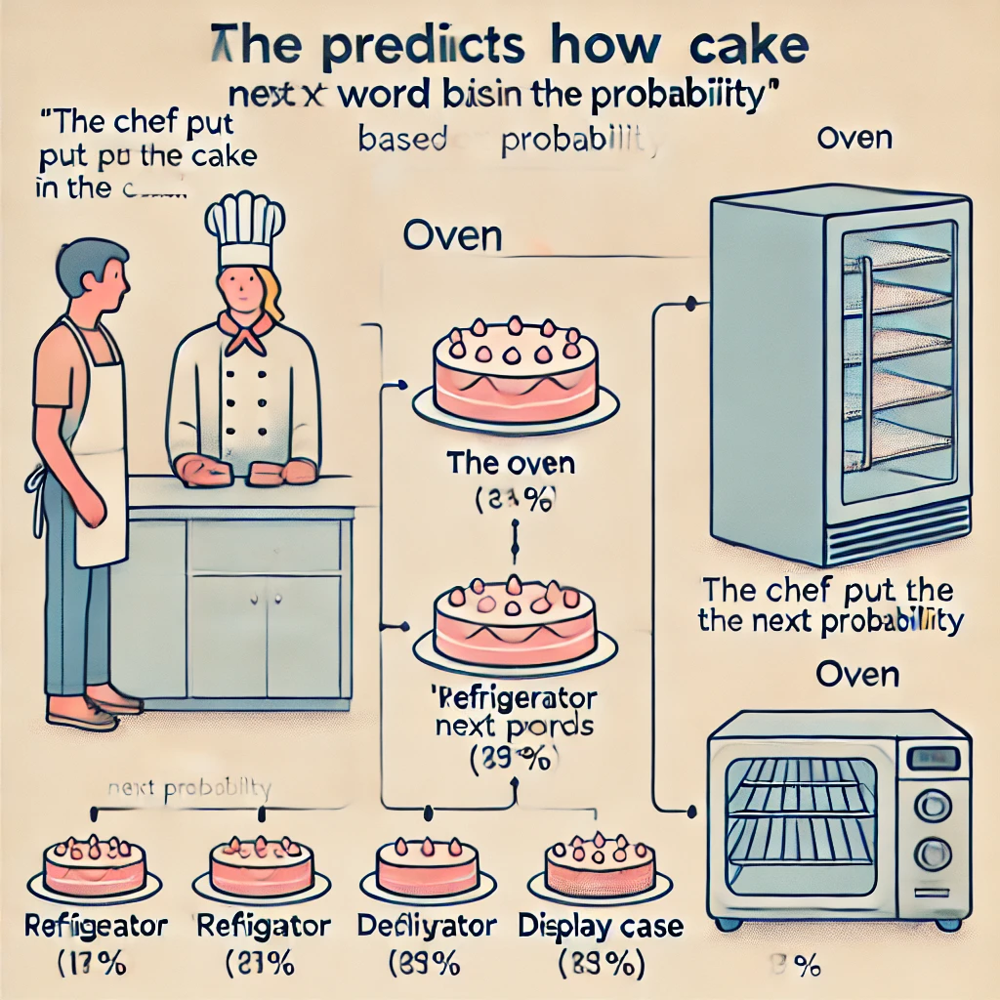

# 現代のAIツールのしくみ（非技術者向け）

AIツールを効果的に指示するためには、すべての技術的な詳細を理解する必要はありません—ちょうど効果的に運転するために車のエンジンがどのように機能するかを正確に知る必要がないのと同じです。しかし、基本的な概念的理解を持つことで、現実的な期待を設定し、これらのツールをより巧みに使用するのに役立ちます。

ChatGPTのようなAIツールがどのように機能するか、その能力と限界の両方を強調するシンプルな類推を使って探ってみましょう。

*「AIについて初めて聞いたとき、SF映画からのようなもの—考えたり感じたりするコンピューターのようなものを想像していました」*と、現在、家系図の趣味のためにChatGPTを毎日使用している退職者のジェームズは言います。*「しかし使い始めると、それは非常に博識で信じられないほど速い研究助手のようなものだが、慎重な指示が必要だということに気づきました。」*

{ width=90% }

## パターン補完マシン

核心部分では、ChatGPTのようなAIは洗練されたパターン補完マシンです。友人と文章を始めて相手に完成させてもらうゲームをしているところを想像してください：

あなた：`シェフはケーキを...に入れました`

友人はほぼ確実に次のように答えます：`オーブン`

なぜでしょうか？彼らが人生を通じて遭遇したすべての言語に基づいて、このコンテキストでは「オーブン」が次に来る可能性が最も高い言葉だからです。

ChatGPTも同様のことをしますが、はるかに大規模です。書籍、記事、ウェブサイト、その他のソースからの膨大な量のテキストでトレーニングされてきました。このトレーニング中に、単語やアイデアが典型的にどのように互いに続くかのパターンを認識することを学びました。

{ width=90% }

それは、音楽理論を実際に理解していないが何千もの曲を聴いた音楽家のようなものだと考えてください。あなたが数音をハミングすると、その音楽家は以前に聞いた類似のパターンに基づいてメロディーを続けることができます。彼らは真に独創的なものを作曲しているのではなく、あなたが始めたパターンを続けるために彼らが吸収したすべての音楽を引き出しているのです。

## 人間の知識のエコーチェンバー

これらのAIツールを考える上で役立つもう一つの方法は、人間の知識のエコーチェンバーとしてです。彼らは、トレーニングされたデータの中にすでに存在する情報とパターンだけを反映することができます。

{ width=90% }

ChatGPTにフランス革命について尋ねると、多くの人間の作家がこのトピックについて書いており、それらの文章がトレーニングデータの一部だったため、情報を提供することができます。しかし、誰も書いたことがない完全に架空の歴史的出来事について尋ねると、そのパターンがトレーニングデータに存在しないため、正確な情報を提供することができません。

これはAIツールが：

- 既存の人間の知識と文章パターンを反映できる
- 既存の知識から派生しない真に新しい発見や洞察を生成することはできない
- もっともらしく見えるが実際には不正確な情報を自信を持って提示することがある

## 理解ではなくテキスト予測

人間のようなテキストを生成する印象的な能力にもかかわらず、ChatGPTは実際には人間のように単語の意味を「理解」していません。それは、より深い概念や実世界の経験にそれらの単語を結びつけるのではなく、統計的パターンに基づいて、どの単語が互いに続く可能性が高いかを予測します。

外国語で料理本を暗記したが、単語の意味を理解していない人のようなものを考えてみてください。彼らは完璧にレシピを暗唱し、観察したパターンに基づいて合理的な代替品を提案することさえできるかもしれませんが、食べ物の味を知らず、材料の感触を感じたこともなく、なぜ特定の技術が使用されるのかを理解していません。

{ width=90% }

この限界は、AIがしばしば以下のことに苦労する理由を説明しています：

- 常識的な推論
- 物理的世界の理解
- 原因と結果の把握
- もっともらしく聞こえるナンセンスと実際の真実との区別

## 確率生成器

ChatGPTがテキストを生成するとき、それは本質的に確率に基づいた一連の単語選択を行っています。メロディーの次の音符を推測するようなものです。文の各位置において、先行する単語と全体的なコンテキストを考慮して、次に来る可能性が最も高い単語を計算します。

あなたが文を始め、誰かが次に来る単語を推測しなければならないゲームを想像してください：

`シェフはケーキを...に入れました`

多くの人が「オーブン」と推測するでしょう。なぜならそれがこのコンテキストで続く可能性が最も高い単語だからです。AIシステムも同様のことをしますが、言語パターンの理解がはるかに洗練されており、選択肢の語彙がはるかに多いです。

{ width=90% }

この確率的アプローチは以下を意味します：

- ChatGPTには固定された応答セットがない—毎回新しいテキストを生成する
- 同一のプロンプトに対しても応答が異なることがある
- AIは推論に基づいて何を言うかを「決定」するのではなく、確率に基づいて単語を選択する

## これがあなたにとって意味すること

AIがどのように機能するかについてのこれらの基本を理解することは、その印象的な能力と驚くべき限界の両方を説明するのに役立ちます：

1. **人間のようなテキストを生成できる**。膨大な量の人間の文章からパターンを学んだため

2. **多くのトピックに関する情報を提供できる**。多様なテキストでトレーニングされているため

3. **事実の正確さに苦労する**。真実を検証するのではなく、もっともらしいテキストを予測しているため

4. **真に推論したり理解したりすることはできない**。意味を理解するのではなく、パターンを一致させているため

5. **経験や目標を持っていない**。意識のある存在ではなく、テキスト予測システムであるため

これらの特性により、AIツールは特定のタスクに非常に役立ちますが、人間の指示と判断—あなたの実践的知性—が依然として不可欠である理由も強調しています。

## 専門家ではなくアシスタント

これらの限界を考えると、AIツールを専門家や権威者ではなく、アシスタントとして考えるのが役立ちます。アイデアを出したり、コンテンツを起草したり、情報をまとめたり、アイデアを探索したりするのを手伝うことはできますが、常に自分の判断をその出力に適用すべきです。

{ width=90% }

日本への家族旅行を計画しているジェイクを思い出してください。彼が単にChatGPTに`「完璧な日本旅行を計画して」`と尋ね、生成された旅程に従うだけなら、彼の家族の興味に合わない一般的な観光体験をしたり、改修中で閉鎖されている観光スポットを訪れたりする可能性があります。

代わりに、ジェイクはAIの限界についての理解を使って、ツールをより効果的に指示します。彼は以下のことを知っています：

- AIの情報は古くなっている可能性がある
- 彼の家族の特定の好みを知らない
- 提案された宿泊施設が実際に利用可能かどうかを確認できない

そのため、彼はAIを特定のタスク（東京での子供向けアクティビティのアイデアの生成、基本的な日本語フレーズの言い回しの提案、荷物チェックリストの作成など）のアシスタントとして使用します。これらはパターンマッチングが役立つタスクです。一方で、重要な判断は自分自身で行い、重要な情報は他のソースで確認します。

次のセクションでは、この人間とAIのパートナーシップをコントロールして、これらの強力だが限られたツールから最大の価値を得る方法を探ります。

--- 