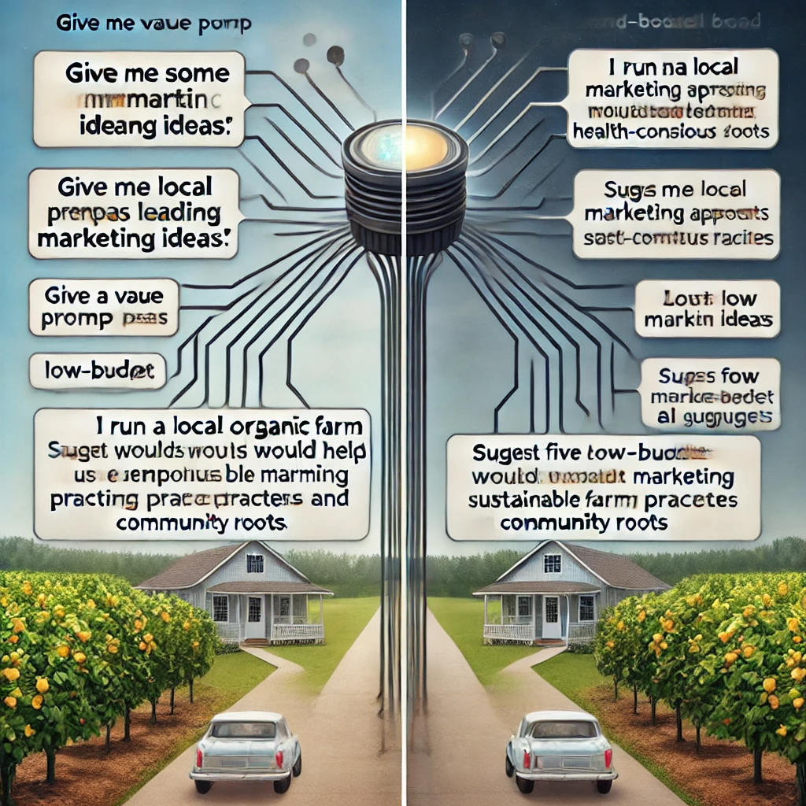
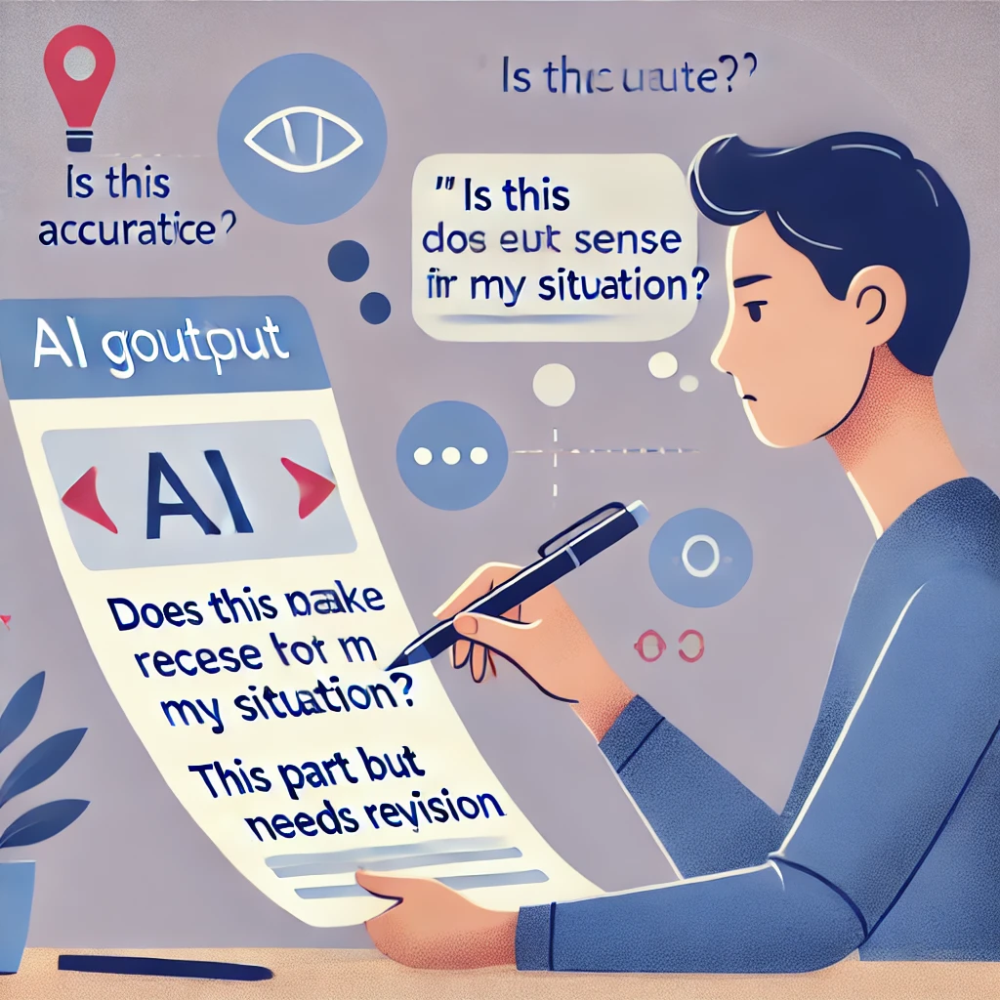
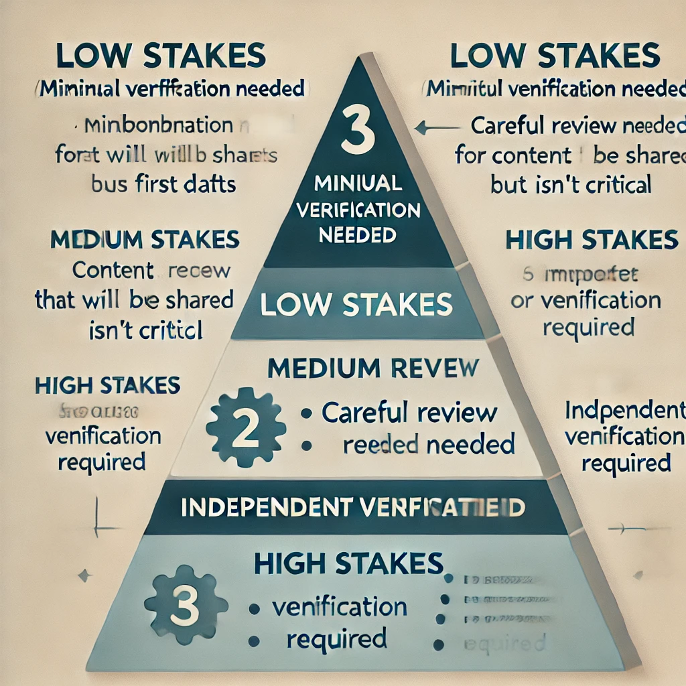

# AIの指示と現実的な期待の設定

人間の知性とAIの能力の関係を理解したところで、あなたのAI体験を成功させる2つの重要な要素に焦点を当てましょう：これらのツールを効果的に指示する方法と、それらに対して現実的に何を期待すべきかです。

## ディレクターのマインドセット

映画監督の比喩を覚えていますか？AIツールの効果的なディレクターであることの意味について掘り下げてみましょう。

映画監督が単に俳優に「良いシーンを作って」と言って最善を期待するのではないように、あいまいなリクエストとAIが生成するものを受動的に受け入れるアプローチをすべきではありません。ディレクターのマインドセットにはいくつかの重要な実践が含まれます：

### 1. 目的の明確さ

*「以前はChatGPTにあいまいな質問をして、一般的な回答にイライラしていました」*と小規模ビジネスコンサルタントのデイビッドは説明します。*「今ではアプリを開く前に、必要なことを正確に明確にする時間を必ず取ります。」*

AIに取り組む前に、自問してみましょう：

- 私はどのような具体的な問題を解決しようとしているのか？
- 成功した結果はどのようなものか？
- 考慮すべき制約や要件は何か？

この明確さは、より効果的な指示を出し、AIの回答をより批判的に評価するのに役立ちます。

--

### 2. 指示の具体性

あいまいなプロンプトは一般的な回答につながります。指示が具体的であればあるほど、AIの支援はより有用になります。これらのアプローチを比較してみましょう：

**あいまいな指示：** 「マーケティングのアイデアをいくつか教えて。」

**具体的な指示：** 「健康志向の家族をターゲットにした地元のオーガニックファームスタンドを経営しています。持続可能な農業実践とコミュニティルーツを強調するのに役立つ低予算のマーケティングアプローチを5つ提案してください。」

具体的な指示は、AIがあなたのニーズに合わせた関連性のある回答を生成するのに役立つコンテキストと制約を提供します。

--

### 3. 反復的な改良

AIとの作業は、一度きりのプロセスであることはめったにありません。それを単一の質問と回答ではなく、会話として考えてください。

*「最初はAIが与えてくれたものをそのまま受け入れていました」*とフリーランスライターのプリヤは言います。*「今では、やり取りの中で魔法が起こることを知っています。『それは堅すぎる』とか『Xについてもっと例を追加できますか』と言うと、結果は劇的に良くなります。」*

あなたのニーズを十分に満たさない最初の回答に満足しないでください。代わりに、フィードバックと追加の指示を提供して、AIをより有用な出力に導きましょう：

- `それは役立ちますが、もっと簡単にできますか？`
- `3番目のアイデアが一番良いです。そのアプローチについて具体的に詳しく説明してもらえますか？`
- `これらの例は技術的すぎます。この分野のバックグラウンドがない人向けに書き直してもらえますか？`

--

### 4. 批判的評価

AI生成コンテンツに健全な懐疑心でアプローチしましょう。自問してみましょう：

- この情報は正確で信頼できるように見えるか？
- これは私の特定の状況に適したアプローチか？
- これは私の価値観と目的に合致しているか？

あなたが品質と適切さの最終的な判断者であることを忘れないでください。AIはあなたを支援するためにあり、最終決定を下すためではありません。

## 増幅効果

人間の指示とAIの能力を組み合わせると、素晴らしいことが起こります：どちらも単独で達成できる以上に増幅されます。これが実践的知性の本質です。

- あなたの創造性は、AIが迅速にバリエーションと代替案を生成する能力によって増幅されます
- あなたの知識は、AIが考慮していなかった情報や視点を提供する能力によって増幅されます
- あなたの生産性は、AIがタスクの日常的な側面を処理する能力によって増幅され、より高いレベルの思考に集中できるようになります

この増幅は、実際の課題に適用されるとき特に強力になります。高校の英語教師であるサラが、カリキュラムを計画するときにこの増幅をどのように経験するかを考えてみましょう：

`
10年生の英語クラスのために「アイデンティティ」に関するユニットを設計する必要があります。私の生徒の多くは第一世代のアメリカ人で、文化間を行き来する課題についてよく議論します。多様な著者からのアイデンティティ形成を探求する現代的な短編小説を提案し、各物語について、移民の経験に関連する潜在的な議論の質問を概説してください。
`

この指示により、ChatGPTは迅速に提案を生成し、サラはそれを彼女の専門的な判断、特定の生徒の知識、カリキュラムの要件に基づいて評価します。彼女はいくつかの提案を受け入れ、他のものを修正し、彼女のビジョンに合わないものを拒否するかもしれません。

結果は、サラの専門知識と生徒の理解を反映したカリキュラムですが、完全に自分だけで作業するよりも効率的に、より広範な視点で開発されました。それが実践的知性の働きです。

## 現実的な期待の設定

AIツールを効果的に活用する上での最大の課題の1つは、現実的な期待を設定することです。メディアのハイプはしばしばAIを魔法の思考マシンや人類への差し迫った脅威として提示しますが、どちらもChatGPTのような現在のツールの現実を正確に反映していません。

*「AIに関するニュースにはすべて正直に脅迫されました」*と引退した会計士のラジは認めます。*「使用するには impossibly complexか、不気味なほど人間らしいかのどちらかを期待していました。現実はずっと現実的でした—ある面では役立ち、別の面では限られています。」*

これらのツールをより効果的に使用するために、それらができることとできないことのバランスの取れた理解を確立しましょう。

### AIツールが得意とすること

#### 人間のようなテキストの生成

AIは、創造的な文章から技術的な説明まで、カジュアルな会話から正式な文書まで、様々なタイプの書かれたコンテンツの作成に優れています。あなたの指示に基づいて、そのトーン、スタイル、複雑さのレベルを適応させることができます。

#### 情報の処理と要約

AIは大量の情報を取り込み、理解して使用しやすい要約、重要なポイント、または構造化されたフォーマットに蒸留することができます。

#### アイデアと代替案のブレインストーミング

AIは問題に対して複数のオプション、視点、またはアプローチを迅速に生成し、自分だけでは考えられなかった可能性を探ることができます。

#### コンテンツの草案と編集

AIは多くのタイプのコンテンツの初期草案を作成し、編集、再構成、または代替のフレーズを提案することで既存のテキストの改善を手伝うことができます。

#### 様々なレベルでの概念の説明

AIは複雑なトピックをよりシンプルな言葉で説明したり、基本的な概念のより詳細な説明を提供したりして、異なる知識レベルと学習ニーズに適応することができます。

#### 会話と視点のシミュレーション

AIは異なる視点や専門分野の役割を演じることができ、異なる人々がどのようにして状況にアプローチするかを探ることができます。

### AIツールが苦手とすること

#### 事実の正確さの検証

AI言語モデルは独立して事実を検証する能力を持っていません。もっともらしく聞こえるが実際には間違っている情報を自信を持って提示することがあります（時に「ハルシネーション」と呼ばれます）。

#### 最新情報の提供

AIのトレーニングデータには切断日があり、それ以降はモデルは特に更新されない限り、世界の出来事、新製品、または最近の発展についての知識を持ちません。

#### あなたの個人情報へのアクセス

AIはあなたが誰であるか、あなたの個人的な歴史、またはあなたの具体的な状況を知りません。ただし、あなたが会話の中でこの情報を明示的に共有した場合を除きます。

#### 現実世界でのアクションの実行

AI言語モデルは、特にそれらの機能と統合されていない限り、インターネットに直接アクセスしたり、プログラムを実行したり、他のシステムと対話したりすることはできません。

#### 真の判断力や知恵の行使

AIはアドバイスや意見をシミュレートできますが、真の知恵や判断に必要な生きた経験、道徳的基盤、文脈的な理解を欠いています。

#### 真に独創的なアイデアの創造

AIは既存の概念を新しい方法で再結合することはできますが、トレーニングデータから切り離された真に斬新なアイデアを生成することはありません。

## 一般的な誤解

非現実的な期待につながる可能性があるAIツールに関するいくつかの頻繁な誤解に対処しましょう：

### 誤解：「AIはすべてを知っている」

**現実：** AIはトレーニングデータに含まれていたことしか知らず、その知識は包括的でも常に正確でもありません。高い信頼性を持って不正確な情報を提示することがあります。

### 誤解：「AIは客観的で偏りがない」

**現実：** AIはトレーニングデータに存在する偏見と、その作成者によって導入された偏見を反映します。中立的または客観的な視点を持っていません。

### 誤解：「AIは自分が言っていることを理解している」

**現実：** AIは本物の理解なしにテキストを生成します。人間のように概念を理解しておらず、言語のパターンを予測していますが、それらを実世界の意味に結びつけていません。

### 誤解：「AIには意見や信念がある」

**現実：** AIはトレーニングデータのパターンに基づいて意見をシミュレートしますが、実際には信念や信条を持っていません。

### 誤解：「AIは常に自己改善している」

**現実：** ほとんどのAIツールは、特にそのように設計されていない限り、あなたのやり取りから学習しません。あなたの会話は通常、時間の経過とともにAIをよりスマートにしたり、あなたにより個人化したりすることはありません。

## 検証の原則

AIツールを使用する際の役立つガイドラインは、「検証の原則」と呼べるものです：AI生成の応答の重要性は、あなたの検証努力に比例すべきです。

言い換えれば：

- リスクの低いブレインストーミングや初期草案では、最小限の検証でAI出力を受け入れることがあります
- 中程度のリスクのコンテンツでは、AI提案を注意深くレビューし、自分自身の判断を下すべきです
- 高リスクの決定や事実の主張については、信頼できるソースを通じて情報を独自に検証すべきです

カメラ機器を研究している趣味の写真家マイケルは、この原則を適用します：*「私はChatGPTを使って技術的な概念の迅速な説明や、尋ねるべき質問を生成しています。しかし、新しいカメラに2,000ドルを費やす前に、特定のモデルの詳細をメーカーのウェブサイトで確認し、信頼できる写真サイトのレビューを読みます。」*

この原則は、AIの限界に関連するリスクを管理しながら、効率的にAIを使用するのに役立ちます。

## プロセスのコントロールを取る

AIツールのディレクターとしてのあなたの役割を完全に受け入れるために、この一般的なアプローチを検討してください：

1. **あなたの目的を明確に定義する**、AIに取り組む前に

2. **コンテキストと制約を提供する**、AIがあなたの特定の状況を理解するのに役立つ

3. **オープンエンドのプロンプトではなく、具体的な質問やリクエストから始める**

4. **応答を批判的に評価する**、有用な要素と潜在的な問題の両方を探す

5. **フィードバックと改良を提供する**、AIをより役立つ応答に導くため

6. **複数のソースを統合する**、AI生成コンテンツだけに頼らない

7. **あなたの判断、価値観、知識に基づいて最終決定を下す**

このアプローチは、AIの能力を活用してあなたの思考と生産性を向上させながら、プロセスを確実にコントロールします。

次のセクションでは、AIディレクターとしてのスキルを開発するために設計された実践的なアクティビティで、これらのアイデアを実践に移します。

--- 