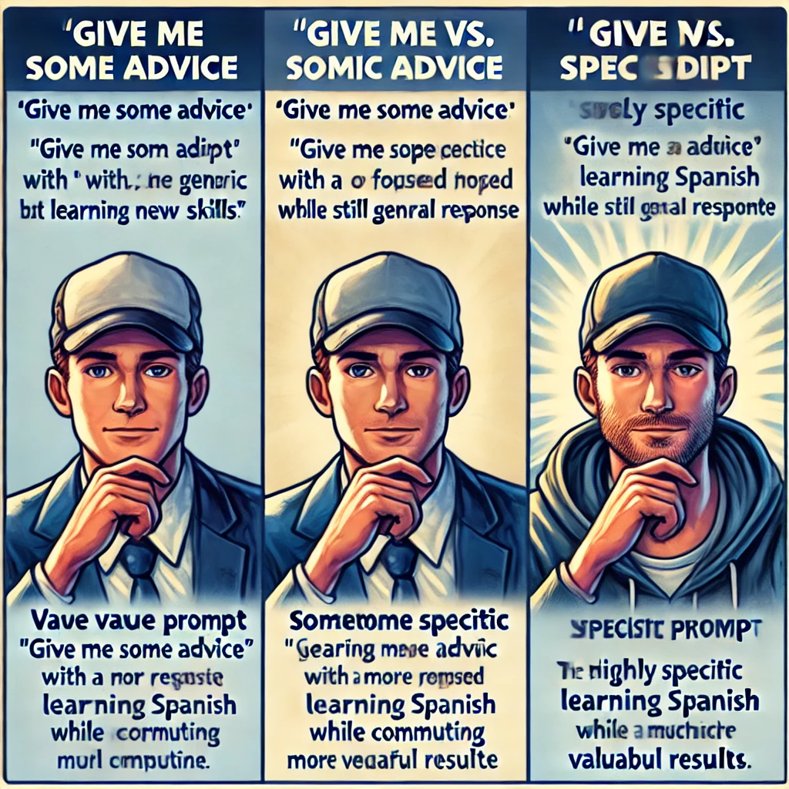

## アクティビティ1：ディレクターズチェア

**目的：** あなたの指示の具体性がAIの出力にどのように影響するかを確認する。

**必要なもの：**

- ChatGPTへのアクセス（無料アカウント）
- 10〜15分

*「このアクティビティは目から鱗でした」*と、高校教師のミゲルは言います。*「質問にいくつかの詳細を追加するだけで、回答がこれほど違うとは信じられませんでした。」*

**手順：**

1. ChatGPTを開き、新しい会話を始めます。

2. まず、あいまいなプロンプトを与え、応答を観察します：

   `「アドバイスをください。」`

3. 次に、少し具体的なプロンプトを試してみましょう：
   
   `「新しいスキルを学ぶことについてアドバイスをください。」`

4. 最後に、コンテキスト、制約、目標を含む非常に具体的なプロンプトを提供します：
   
   `「私は2人の幼い子供を持つ忙しい親で、3ヶ月後に家族でメキシコ旅行をする準備として基本的なスペイン語を学ぼうとしています。通常は公共交通機関で通勤しながら、毎日約15分しか練習できません。これらの制約に合った現実的な学習計画で、実用的な旅行フレーズに焦点を当てたものを提案してください。」`

5. 3つの回答を比較します。AIの出力の質と有用性があなたの指示の具体性に直接対応していることに注目してください。

**振り返りの質問：**

- どの回答があなたにとって最も役立ちましたか？そしてなぜですか？
- 詳細なプロンプトのどの具体的な要素がAIの回答の改善につながりましたか？
- AIを使用する際に、この具体性の原則をあなた自身の目標にどのように適用できるでしょうか？

--- 