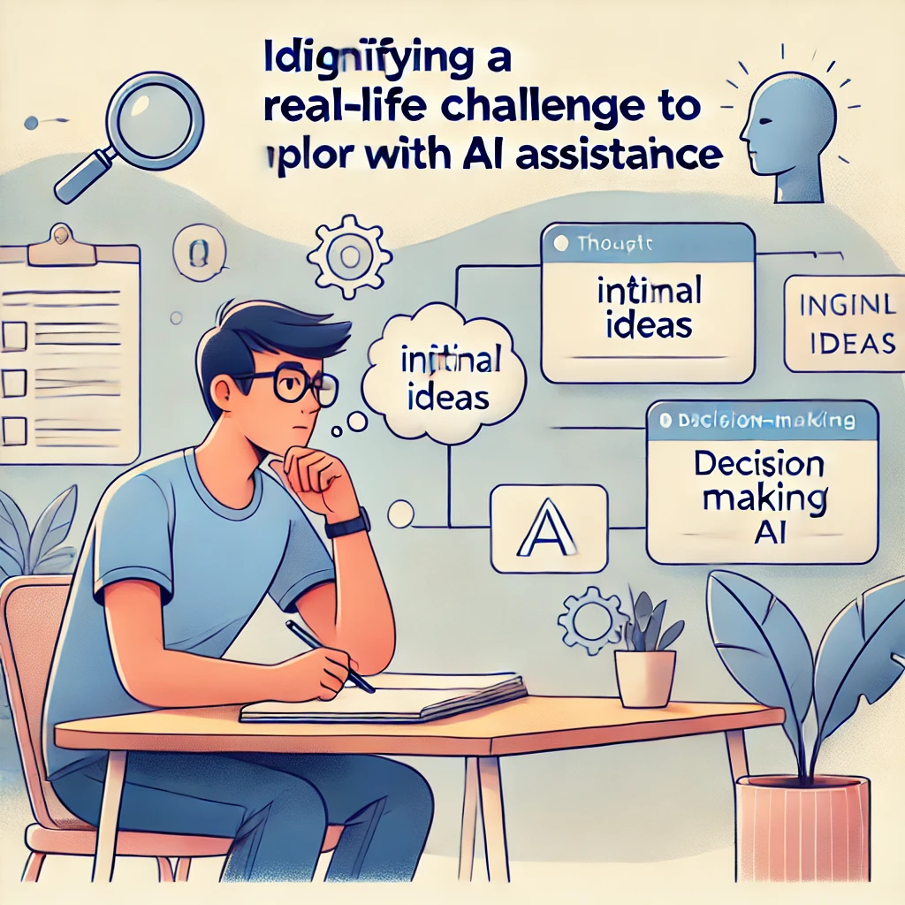

# アクティビティ2

## 知性増幅器

**目的：** 個人的な課題に対して、あなた自身の知性を増幅するための思考パートナーとしてAIを使用する。

**必要なもの：**

- ChatGPTへのアクセス
- あなたが現在直面している実際の問題や課題
- 15〜20分

**手順：**

1. 考えたり計画したりする必要がある現在のあなたの人生における課題を特定します。これは、あなたが下す必要がある決断、計画中のプロジェクト、解決しようとしている問題などかもしれません。実際のものを選びますが、極めて個人的または機密性の高いものは避けてください。

{ width=90% }

2. AIに相談する前に、3〜5分かけて課題についてあなた自身の考えを書き留めます：

   - これが難しい理由は何ですか？
   - あなたが検討した方法は？
   - 重要な制約や考慮事項は何ですか？

3. 次に、この課題について考えるのを助けてもらうようAIに依頼するプロンプトを作成します。以下を含めてください：

   - 状況の簡単な説明
   - あなたの現在の考えとアプローチ
   - どのような具体的な助けが欲しいか（ブレインストーミング、考えの整理、見落としていた可能性のある視点の検討など）

4. AIの回答を確認し、あなたが十分に考慮していなかった洞察やアイデアを少なくとも1つ特定します。

5. AIの回答に基づいて、少なくとも1つの明確化質問やリクエストでフォローアップします。

*「私はキャリアチェンジを計画するときにこのアプローチを使いました」*と、以前は小売店マネージャーで現在は医療管理で働いているタニシャは共有しています。*「AIは私に何をすべきか教えてくれたわけではありませんが、私の考えを整理し、私がすでに持っていた転用可能なスキルなど、考えていなかった側面を考慮するのに役立ちました。」*

**振り返りの質問：**

- AIの回答はあなたの最初の考えとどのように比較されましたか？
- AIは新しい角度から問題を見るのに役立ちましたか？
- 状況に関するあなたの具体的な知識は、AIの提案を評価するのにどのように役立ちましたか？
- この思考パートナーシップにおいて、あなたはどのような役割を果たし、AIはどのような役割を果たしましたか？

--- 