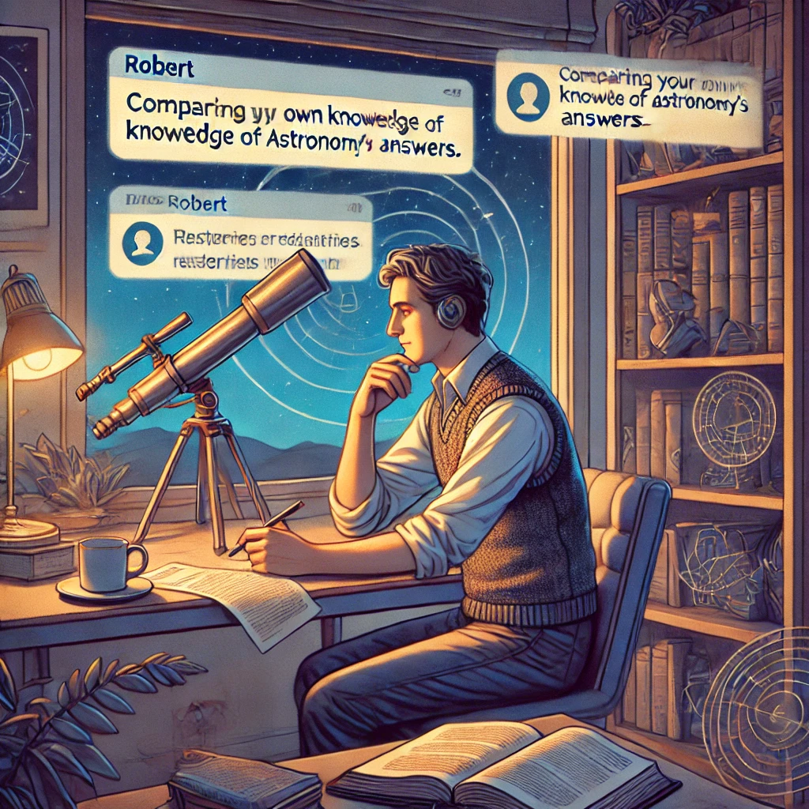

# アクティビティ3

## 神話vs現実

**目的：** AIの限界をテストして、人間の知性が不可欠である部分をより良く理解する。

**必要なもの：**
- ChatGPTへのアクセス
- 信頼できる情報源（ウェブサイト、書籍、専門家）へのアクセス
- 20〜30分

**手順：**

1. あなたがよく知っているトピックを選びます—おそらくあなたの職業、趣味、または地域社会に関連するものです。

{ width=90% }

2. ChatGPTに一連の徐々に具体的な質問をします。一般的な質問から始めて、非常に最近または専門的な知識を必要とする可能性のある高度に具体的な質問へと移行します。

3. AIが正確に答える質問と、苦戦したり不正確な情報を提供したりする質問を記録します。

4. AIが不正確または不完全な情報を提供した質問の少なくとも1つについて、信頼できる情報源を通じて正しい情報を確認します。

5. このトピックに関するAIの限界を説明するよう依頼します。次のようなプロンプトがうまく機能します：
   
   `「[あなたのトピック]に関する情報提供において、あなたにはどのような限界があるかもしれませんか？このテーマのどの側面があなたにとって正確に対応するのが難しいでしょうか？」`

アマチュア天文学者のロバートは、彼の趣味でこれを試しました：*「AIの基本的な天文学概念の知識に感心しましたが、私が観測した特定の深宇宙天体や最近の発見について尋ねたとき、時代遅れの情報を提供したり、詳細を作り上げたりしました。直接尋ねたとき、実際にはその限界についてかなり正直でした。」*

**振り返りの質問：**

- どの時点でAIの知識や正確さが崩れ始めましたか？
- どのタイプの質問がAIにとって最も困難に思えましたか？
- AIはその限界についてどれほど透明でしたか？
- これらの限界を知った上で、将来このトピックにAIを使用するにはどのようにアプローチしますか？

--- 