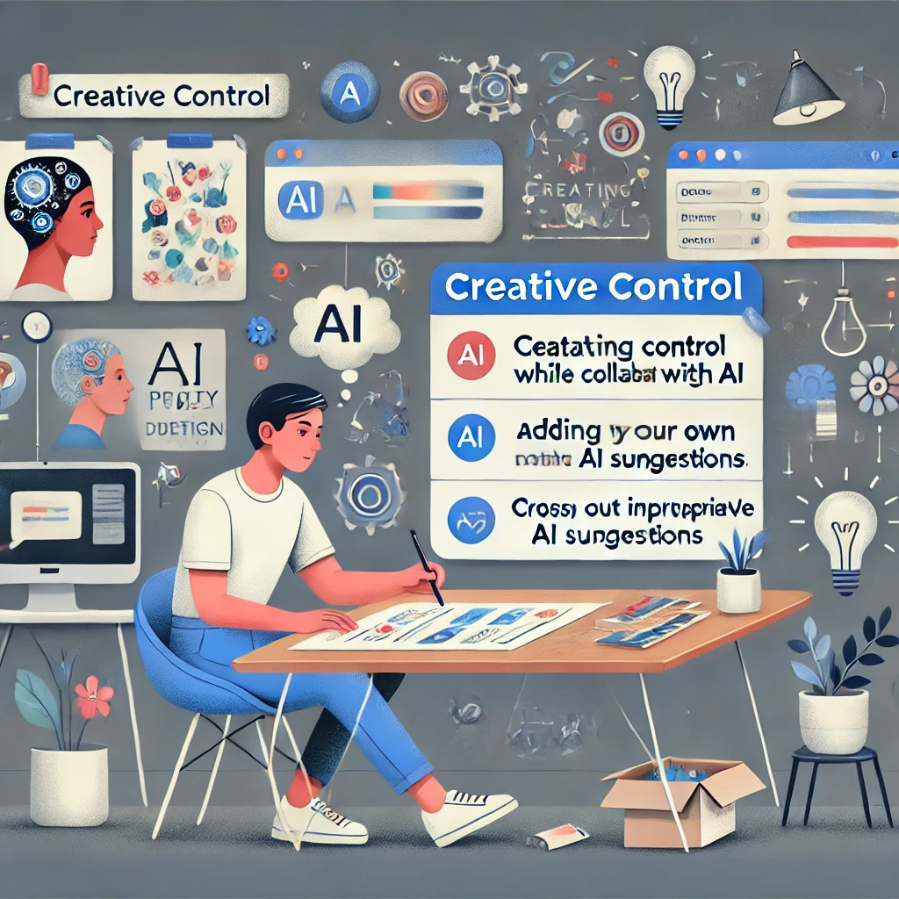

# アクティビティ4

## 創造的コントロール

**目的：** AIをアシスタントとして使用しながら、創造的プロジェクトの所有権を維持する練習をする。

**必要なもの：**

- ChatGPTへのアクセス
- 20〜30分

**手順：**

1. 以下のオプションから簡単な創造的プロジェクトを選択します（または独自のものを作成します）：

   - 短編小説を書く（300〜500語）
   - テーマディナーパーティーを計画する
   - コミュニティイベントのチラシをデザインする
   - ワークアウトルーティンを作成する

2. プロジェクトのビジョンを定義することから始めます。次のことを書き留めてください：

   - 主な目標または目的
   - 含めたい主要な要素
   - あなた個人のスタイルまたは好み
   - 制約や要件

3. プロジェクトの異なる側面を支援するChatGPTへの一連の具体的なリクエストを作成します。プロジェクト全体を完了するよう依頼するのではなく、AI支援が役立つコンポーネントに分解します。例えば、短編小説を書く場合：

   - `...についての物語の可能な冒頭段落を3つ提案してください`
   - `...である主人公を発展させるのを手伝ってください`
   - `...の設定のための描写的な言語を提供してください`

4. 各AIの応答に対して、好きな要素を選択し、他の要素を修正し、あなたのビジョンに合わないものを捨てます。

5. 最終的なプロジェクトを自分で組み立て、AI支援の要素をあなた自身の貢献と統合します。

*「私は娘の誕生日パーティーを計画するためにこのアプローチを使いました」*と、忙しい親のウェイは説明します。*「恐竜をテーマにしたいと思っていましたが、ゲームのアイデアや装飾の助けが必要でした。完全なパーティープランを依頼する代わりに、各側面について具体的な質問をし、好きな要素をまとめました。パーティーはAIが作ったものではなく、私の創作物のように感じました。」*

**振り返りの質問：**

- プロジェクトを具体的なリクエストに分解することで、創造的コントロールを維持するのにどのように役立ちましたか？
- プロセスのどの部分がAI支援から最も恩恵を受けましたか？
- どの側面があなたの人間の判断と創造性を必要としましたか？
- AI支援を使用したにもかかわらず、最終結果はどのようにあなたのビジョンとスタイルを反映していますか？

--- 