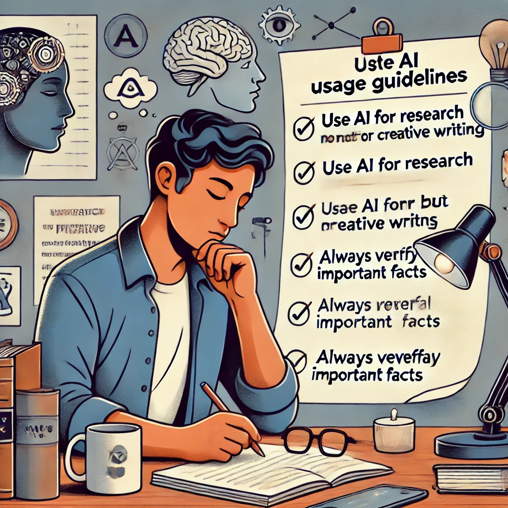

# アクティビティ5

## あなたのAIコンパスを設定する

**目的：** あなたの人生でAIをどのように使いたいかについての個人的なガイドラインを開発する。

**必要なもの：**

- ChatGPTへのアクセス
- 紙とペン、またはデジタル文書
- 15〜20分

**手順：**

1. あなたの価値観、目標、そしてAIツールが役立つと思われるあなたの人生の領域について考えます。考慮すべき点：

   - どのようなタイプのタスクがあなたにとって消耗的または時間がかかりますか？
   - AIを学習補助として、どのようなスキルを身につけたいですか？
   - あなたの思考や仕事のどの側面をアウトソースしたくないですか？

2. 次のようなプロンプトで、これらの質問を考えるのを手伝ってもらうようChatGPTに依頼します：
   
   `あなたのようなAIツールを私の人生でどのように使いたいかについての個人的なガイドラインを開発しています。AIが私にとって最も役立つ場所と、使用に慎重になりたい場所について考慮すべきいくつかの質問を考えるのを手伝ってもらえますか？学習、創造性、批判的思考、実践的なタスクなどの側面を考慮してください。`

3. AIの提案とあなた自身の考察に基づいて、AI使用のための3〜5つの個人的なガイドラインを草案します。これらには以下が含まれるかもしれません：

   - AIを使用するタスクのタイプ
   - 維持する境界
   - AI生成コンテンツをどのように検証または評価するか
   - 純粋に人間のアプローチに頼るとき

4. あなたの草案ガイドラインをChatGPTと共有し、フィードバックを求めます：
   
   `これがAI使用のための私の草案ガイドラインです。私が見落としているかもしれない考慮事項や、これらのガイドラインをより実用的にする方法を提案してもらえますか？`

5. このフィードバックに基づいてガイドラインを最終決定し、あなたの価値観とニーズに合うものを保持し、合わないものを捨てます。

*「この演習は健全な境界を設定するのに役立ちました」*と、フリーランスライターのガブリエラは言います。*「私は研究や編集にAIを使用したいが、私の執筆の創造的な核心には使用したくないと気づきました。これらのガイドラインを持つことで、自分の技術を妥協していると感じることなく、AIをツールとして使用するのに役立ちます。」*

**振り返りの質問：**

- この演習を通じて、あなた自身の優先事項について何を学びましたか？
- AIからの提案で、あなたを驚かせたりアプローチを再考させたりしたものはありましたか？
- AIツールの経験を積むにつれて、これらのガイドラインはどのように進化するかもしれませんか？
- これらのガイドラインは、人間とAIのパートナーシップとしての実践的知性についてのあなたの理解をどのように反映していますか？

--- 