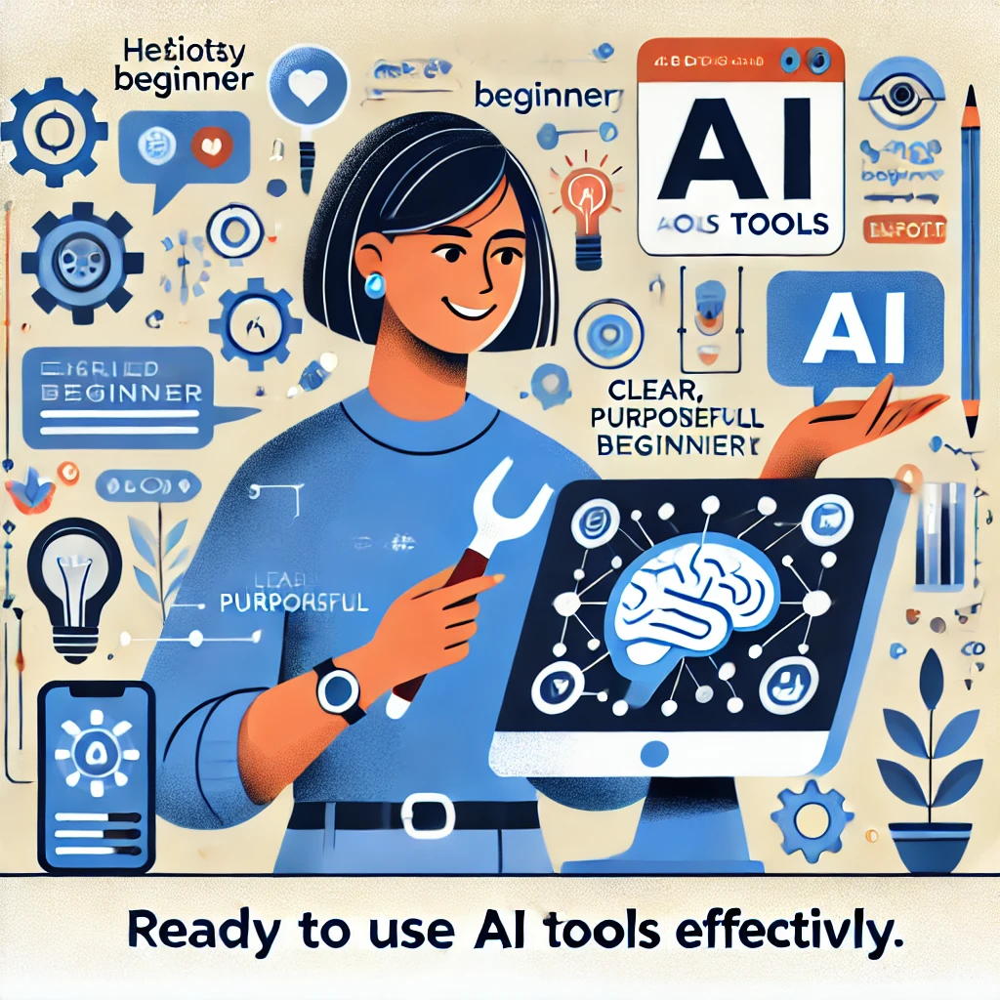

# 自信を持って前進する

これらのアクティビティを完了したことおめでとうございます！あなたは熟練したAIディレクターになるための最初の一歩を踏み出しました。これらの演習を通じて、あなたの指示がAIの出力をどのように形作るか、創造的プロセスのコントロールを維持する方法、そしてあなたの人生でのAI使用のための健全な境界を設定する方法を直接体験しました。

実践的知性の概念が、このパートナーシップにおいて本質的な知性は—人間である—あなたであることを強調していることを忘れないでください。AIはあなたの思考を増幅するツールですが、方向性、目的、そして知恵はあなたから来ます。

*「これらのアクティビティを試す前は、AIは私が理解できない謎のものだと感じていました」*と、小規模ビジネスオーナーのジョーダンは共有しています。*「今、それは単なるツール—強力なものですが、それでも私がコントロールする単なるツールだと理解しています。その視点の変化が大きな違いを生み出しました。」*

この先の章では、あなたの人生のさまざまな側面でAIツールを効果的に使用するためのより具体的なアプリケーションとテクニックを探ることで、これらの基礎を築いていきます。まず、無料のChatGPTアカウントを設定し、インターフェースの基本を説明することから始め、学んだことをすぐに適用できるようにします。

今のところ、人間とAIのパートナーシップについて発見したこと、そしてこれらのツールをあなたの目標と価値観に合った方法であなたの人生に取り入れ始める方法について考える時間を取ってください。

--- 