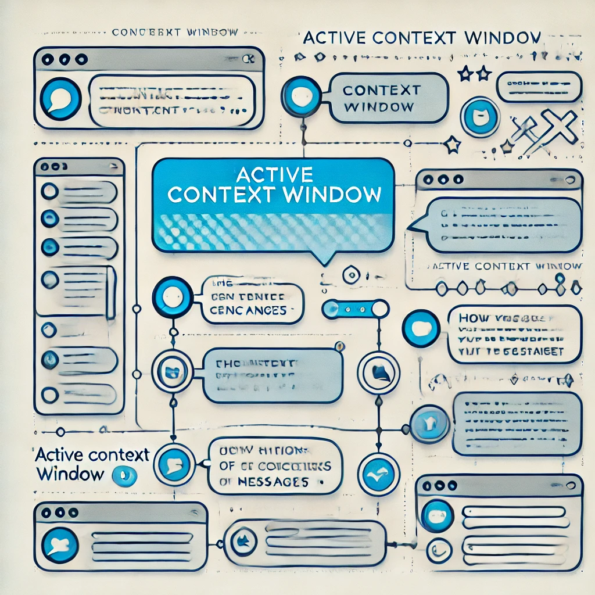

## コンテキストと会話の流れを理解する

ChatGPTの最も強力な機能の一つは、会話全体を通じてコンテキストを維持する能力です。各クエリを独立して処理する従来の検索エンジンとは異なり、ChatGPTは同じ会話で以前に議論したことを覚えており、そのコンテキストに基づいて構築することができます。このツールのこの側面をマスターすることで、あなたの体験を大幅に向上させることができます。

### ChatGPTにおけるコンテキストの仕組み

ChatGPTとチャットすると、「コンテキストウィンドウ」と呼ばれるもの—基本的には会話の最近の履歴—が維持されます。これにより、以下のような自然で流れるようなやり取りが可能になります：

- トピックを再度述べることなく、フォローアップの質問をする
- 以前の回答に基づいて応答を洗練させる
- アイデアを徐々に構築する
- 会話の以前のポイントを参照する

ただし、コンテキストウィンドウには制限があります。ChatGPTは無限の会話履歴を記憶することはできず、特にその情報を再導入しない限り、別々のチャットセッション間で情報を保存しません。

### コンテキストを効果的に管理するためのテクニック

#### 1. スレッドベースの会話

コンテキストを維持するために、関連する質問を同じ会話スレッド内に保つようにしましょう。例えば、日本への旅行を計画している場合、旅行の各側面について新しいチャットを始めるのではなく、すべての旅行関連の質問を一つの会話に保つようにします。

**シーケンスの例：**

1. `東京を初めて訪れる人にとって必見の場所は何ですか？`
2. `そのうち、伝統文化に興味がある人に適しているのはどれですか？`
3. `これらの場所間の交通手段は何がありますか？`
4. `10月に訪問する場合、特別な季節的考慮事項はありますか？`

ChatGPTは、各質問が前の質問に基づいていることを理解し、これらが別々の会話である場合よりも、より一貫性があり関連性のある情報を提供します。

#### 2. コンテキストのリフレッシュ

会話が長くなったり、ChatGPTが特定の詳細を覚えていることを確認したい場合は、重要なポイントを時々要約したり、以前の情報を明示的に参照したりしましょう。

**例：**

`先ほど、朝4時間の日光があるバルコニーでコンテナガーデンを始めることについて話しました。その照明状況に基づいて、あなたが今言及したハーブの品種のうち、どれが最も適していますか？`

これにより、重要なコンテキスト（照明条件）をリフレッシュしながら、会話を前進させる（適切なハーブの選択）ことができます。

#### 3. 必要に応じて新しく始める

特に次のような場合、蓄積されたコンテキストが実際に邪魔になることがあります：
- 会話が元のトピックから大きく離れている場合
- 前の誤解が現在の応答に影響を与えている場合
- トピックに完全に異なる角度からアプローチしたい場合

このような場合、新しいチャットを始めることでクリーンスレートが作成されます。また、方向を変えたいときに明示的に述べることもできます：

`フィクション執筆についての前の議論は脇に置いておきましょう。今からノンフィクションの研究方法に焦点を当てたいと思います。`

### 複数ターンの会話：フォローアップの力

ChatGPTから価値を得る最も効果的な方法の一つは、各プロンプトが前の応答に基づいて構築される複数ターンの交換です。これにより以下が可能になります：

- アイデアの段階的な洗練
- 複雑なトピックのより深い探求
- 誤解の明確化
- 段階的な問題解決

**生産的な複数ターン交換の例：**

**ユーザー：**

`6歳の子どもに水の循環を説明する必要があります。簡単な説明を手伝っていただけますか？`

**ChatGPT：** *[幼い子どもに適した水の循環の基本的な説明を提供]*

**ユーザー：** `それは良いスタートです。これを説明するために家庭用品を使って簡単な活動やデモンストレーションを含めていただけますか？`

**ChatGPT：** *[一般的なアイテムを使用した年齢に適したデモンストレーションを提案]*

**ユーザー：**
`完璧です。説明と活動の後に、彼らの理解を確認するために尋ねることができる簡単な質問をいくつか提案していただけますか？`

このステップバイステップのアプローチは、単一のプロンプトですべてを得ようとするよりも、より徹底的で有用な結果につながることが多いです。

### 一般的なコンテキストの課題と解決策

#### 課題：コンテキストの過負荷

**問題：** 長い会話の後、ChatGPTが多すぎるコンテキストによって混乱しているように見える。

**解決策：** 維持したい重要なポイントを定期的に要約し、会話の無関係な部分を明示的に破棄する。

**例：**

`私たちの重要なポイントをまとめると：粘土質の土壌と部分的な日陰を持つゾーン7bの野菜庭園を設計しています。これらの条件に焦点を当て、花の園芸についての以前の議論は脇に置いておきましょう。`

#### 課題：セッション間でのコンテキストの損失

**問題：** 前日やセッションからの会話を続けたい。

**解決策：** 前の会話の簡単な要約と到達した重要な結論で新しいセッションを始める。

**例：**

`昨日、私の小さなパン屋ビジネスのマーケティング戦略について話し合いました。限られた予算を考えると、地元のソーシャルメディアとコミュニティイベントに焦点を当てることが最も効果的であるという結論に達しました。今日は、それらのアプローチに基づいた具体的な3ヶ月のコンテンツ計画を作成したいと思います。`

#### 課題：軌道から外れた会話の方向転換

**問題：** 会話が元の目標から離れてしまった。

**解決策：** 丁寧かつ断固として、焦点を当てたいことを明確に述べて方向転換する。

**例：**

`パンのレシピの議論に移ってしまったことに気づきましたが、小さな町の市場での特製焼き菓子の価格設定戦略についての元の質問に戻りたいと思います。`

### より長い会話への準備

複雑な複数ターンの会話を予想する場合は、以下のように準備することを検討してください：

1. 事前にカバーしたい**重要なポイントを概説する**
2. 複雑なトピックを**論理的なセグメントに分割する**
3. 一般的なものから具体的なものへの**進行を計画する**
4. より深く掘り下げたい**フォローアップ領域を予測する**

この準備は、会話を効率的に導き、トピックの重要な側面を見逃さないようにするのに役立ちます。

### コンテキスト管理におけるプライバシーの考慮事項

ChatGPTと共有するすべてのものが会話のコンテキストの一部になることを覚えておいてください。以下のベストプラクティスを検討してください：

- フルネーム、住所、電話番号、財務詳細などの機密性の高い個人情報の共有を避ける
- 機密性の高いトピックについて議論する際は、必要なレベルの詳細のみを提供する
- 新しいチャットを始めると新しいコンテキストが作成されることを覚えておく

コンテキストを思慮深く管理することで、適切なプライバシー境界を維持しながら、複数の交換にわたって意味のある構築をする豊かで生産的な会話を持つことができます。 