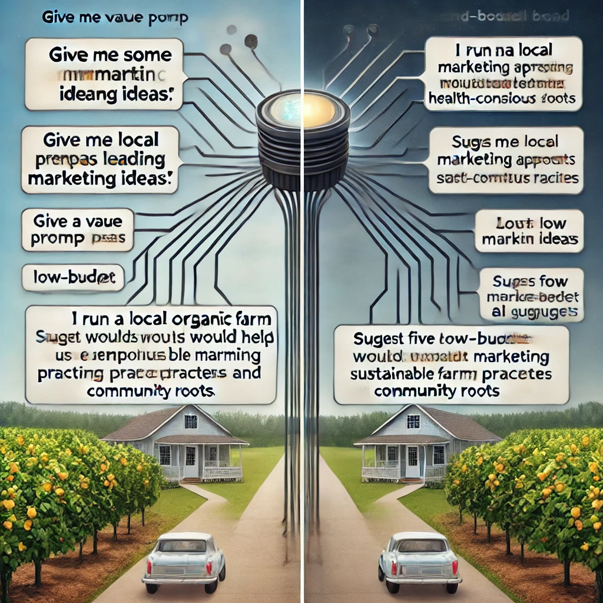

# Capítulo 1: Inteligencia Real
*... El Lado Humano de la IA*

¿Alguna vez has visto a alguien usar una nueva tecnología y hacer que parezca sencillo, sólo para sentirte perdido cuando lo intentas tú mismo? ¿O quizás has escuchado sobre **ChatGPT** y otras herramientas de IA en las noticias pero aún no las has probado, inseguro de si son demasiado complicadas o técnicas para ti?

No estás solo. Muchas personas encuentran estas tecnologías intimidantes o no están seguras por dónde empezar. La buena noticia es que no necesitas ser un experto en tecnología para usar estas herramientas de manera efectiva. De hecho, las habilidades más importantes que necesitarás son las que ya tienes: curiosidad, criterio y tu propia perspectiva única sobre lo que importa.

De eso se trata este libro: mostrarte cómo combinar tu sabiduría humana con herramientas de IA para lograr cosas que son importantes para ti. Llamamos a esta asociación "Inteligencia Real", y te coloca a ti —no a la tecnología— en el centro de la experiencia.

## Reflexión Rápida

Antes de sumergirnos, tómate un momento para anotar tus respuestas a estas preguntas:

* ¿Cuál es una tarea en tu vida diaria o trabajo que sientes repetitiva o que consume mucho tiempo?
* ¿Cuál es un tema sobre el que has sentido curiosidad pero no has tenido tiempo de explorar a fondo?
* ¿Cuál es un proyecto creativo que has querido probar pero no has tenido la oportunidad de hacerlo?

Mantén estas respuestas a mano; te ayudarán a personalizar tus primeras experiencias con IA a medida que avanzamos en este capítulo.

En las páginas siguientes, estableceremos un marco simple para pensar sobre las herramientas de IA, demostraremos lo fácil que es comenzar a usarlas (¡sin conocimientos técnicos necesarios!) y te mostraremos por qué tu dirección y criterio son los ingredientes críticos para obtener resultados valiosos.

Comencemos nuestro viaje hacia convertirnos en directores confiados y efectivos de estas poderosas herramientas, comenzando desde la primera interacción.

---

ewpage

<!-- Start of section: 01-what-is-actual-intelligence.md -->

# ¿Qué es la **Inteligencia Real**?
*...La Colaboración Humano-IA*

## Tu Primera Conversación con IA: Un Recorrido Guiado

Comencemos con algo simple. No se requieren habilidades técnicas, solo la capacidad de escribir una frase.

1. Abre ChatGPT *(te mostraremos exactamente cómo en el siguiente capítulo)*
2. Escribe exactamente esto: `Hola, soy nuevo en ChatGPT. ¿Puedes explicarme en términos sencillos en qué me puedes ayudar?`
3. Presiona Enter y lee la respuesta

¡Eso es todo! Acabas de tener tu primera conversación con IA.

Observa cómo la IA se presenta y explica sus capacidades. Este no es un mensaje pregrabado; la IA está generando esta respuesta específicamente para ti. En los próximos capítulos, aprenderás cómo hacer que estas conversaciones sean cada vez más útiles para tus necesidades específicas.

María, una propietaria de un pequeño negocio sin experiencia técnica, describió su primera experiencia: 
*"Honestamente esperaba que fuera complicado, como si necesitara aprender comandos especiales o algo así. Pero fue como enviar mensajes de texto. Pregunté cómo escribir un mejor boletín por correo electrónico, y en segundos tenía ideas que realmente podía usar. Sin jerga técnica, sin configuración complicada."*

## Entendiendo la Colaboración Humano-IA

Piensa en las herramientas de IA como electrodomésticos de cocina. Una batidora de pie puede hacer el trabajo duro de mezclar la masa, pero no decide qué receta hacer o sabe cuándo la consistencia es perfecta; ese es tu trabajo. La batidora es muy buena en su tarea específica, pero tú eres quien tiene las papilas gustativas, la creatividad para modificar recetas y el conocimiento de si estás horneando para alguien con restricciones dietéticas.

**Inteligencia Real** es esta colaboración entre tu juicio humano y las capacidades de la IA. Es lo que sucede cuando tu sabiduría, creatividad y propósito se combinan con la capacidad de la IA para procesar información y generar contenido.

Piensa en la última vez que usaste una herramienta poderosa para resolver un problema. Quizás fue un procesador de alimentos que redujo tu tiempo de preparación a la mitad, o un software de mapas que te ayudó a navegar por una ciudad desconocida. La herramienta fue invaluable, pero tú fuiste quien decidió qué cocinar o a dónde ir. Esa es exactamente tu relación con la IA: no solo estás presionando botones, eres el director creativo que toma las decisiones.

### El Modelo de Colaboración

En lugar de pensar en la IA como una entidad mágica con mente propia, considera esta simple relación:

- **Tú** proporcionas los objetivos, valores, creatividad y criterio
- La **IA** proporciona poder computacional, acceso a información y asistencia en tareas

¿Por qué importa tanto esta relación? Porque entenderla transforma la manera en que usarás estas herramientas todos los días.

Cuando reconoces que eres el director y la IA es tu asistente, naturalmente tomas el control del proceso en lugar de aceptar pasivamente lo que la IA produce. Desarrollas expectativas más claras sobre lo que estas herramientas pueden (y no pueden) hacer por ti. Te enfocas en fortalecer las habilidades exclusivamente humanas que la IA no puede replicar. Y quizás lo más importante, mantienes la propiedad de tu trabajo e ideas.

¿No es esa una forma más empoderadora de abordar estas herramientas?

### El Elemento Humano en Acción

Veamos esta colaboración en acción a través de un ejemplo real.

Luisa, una profesora de ciencias de secundaria sin experiencia previa en IA, quería crear una lección sobre el cambio climático. Podría haber simplemente pedido a ChatGPT que `cree una lección sobre cambio climático para estudiantes de 7º grado` y usar lo que generara, pero eso habría ignorado su conocimiento único de sus estudiantes.

En cambio, Luisa aplicó su criterio humano. Conocía a sus estudiantes específicos: sus niveles de conocimiento, intereses y los problemas ambientales locales que ven todos los días. Entendía con qué conceptos habían luchado en lecciones anteriores.

Con este contexto que ninguna IA podría poseer, Luisa dirigió a ChatGPT con una solicitud más específica: `Ayúdame a crear una demostración interactiva que muestre cómo funcionan los gases de efecto invernadero, adecuada para estudiantes de 7º grado que ya han aprendido sobre el ciclo del agua pero tienen dificultades con conceptos abstractos.`

La lección resultante fue mucho más efectiva porque combinó la comprensión de Luisa sobre sus estudiantes con la capacidad de la IA para generar ideas creativas de enseñanza. Esa es la Inteligencia Real en acción: tú sigues siendo central en el proceso mientras aprovechas la IA como una herramienta poderosa.

## Creando Tu Primera Solicitud Personalizada

Ahora es tu turno. Vamos a crear una solicitud que sea específicamente relevante para ti. Completa los espacios en blanco a continuación:
`Trabajo como _____________ y un desafío que enfrento a menudo es _____________. ¿Podrías sugerirme tres formas en las que podría abordar este problema?`

Por ejemplo:
`Trabajo como gerente de tienda y un desafío que enfrento a menudo es programar al personal de manera eficiente. ¿Podrías sugerirme tres formas en las que podría abordar este problema?`

 o

 `Trabajo como padre/madre y un desafío que enfrento a menudo es encontrar actividades educativas para días lluviosos. ¿Podrías sugerirme tres formas en las que podría abordar este problema?`

En las siguientes secciones, exploraremos qué hace que la inteligencia humana sea única y cómo complementa las capacidades de la IA. Pero recuerda, no necesitas entender todos los detalles técnicos para comenzar a usar estas herramientas de manera efectiva hoy mismo.

---

ewpage

<!-- Start of section: 02-ai-tools-vs-human-intelligence.md -->

# Herramientas de IA vs. Inteligencia Humana: Entendiendo la Relación

Quizás te estés preguntando... *"¿Necesito aprender programación o ciencias de la computación para usar estas herramientas de IA de manera efectiva?"*

La respuesta simple es *no*. Usar herramientas de IA como ChatGPT no requiere más habilidades técnicas que usar un motor de búsqueda o enviar un mensaje de texto. Si puedes escribir una pregunta, puedes usar IA.

Lo que importa mucho más que el conocimiento técnico es tu capacidad para:

- Hacer preguntas claras sobre temas que te importan
- Evaluar si las respuestas tienen sentido para tu situación
- Hacer seguimiento cuando necesitas más detalles o un enfoque diferente

Estas son habilidades humanas que has estado desarrollando toda tu vida, y son exactamente lo que te convierte en la **Inteligencia Real** en esta colaboración.

Para usar las herramientas de IA de manera efectiva, es útil entender qué hace que la inteligencia humana sea diferente de la inteligencia artificial, y por qué esa diferencia crea una asociación tan poderosa.

## Qué Hace Única a la Inteligencia Humana

La inteligencia humana tiene varias cualidades que los sistemas de IA actuales simplemente no poseen, a pesar de sus impresionantes capacidades:

### Propósito y Significado

Los humanos no solo hacemos cosas, las hacemos por razones. Nos preguntamos *por qué*, establecemos metas basadas en nuestros valores y sentimos satisfacción cuando logramos algo significativo. Nos importa profundamente el propósito detrás de una actividad, no solo completarla.

Los sistemas de IA, en contraste, no tienen propósitos o deseos intrínsecos. No *quieren* nada; simplemente procesan entradas y generan salidas. Cualquier sentido de propósito debe provenir de los humanos que los utilizan.

### Comprensión del Mundo Real

Piensa en tu profunda comprensión del mundo, construida a través de la experiencia vivida. Sabes cómo se siente cuando te sorprende la lluvia sin paraguas. Entiendes el peso emocional de recibir buenas noticias inesperadas. Comprendes la sutil dinámica social de una reunión familiar.

Los sistemas de IA como ChatGPT han sido entrenados con enormes cantidades de texto que describen el mundo, pero nunca han vivido realmente en él. Han "leído" sobre el helado pero nunca lo han probado. Pueden describir cómo es estar bajo la lluvia, pero nunca han sentido esa repentina salpicadura fría o esa carrera loca buscando refugio. Es como la diferencia entre leer una guía de viaje y visitar realmente un lugar; por muy detallada que sea la guía, hay algo esencial sobre la experiencia que simplemente no puede ser capturado en palabras.

### Creatividad e Intuición

Elena, una profesora de arte jubilada, era escéptica sobre el uso de la IA para su afición a la acuarela. *"No veía cómo un programa de computadora podía ayudar con algo tan personal como el arte"*, dijo. Pero cuando le pidió a ChatGPT sugerencias para pintar hojas de otoño con más vivacidad, se sorprendió gratamente.

*"Las técnicas que sugirió eran fundamentos sólidos, cosas que podría decirles a mis propios estudiantes. Pero aún tenía que aplicar mi sentido del color, mi sentido de la composición y mis propias preferencias estéticas. La IA me dio opciones para considerar, pero las decisiones creativas siguieron siendo mías."*

Esto ilustra otra diferencia clave: la creatividad humana a menudo implica hacer conexiones inesperadas, inspirarse en ideas aparentemente no relacionadas o tener repentinas intuiciones que no se pueden explicar completamente. Nuestra intuición nos permite tomar decisiones basadas en señales sutiles y años de experiencia.

Si bien la IA puede recombinar ideas existentes de maneras impresionantes, no tiene la chispa de inspiración genuina o el sentido intuitivo que permite a los humanos dar saltos más allá de lo que se conoce explícitamente.

## En Qué Destacan las Herramientas de IA

Estas diferencias no son debilidades, son la base de una asociación poderosa. La IA y los humanos son como compañeros de equipo con fortalezas complementarias.

Imagina que estás investigando sobre una condición de salud que afecta a alguien que amas. Podrías pasar semanas leyendo revistas médicas, tratando de entender terminología compleja y estudios contradictorios. O podrías pedirle a una IA que resuma la investigación actual, explique términos clave y destaque opciones de tratamiento, todo en minutos. Aquí es donde la IA realmente brilla: procesando vastas cantidades de información que abrumarían incluso al lector humano más dedicado.

La IA sobresale en:

**Procesamiento de Información**: Sintetizar rápidamente enormes cantidades de información y encontrar patrones en vastos conjuntos de datos.

**Producción Consistente**: Trabajar incansablemente sin aburrirse, distraerse o emocionarse.

**Generación Rápida de Ideas**: Producir múltiples opciones, borradores o enfoques para un problema en segundos.

**Aprendizaje de Patrones**: Identificar tendencias y conexiones en datos que los humanos podrían pasar por alto.

## El Director y el Asistente

Una forma útil de entender esta relación es pensar en ti mismo como un director de cine y en la IA como tu asistente.

Como director, tú:

- Determinas la visión y el propósito del proyecto
- Tomas decisiones creativas y éticas
- Evalúas la calidad basada en tu gusto y criterio
- Asumes la responsabilidad final del producto terminado

El asistente de IA:

- Ayuda a ejecutar tareas específicas
- Ofrece opciones basadas en tu dirección
- Proporciona información y sugerencias
- Trabaja incansablemente en los detalles que especificas

Sin el director, el asistente no tendría propósito ni dirección. Sin el asistente, el director tendría que manejar solo cada pequeño detalle.

¿Cómo se ve esto en la práctica? Veamos cómo Marcos, un dueño de un pequeño negocio sin experiencia técnica, pone en acción esta colaboración.

Marcos es propietario de una panadería exitosa y está considerando abrir un segundo local. En lugar de simplemente preguntar a la IA: *"¿Dónde debería abrir mi segunda panadería?"* — una pregunta que la IA no podría responder bien sin conocer su negocio específico — Marcos dirige la IA con indicaciones más específicas:

- `¿Qué datos demográficos debería analizar al seleccionar una nueva ubicación para una panadería?`
- `Ayúdame a crear una lista de verificación para evaluar posibles espacios comerciales para una panadería.`
- `¿Cuáles son los desafíos típicos que enfrentan las panaderías al abrir un segundo local?`

Observa el patrón aquí: cada pregunta aprovecha la capacidad de la IA para organizar información mientras mantiene a Marcos firmemente en el papel de tomador de decisiones. La IA proporciona marcos e información valiosos, pero Marcos toma la decisión final basada en factores que solo él puede entender completamente: su apetito por el riesgo, su intuición sobre diferentes vecindarios y su visión para su marca.

En la siguiente sección, exploraremos en términos simples cómo funcionan realmente estas herramientas de IA, lo que te ayudará a comprender sus capacidades y limitaciones sin requerir ningún conocimiento técnico.

---

ewpage

<!-- Start of section: 03-how-modern-ai-tools-work.md -->

# Cómo Funcionan las Herramientas Modernas de IA (Simplificado para Lectores No Técnicos)

Para dirigir efectivamente las herramientas de IA, no necesitas entender todos los detalles técnicos, al igual que no necesitas saber exactamente cómo funciona el motor de un auto para conducir de manera efectiva. Sin embargo, tener una comprensión conceptual básica te ayudará a establecer expectativas realistas y usar estas herramientas con mayor habilidad.

Exploraremos cómo funcionan herramientas de IA como ChatGPT, usando analogías simples que destacan tanto sus capacidades como sus limitaciones.

*"Cuando escuché por primera vez sobre IA, imaginaba algo de películas de ciencia ficción, como una computadora que piensa y siente"*, dice Jaime, un jubilado que ahora usa ChatGPT diariamente para ayudar con su afición a la genealogía. *"Pero una vez que comencé a usarla, me di cuenta de que es más como tener un asistente de investigación muy culto que es increíblemente rápido pero necesita dirección cuidadosa."*

## La Máquina de Completar Patrones

En su esencia, una IA como ChatGPT es una sofisticada máquina de completar patrones. Imagina que estás jugando con un amigo donde comienzas una frase y ellos la terminan:

Tú dices: `El chef puso el pastel en el...`

Tu amigo casi seguramente responde: `horno`

¿Por qué? Porque basándose en todo el lenguaje que ha encontrado a lo largo de su vida, `horno` es la palabra más probable que sigue en este contexto.

ChatGPT hace algo similar, pero a una escala mucho mayor. Ha sido entrenado con enormes cantidades de texto de libros, artículos, sitios web y otras fuentes. Durante este entrenamiento, aprendió a reconocer patrones en cómo las palabras e ideas normalmente se siguen unas a otras.

Piénsalo como un músico que ha escuchado miles de canciones pero no entiende realmente la teoría musical. Cuando tarareas algunas notas, el músico puede continuar la melodía basándose en patrones similares que ha escuchado antes. No está componiendo algo verdaderamente original, está recurriendo a toda la música que ha absorbido para continuar el patrón que iniciaste.

## La Cámara de Eco del Conocimiento Humano

Otra forma útil de pensar sobre estas herramientas de IA es como una cámara de eco del conocimiento humano. Solo pueden reflejar información y patrones que ya existen en los datos con los que fueron entrenadas.

Si le preguntas a ChatGPT sobre la Revolución Francesa, puede proporcionar información porque muchos escritores humanos han escrito sobre este tema, y esos escritos formaron parte de sus datos de entrenamiento. Pero si preguntas sobre un evento histórico completamente ficticio del que nadie ha escrito, no puede proporcionar información precisa porque ese patrón no existe en sus datos de entrenamiento.

Esto significa que las herramientas de IA:
- Pueden reflejar el conocimiento humano existente y los patrones de escritura
- No pueden generar descubrimientos o ideas verdaderamente novedosos que no se deriven de conocimientos existentes
- Pueden presentar con confianza información que parece plausible pero que es realmente incorrecta

## Predicción de Texto, No Comprensión

A pesar de su impresionante capacidad para generar texto similar al humano, ChatGPT no "entiende" realmente el significado de las palabras como lo hacen los humanos. Predice qué palabras es probable que sigan a otras basándose en patrones estadísticos, no en conectar esas palabras con experiencias del mundo real o conceptos más profundos.

Piénsalo como alguien que ha memorizado un libro de cocina en un idioma extranjero sin entender lo que significan las palabras. Podrían recitar recetas perfectamente e incluso hacer sustituciones razonables basadas en patrones que han observado, pero nunca han probado la comida, sentido la textura de los ingredientes o entendido por qué se utilizan ciertas técnicas.

Esta limitación explica por qué la IA a menudo tiene dificultades con:
- Razonamiento de sentido común
- Comprensión del mundo físico
- Captación de causa y efecto
- Distinción entre tonterías que suenan plausibles y la verdad real

## El Generador de Probabilidades

Cuando ChatGPT genera texto, esencialmente está haciendo una serie de elecciones de palabras basadas en la probabilidad. Para cada posición en una oración, calcula qué palabra es más probable que venga a continuación, dados los términos precedentes y el contexto general.

Imagina un juego donde comienzas una oración, y alguien tiene que adivinar qué palabra viene después:

`El chef puso el pastel en el...`

La mayoría de las personas adivinarían `"horno"` porque esa es la palabra más probable que sigue en este contexto. Los sistemas de IA hacen algo similar, pero con una comprensión mucho más sofisticada de los patrones del lenguaje y un vocabulario mucho más amplio de posibles palabras entre las que elegir.

Este enfoque probabilístico significa que:
- ChatGPT no tiene un conjunto fijo de respuestas—genera nuevo texto cada vez
- Las respuestas pueden variar incluso ante indicaciones idénticas
- La IA no "decide" qué decir basada en el razonamiento—selecciona palabras basadas en la probabilidad

## Qué Significa Esto Para Ti

Entender estos conceptos básicos sobre cómo funciona la IA ayuda a explicar tanto sus impresionantes capacidades como sus sorprendentes limitaciones:

1. **Puede generar texto similar al humano** porque ha aprendido patrones de una vasta cantidad de escritura humana

2. **Puede proporcionar información sobre muchos temas** porque ha sido entrenada con textos diversos

3. **Tiene dificultades con la precisión factual** porque está prediciendo texto plausible, no verificando la verdad

4. **No puede razonar o entender realmente** porque está coincidiendo con patrones, no comprendiendo el significado

5. **No tiene experiencias ni objetivos** porque es un sistema de predicción de texto, no una entidad consciente

Estas características hacen que las herramientas de IA sean increíblemente útiles para ciertas tareas, pero también destacan por qué la dirección y el juicio humanos—tu Inteligencia Real—siguen siendo esenciales.

## El Asistente, No el Experto

Dadas estas limitaciones, es útil pensar en las herramientas de IA como asistentes en lugar de expertos o autoridades. Pueden ayudarte a hacer lluvia de ideas, redactar contenido, resumir información y explorar ideas, pero siempre debes aplicar tu propio juicio a su producción.

Recuerda a Javier, que está planeando unas vacaciones familiares a Japón. Si simplemente le pide a ChatGPT `"Planifica mi viaje perfecto a Japón"` y sigue cualquier itinerario que genere, podría terminar con una experiencia turística genérica que no coincide con los intereses de su familia o visitar atracciones que están cerradas por renovación.

En cambio, Javier utiliza su comprensión de las limitaciones de la IA para dirigir la herramienta de manera más efectiva. Sabe que:
- La información de la IA podría estar desactualizada
- No conoce las preferencias específicas de su familia
- No puede verificar si los alojamientos sugeridos están realmente disponibles

Así que utiliza la IA como un asistente para tareas específicas donde la coincidencia de patrones es útil—generar ideas para actividades aptas para niños en Tokio, sugerir redacción para frases básicas en japonés o crear una lista de comprobación para el equipaje—mientras maneja por sí mismo las decisiones críticas y verifica información clave a través de otras fuentes.

En la siguiente sección, exploraremos cómo tomar el control de esta asociación humano-IA para obtener el mayor valor de estas herramientas poderosas pero limitadas.

---

ewpage

<!-- Start of section: 04-directing-ai-and-setting-expectations.md -->

# Dirigiendo la IA y Estableciendo Expectativas Realistas

Ahora que entendemos la relación entre la inteligencia humana y las capacidades de la IA, enfoquémonos en dos elementos críticos que harán que tus experiencias con IA sean exitosas: cómo dirigir efectivamente estas herramientas y qué deberías esperar realistamente de ellas.

## La Mentalidad del Director

¿Recuerdas nuestra metáfora del director de cine? Ampliemos lo que significa ser un director efectivo de herramientas de IA.

Así como un director de cine no simplemente dice a los actores "hagan una buena escena" y espera lo mejor, tú no deberías acercarte a la IA con peticiones vagas y una aceptación pasiva de lo que sea que produzca. La mentalidad del director involucra varias prácticas clave:

### 1. Claridad de Propósito

*"Solía comenzar haciéndole a ChatGPT preguntas vagas y me frustraba con las respuestas genéricas"*, explica David, un consultor de pequeñas empresas. *"Ahora siempre me tomo un momento para aclarar exactamente lo que necesito antes incluso de abrir la aplicación."*

Antes de interactuar con la IA, pregúntate:

- ¿Qué problema específico estoy tratando de resolver?
- ¿Cómo sería un resultado exitoso?
- ¿Qué limitaciones o requisitos debería tener en cuenta?

Esta claridad te ayuda a dar indicaciones más efectivas y evaluar las respuestas de la IA de manera más crítica.

### 2. Especificidad en la Dirección

Las indicaciones vagas conducen a respuestas genéricas. Cuanto más específica sea tu dirección, más útil será la asistencia de la IA. Compara estos enfoques:

**Dirección vaga:** "Dame algunas ideas de marketing."

**Dirección específica:** "Dirijo un puesto de venta de productos de granja orgánica local dirigido a familias conscientes de la salud. Sugiéreme cinco enfoques de marketing de bajo presupuesto que nos ayuden a enfatizar nuestras prácticas agrícolas sostenibles y nuestras raíces comunitarias."

La dirección específica proporciona contexto y limitaciones que ayudan a la IA a generar respuestas relevantes adaptadas a tus necesidades.

### 3. Refinamiento Iterativo

Trabajar con IA raramente es un proceso de una sola vez. Piénsalo como una conversación en lugar de una sola pregunta y respuesta.

*"Al principio simplemente aceptaba lo que la IA me daba"*, dice Pilar, una escritora freelance. *"Ahora sé que la magia ocurre en el ida y vuelta. Diré 'eso es demasiado formal' o 'puedes añadir más ejemplos sobre X' y los resultados mejoran dramáticamente."*

No te conformes con la primera respuesta si no satisface completamente tus necesidades. En cambio, proporciona retroalimentación y dirección adicional para guiar a la IA hacia resultados más útiles:

- `Eso es útil, pero ¿podrías hacerlo más simple?`
- `Me gusta más la tercera idea. ¿Puedes ampliar específicamente ese enfoque?`
- `Estos ejemplos son demasiado técnicos. ¿Puedes reescribirlos para alguien sin experiencia en este campo?`

### 4. Evaluación Crítica

Aproxímate al contenido generado por IA con un escepticismo saludable. Pregúntate:

- ¿Esta información parece precisa y confiable?
- ¿Es este el enfoque correcto para mi situación específica?
- ¿Esto se alinea con mis valores y objetivos?

Recuerda que tú eres el juez final de la calidad y la idoneidad. La IA está ahí para ayudarte, no para tomar decisiones finales.

## El Efecto de Amplificación

Cuando combinas la dirección humana con las capacidades de la IA, sucede algo notable: ambas se amplifican más allá de lo que cualquiera podría lograr por sí sola. Esta es la esencia de la Inteligencia Real.

- Tu creatividad se amplifica por la capacidad de la IA para generar rápidamente variaciones y alternativas
- Tu conocimiento se amplifica por la capacidad de la IA para proporcionar información y perspectivas que quizás no habías considerado
- Tu productividad se amplifica por la capacidad de la IA para manejar aspectos rutinarios de las tareas, liberándote para centrarte en un pensamiento de nivel superior

Sara, una profesora de inglés de secundaria, experimenta esta amplificación cuando planifica su currículum. Podría pasar horas buscando materiales de lectura relevantes, redactando preguntas para discusión y creando tareas. En cambio, dirige a ChatGPT con sus objetivos educativos específicos y conocimiento de sus estudiantes:

*"Necesito diseñar una unidad sobre 'identidad' para mi clase de inglés de 10º grado. Muchos de mis estudiantes son estadounidenses de primera generación que a menudo discuten los desafíos de navegar entre culturas. Sugiere cuentos contemporáneos de autores diversos que exploren la formación de identidad, y para cada historia, esboza posibles preguntas de discusión que conecten con la experiencia inmigrante."*

Con esta dirección, ChatGPT puede generar rápidamente sugerencias que Sara luego evalúa basadas en su juicio profesional, conocimiento de sus estudiantes específicos y requisitos curriculares. Puede aceptar algunas sugerencias, modificar otras y rechazar aquellas que no encajan con su visión.

El resultado es un currículo que refleja la experiencia de Sara y su comprensión de sus estudiantes, pero que se desarrolló de manera más eficiente y con una gama más amplia de perspectivas de lo que podría haber logrado trabajando completamente por su cuenta. Esa es la Inteligencia Real en acción.

## Estableciendo Expectativas Realistas

Uno de los mayores desafíos al trabajar efectivamente con herramientas de IA es establecer expectativas realistas. El bombo mediático a menudo presenta la IA como máquinas pensantes mágicas o amenazas inminentes para la humanidad, ninguna de las cuales refleja con precisión la realidad de las herramientas actuales como ChatGPT.

*"Honestamente estaba intimidado por todas las noticias sobre IA"*, admite Ramón, un contador jubilado. *"Esperaba que fuera imposiblemente compleja de usar o inquietantemente parecida a un humano. La realidad fue mucho más práctica: útil en algunos aspectos, limitada en otros."*

Establezcamos una comprensión equilibrada de lo que estas herramientas pueden y no pueden hacer para ayudarte a usarlas más efectivamente.

### Lo que las Herramientas de IA Pueden Hacer Bien

#### Generar Texto Similar al Humano

La IA sobresale en producir varios tipos de contenido escrito, desde escritura creativa hasta explicaciones técnicas, desde conversaciones casuales hasta documentos formales. Puede adaptar su tono, estilo y nivel de complejidad según tu dirección.

#### Procesar y Resumir Información

La IA puede tomar grandes cantidades de información y destilarla en resúmenes, puntos clave o formatos estructurados que son más fáciles de entender y usar.

#### Hacer Lluvia de Ideas y Alternativas

La IA puede generar rápidamente múltiples opciones, perspectivas o enfoques para un problema, ayudándote a explorar posibilidades que quizás no habías considerado por tu cuenta.

#### Redactar y Editar Contenido

La IA puede crear borradores iniciales de muchos tipos de contenido y ayudar a mejorar el texto existente sugiriendo ediciones, reorganización o frases alternativas.

#### Explicar Conceptos a Varios Niveles

La IA puede explicar temas complejos en términos más simples o proporcionar explicaciones más detalladas de conceptos básicos, adaptándose a diferentes niveles de conocimiento y necesidades de aprendizaje.

#### Simular Conversaciones y Perspectivas

La IA puede representar diferentes puntos de vista o áreas de experiencia, permitiéndote explorar cómo diferentes personas podrían abordar una situación.

### Lo que las Herramientas de IA No Pueden Hacer Bien

#### Verificar la Precisión Factual

Los modelos de lenguaje de IA no tienen la capacidad de verificar hechos de forma independiente. Pueden presentar con confianza información incorrecta (a veces llamada "alucinaciones") que suena plausible pero es realmente errónea.

#### Proporcionar Información Actualizada

Los datos de entrenamiento de IA tienen una fecha límite, después de la cual el modelo no tiene conocimiento de eventos mundiales, nuevos productos o desarrollos recientes a menos que se actualice específicamente.

#### Acceder a Tu Información Personal

La IA no sabe quién eres, tu historia personal o tus circunstancias específicas a menos que compartas explícitamente esta información en tu conversación.

#### Realizar Acciones en el Mundo Real

Los modelos de lenguaje de IA no pueden acceder directamente a internet, ejecutar programas o interactuar con otros sistemas a menos que estén específicamente integrados con esas capacidades.

#### Ejercer Verdadero Juicio o Sabiduría

La IA puede simular consejos u opiniones, pero carece de la experiencia vivida, el fundamento moral y la comprensión contextual necesarios para la verdadera sabiduría o juicio.

#### Crear Ideas Verdaderamente Originales

Aunque la IA puede recombinar conceptos existentes de nuevas maneras, no genera ideas verdaderamente novedosas desconectadas de sus datos de entrenamiento.

## Conceptos Erróneos Comunes

Abordemos algunos conceptos erróneos frecuentes sobre las herramientas de IA que pueden llevar a expectativas poco realistas:

### Concepto erróneo: "La IA lo sabe todo"

**Realidad:** La IA solo conoce lo que estaba en sus datos de entrenamiento, y ese conocimiento no es ni completo ni siempre preciso. Puede presentar información incorrecta con alta confianza.

### Concepto erróneo: "La IA es objetiva e imparcial"

**Realidad:** La IA refleja los sesgos presentes en sus datos de entrenamiento y los introducidos por sus creadores. No tiene un punto de vista neutral u objetivo.

### Concepto erróneo: "La IA entiende lo que está diciendo"

**Realidad:** La IA genera texto sin comprensión genuina. No entiende los conceptos como lo hacen los humanos; predice patrones en el lenguaje sin conectarlos con el significado del mundo real.

### Concepto erróneo: "La IA tiene opiniones o creencias"

**Realidad:** La IA simula opiniones basadas en patrones en sus datos de entrenamiento, pero realmente no tiene creencias o convicciones.

### Concepto erróneo: "La IA siempre se está mejorando a sí misma"

**Realidad:** La mayoría de las herramientas de IA no aprenden de tus interacciones a menos que estén diseñadas específicamente para hacerlo. Tus conversaciones típicamente no hacen que la IA sea más inteligente o más personalizada para ti con el tiempo.

## El Principio de Verificación

Una pauta útil cuando se usan herramientas de IA es lo que podríamos llamar el "principio de verificación": la importancia de una respuesta generada por IA debe ser proporcional a tus esfuerzos de verificación.

En otras palabras:

- Para lluvia de ideas de bajo riesgo o primeros borradores, podrías aceptar la salida de IA con verificación mínima
- Para contenido de riesgo moderado, deberías revisar cuidadosamente las sugerencias de IA y hacer tus propios juicios
- Para decisiones de alto riesgo o afirmaciones factuales, deberías verificar independientemente la información a través de fuentes confiables

Miguel, un fotógrafo aficionado investigando equipos de cámara, aplica este principio: *"Uso ChatGPT para obtener explicaciones rápidas de conceptos técnicos y generar preguntas que debería hacer. Pero antes de gastar 2,000 dólares en una nueva cámara, siempre verifico los detalles específicos del modelo en el sitio web del fabricante y leo reseñas de sitios de fotografía confiables."*

Este principio te ayuda a usar la IA de manera eficiente mientras gestionas los riesgos asociados con sus limitaciones.

## Tomando Control del Proceso

Para abrazar plenamente tu papel como director de herramientas de IA, considera este enfoque general:

1. **Define tu objetivo** claramente antes de interactuar con la IA

2. **Proporciona contexto y limitaciones** que ayuden a la IA a entender tu situación específica

3. **Comienza con preguntas o solicitudes específicas** en lugar de indicaciones abiertas

4. **Evalúa las respuestas críticamente**, buscando tanto elementos útiles como problemas potenciales

5. **Proporciona retroalimentación y refinamiento** para guiar a la IA hacia respuestas más útiles

6. **Integra múltiples fuentes**, sin depender únicamente del contenido generado por IA

7. **Toma las decisiones finales** basadas en tu juicio, valores y conocimiento

Este enfoque te coloca firmemente en control del proceso mientras aprovechas las capacidades de la IA para mejorar tu pensamiento y productividad.

En la siguiente sección, pondremos estas ideas en práctica con actividades prácticas diseñadas para ayudarte a desarrollar tus habilidades como director de IA.

---

ewpage

<!-- Start of section: 05-activities.md -->

# Actividades: Tus Primeras Experiencias Prácticas con IA

¡Pongamos en práctica todo lo que hemos aprendido! Estas actividades prácticas te ayudarán a desarrollar tus habilidades de dirección de IA mientras experimentas de primera mano cómo tu aportación da forma a los resultados que obtienes.

Recuerda, no hay mejor manera de aprender que haciendo. No te preocupes por cometer errores, son parte del proceso de aprendizaje.

---

## Actividad 1: La Silla del Director

**Objetivo:** Ver cómo la especificidad de tu dirección afecta el resultado de la IA.

**Lo que necesitarás:**
- Acceso a ChatGPT (cuenta gratuita)
- 10-15 minutos

"Esta actividad fue reveladora", dice Miguel, un profesor de secundaria. "No podía creer lo diferentes que eran las respuestas solo con añadir algunos detalles a mi pregunta".

**Instrucciones:**

1. Abre ChatGPT y comienza una nueva conversación.

2. Primero, da una indicación vaga y observa la respuesta:
   
   `"Dame algunos consejos."`

3. Ahora, prueba con una indicación un poco más específica:
   
   `"Dame algunos consejos sobre aprender nuevas habilidades."`

4. Finalmente, proporciona una indicación altamente específica con contexto, limitaciones y tu objetivo:
   
   `"Soy un padre/madre ocupado/a con dos niños pequeños tratando de aprender español básico en preparación para un viaje familiar a México en tres meses. Solo puedo practicar durante unos 15 minutos cada día, generalmente mientras viajo en transporte público. Dame un plan de aprendizaje realista que se ajuste a estas limitaciones y se centre en frases prácticas para viajar."`

5. Compara las tres respuestas. Observa cómo la calidad y utilidad de la producción de la IA corresponde directamente a la especificidad de tu dirección.

**Preguntas de reflexión:**

- ¿Qué respuesta te resultó más útil y por qué?
- ¿Qué elementos específicos de tu indicación detallada llevaron a mejoras en la respuesta de la IA?
- ¿Cómo podrías aplicar este principio de especificidad a tus propios objetivos al usar IA?

---

## Actividad 2: Amplificador de Inteligencia

**Objetivo:** Usar la IA como compañero de pensamiento para amplificar tu propia inteligencia en un desafío personal.

**Lo que necesitarás:**
- Acceso a ChatGPT
- Un problema o desafío real que estés enfrentando actualmente
- 15-20 minutos

**Instrucciones:**

1. Identifica un desafío actual en tu vida que requiera algo de pensamiento o planificación. Podría ser una decisión que necesitas tomar, un proyecto que estás planificando o un problema que estás tratando de resolver. Elige algo real pero no extremadamente personal o sensible.

2. Antes de consultar con la IA, dedica 3-5 minutos a escribir tus propios pensamientos sobre el desafío:
   - ¿Qué hace que esto sea desafiante?
   - ¿Qué enfoques has considerado?
   - ¿Qué limitaciones o consideraciones son importantes?

3. Ahora, elabora una indicación que pida a la IA que te ayude a pensar en este desafío. Incluye:
   - Una breve descripción de la situación
   - Tus pensamientos y enfoques actuales
   - Qué tipo específico de ayuda quieres (lluvia de ideas, organizar tus pensamientos, considerar perspectivas que podrías haber pasado por alto, etc.)

4. Revisa la respuesta de la IA e identifica al menos una idea o perspectiva que no habías considerado completamente.

5. Haz un seguimiento con al menos una pregunta aclaratoria o solicitud basada en la respuesta de la IA.

*"Usé este enfoque cuando planificaba un cambio de carrera"*, comparte Tania, una ex gerente de tienda minorista que ahora trabaja en administración de salud. *"La IA no me dijo qué hacer, pero me ayudó a organizar mis pensamientos y considerar aspectos en los que no había pensado, como qué habilidades transferibles ya tenía."*

**Preguntas de reflexión:**

- ¿Cómo se comparó la respuesta de la IA con tu pensamiento inicial?
- ¿La IA te ayudó a ver el problema desde nuevos ángulos?
- ¿Cómo te ayudó tu conocimiento específico de la situación a evaluar las sugerencias de la IA?
- ¿Qué papel desempeñaste tú frente al papel que desempeñó la IA en esta asociación de pensamiento?

---

## Actividad 3: Mito vs. Realidad

**Objetivo:** Probar las limitaciones de la IA para comprender mejor dónde sigue siendo esencial la inteligencia humana.

**Lo que necesitarás:**
- Acceso a ChatGPT
- Acceso a fuentes de información confiables (sitios web, libros, expertos)
- 20-30 minutos

**Instrucciones:**

1. Elige un tema que conozcas bien, quizás relacionado con tu profesión, un pasatiempo o tu comunidad local.

2. Haz a ChatGPT una serie de preguntas cada vez más específicas sobre este tema, comenzando con preguntas generales y avanzando hacia preguntas muy específicas que podrían requerir conocimientos muy recientes o especializados.

3. Anota qué preguntas responde la IA con precisión y con cuáles tiene dificultades o proporciona información incorrecta.

4. Para al menos una pregunta donde la IA proporcionó información incorrecta o incompleta, verifica la información correcta a través de fuentes confiables.

5. Pide a la IA que explique sus limitaciones con respecto a este tema. Una indicación como esta funciona bien: 
   
   `"¿Qué limitaciones podrías tener al proporcionar información sobre [tu tema]? ¿Qué aspectos de este tema serían difíciles de abordar con precisión para ti?"`

Roberto, un astrónomo aficionado, probó esto con su pasatiempo: *"Me impresionó el conocimiento de la IA sobre conceptos básicos de astronomía, pero cuando pregunté sobre objetos específicos de cielo profundo que he observado o descubrimientos recientes, dio información desactualizada o inventó detalles. Fue bastante honesta sobre sus limitaciones cuando pregunté directamente."*

**Preguntas de reflexión:**

- ¿En qué punto comenzó a deteriorarse el conocimiento o la precisión de la IA?
- ¿Qué tipos de preguntas parecieron más desafiantes para la IA?
- ¿Cuán transparente fue la IA sobre sus limitaciones?
- ¿Cómo abordarías el uso de IA para este tema en el futuro, conociendo estas limitaciones?

---

## Actividad 4: Control Creativo

**Objetivo:** Practicar mantener la propiedad de un proyecto creativo mientras usas la IA como asistente.

**Lo que necesitarás:**
- Acceso a ChatGPT
- 20-30 minutos

**Instrucciones:**

1. Elige un proyecto creativo simple de las opciones a continuación (o crea el tuyo propio):
   - Escribe un cuento corto (300-500 palabras)
   - Planifica una cena temática
   - Diseña un volante para un evento comunitario
   - Crea una rutina de ejercicios

2. Comienza por definir tu visión para el proyecto. Escribe:
   - El objetivo o propósito principal
   - Elementos clave que quieres incluir
   - Tu estilo o preferencias personales
   - Cualquier limitación o requisito

3. Crea una serie de solicitudes específicas para ChatGPT que te ayudarán con diferentes aspectos de tu proyecto. En lugar de pedirle que complete todo el proyecto, divídelo en componentes donde la asistencia de IA sería útil. Por ejemplo, si estás escribiendo un cuento corto:
   - `Sugiere tres posibles párrafos de apertura para una historia sobre...`
   - `Ayúdame a desarrollar el personaje principal que es...`
   - `Proporciona algo de lenguaje descriptivo para el escenario de...`

4. Para cada respuesta de la IA, selecciona elementos que te gusten, modifica otros y descarta aquellos que no se ajusten a tu visión.

5. Ensambla el proyecto final tú mismo, integrando elementos asistidos por IA con tus propias contribuciones.

*"Usé este enfoque para planificar la fiesta de cumpleaños de mi hija"*, explica Wei, un padre ocupado. *"Tenía en mente un tema de dinosaurios pero necesitaba ayuda con ideas para juegos y decoraciones. En lugar de pedir un plan completo para la fiesta, hice preguntas específicas sobre cada aspecto y reuní los elementos que me gustaron. La fiesta se sintió como mi creación, no algo que hizo una IA."*

**Preguntas de reflexión:**

- ¿Cómo te ayudó dividir el proyecto en solicitudes específicas a mantener el control creativo?
- ¿Qué partes del proceso se beneficiaron más de la asistencia de IA?
- ¿Qué aspectos requirieron tu juicio y creatividad humanos?
- ¿Cómo refleja el resultado final tu visión y estilo, a pesar de usar asistencia de IA?

---

## Actividad 5: Estableciendo Tu Brújula de IA

**Objetivo:** Desarrollar pautas personales sobre cómo quieres usar la IA en tu vida.

**Lo que necesitarás:**
- Acceso a ChatGPT
- Papel y bolígrafo, o documento digital
- 15-20 minutos

**Instrucciones:**

1. Reflexiona sobre tus valores, objetivos y las áreas de tu vida donde crees que las herramientas de IA podrían ser útiles. Considera:
   - ¿Qué tipos de tareas encuentras agotadoras o que consumen mucho tiempo?
   - ¿Qué habilidades te gustaría desarrollar, con la IA como ayuda de aprendizaje?
   - ¿Qué aspectos de tu pensamiento o trabajo nunca querrías externalizar?

2. Pide ayuda a ChatGPT para pensar en estas preguntas con una indicación como:
   
   `Estoy desarrollando pautas personales sobre cómo quiero usar herramientas de IA como tú en mi vida. ¿Puedes ayudarme a pensar en algunas preguntas a considerar sobre dónde la IA podría serme más útil y dónde podría querer ser cauteloso al usarla? Considera aspectos como el aprendizaje, la creatividad, el pensamiento crítico y las tareas prácticas.`

3. Basándote en las sugerencias de la IA y tu propia reflexión, redacta 3-5 pautas personales para tu uso de IA. Estas podrían incluir:
   - Tipos de tareas para las que usarás IA
   - Límites que mantendrás
   - Cómo verificarás o evaluarás el contenido generado por IA
   - Cuándo confiarás en enfoques puramente humanos

4. Comparte tu borrador de pautas con ChatGPT y pide retroalimentación: 
   
   `Aquí están mis pautas preliminares para usar IA. ¿Puedes sugerir alguna consideración que podría haber pasado por alto o formas de hacer estas pautas más prácticas?`

5. Finaliza tus pautas basándote en esta retroalimentación, manteniendo lo que resuena y descartando lo que no se ajusta a tus valores y necesidades.

*"Este ejercicio me ayudó a establecer límites saludables"*, dice Gabriela, una escritora freelance. *"Me di cuenta de que quería usar IA para investigación y edición pero no para el corazón creativo de mi escritura. Tener estas pautas me ayuda a usar la IA como una herramienta sin sentir que estoy comprometiendo mi oficio."*

**Preguntas de reflexión:**

- ¿Qué aprendiste sobre tus propias prioridades a través de este ejercicio?
- ¿Hubo alguna sugerencia de la IA que te sorprendió o te hizo reconsiderar tu enfoque?
- ¿Cómo podrían evolucionar estas pautas a medida que adquieras más experiencia con herramientas de IA?
- ¿Cómo reflejan estas pautas tu comprensión de la Inteligencia Real como una asociación humano-IA?

---

## Avanzando con Confianza

¡Felicitaciones por completar estas actividades! Has dado tus primeros pasos para convertirte en un hábil director de IA. A través de estos ejercicios, has experimentado de primera mano cómo tu dirección da forma a los resultados de la IA, cómo mantener el control de los procesos creativos y cómo establecer límites saludables para el uso de IA en tu vida.

Recuerda que el concepto de Inteligencia Real enfatiza que tú—el humano—eres la inteligencia esencial en esta asociación. La IA es una herramienta que amplifica tu pensamiento, pero la dirección, el propósito y la sabiduría provienen de ti.

*"Antes de probar estas actividades, sentía que la IA era esta cosa misteriosa que no podía entender posiblemente"*, comparte Jordán, un propietario de pequeña empresa. *"Ahora veo que es solo una herramienta—una poderosa, pero aún solo una herramienta que yo controlo. Ese cambio de perspectiva ha marcado toda la diferencia."*

En los capítulos siguientes, construiremos sobre estos fundamentos explorando aplicaciones y técnicas más específicas para usar herramientas de IA de manera efectiva en varios aspectos de tu vida. Comenzaremos configurando tu cuenta gratuita de ChatGPT y recorriendo los conceptos básicos de la interfaz, para que puedas comenzar a aplicar lo que has aprendido de inmediato.

Por ahora, tómate un momento para reflexionar sobre lo que has descubierto acerca de la asociación humano-IA y cómo podrías empezar a incorporar estas herramientas en tu vida de manera que se alineen con tus objetivos y valores.

---

ewpage

